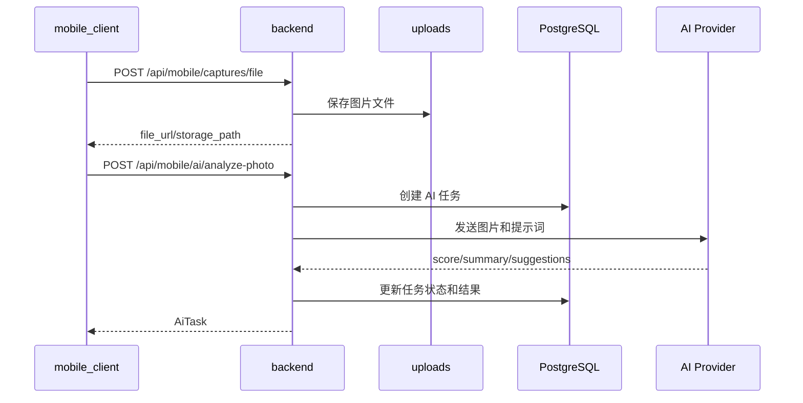

# AI 照片分析链路说明

本文档说明当前 AI 图片分析的业务链路，以及它和设备端 AI 编排之间的区别。

## 1. 当前能力

业务后端支持：

- 单张照片分析。
- 背景分析。
- 连拍选优。
- AI 任务落库与查询。
- 管理后台维护 AI Provider 配置。
- 套餐通过 `feature_flags` 影响 Provider 选择。

设备运行时支持：

- 自动找角度。
- 背景扫描并锁机位。
- 根据 AI 推荐框计算锁定匹配分数。
- 设备本地抓拍可选自动分析。

## 2. 手机照片分析流程



## 3. 图片上传

手机上传图片使用：

```text
POST /api/mobile/captures/file
```

multipart 字段名：

```text
file
```

后端保存到 `uploads/captures/user_{id}/日期/uuid.jpg`，并通过 `/uploads/*` 静态路径访问。

## 4. AI Provider 选择

Provider 配置存在 `ai_provider_configs` 表，管理后台可新增、更新、删除和设置默认配置。

套餐 `feature_flags` 可指定：

- `default_ai_provider_code`
- `available_ai_provider_codes`

选择顺序：

1. 套餐默认 Provider。
2. 套餐可用 Provider 列表中的第一个可用配置。
3. 系统默认 Provider。
4. 无可用配置时返回 mock 或可解释失败结果。

移动端不会直接持有 API key。

## 5. AI 任务类型

| 任务 | 接口 | 用途 |
| --- | --- | --- |
| 照片分析 | `POST /api/mobile/ai/analyze-photo` | 对单张照片评分、总结并给出建议。 |
| 背景分析 | `POST /api/mobile/ai/analyze-background` | 分析背景或取景建议。 |
| 连拍选优 | `POST /api/mobile/ai/batch-pick` | 在多张抓拍中选择最佳照片。 |
| 任务查询 | `GET /api/mobile/ai/tasks/{task_id}` | 查询 AI 任务状态和结果。 |

## 6. 与设备端协同

设备端 AI 不经过 `backend` 的 AI 任务表，它属于本地运行时编排：

- `POST /api/device/ai/angle-search/start`
- `POST /api/device/ai/background-lock/start`
- `POST /api/device/ai/background-lock/unlock`
- `POST /api/device/ai/apply-angle`
- `POST /api/device/ai/apply-lock`

设备端会使用当前实时帧和云台控制能力，扫描多个候选角度或背景，然后应用结果。业务后端 AI 主要处理已经上传的图片和历史记录；设备端 AI 主要服务实时构图和云台控制。

## 7. WebRTC 与 AI 的关系

WebRTC 只改变手机和设备之间的视频传输方式，不改变 AI 任务结构：

```text
手机 video track -> device_runtime -> OpenCV frame -> 检测/构图/AI 编排
```

业务后端 AI 分析仍走图片上传和任务接口。设备联动页可以把后端或手机得到的角度/锁定建议通过设备端 `/api/device/ai/apply-*` 接口应用到云台。

## 8. 当前限制

- 业务后端 AI 任务仍在请求内同步调用 Provider，没有独立队列。
- 设备端抓拍默认保存在设备本地，不自动写入后端 `captures` 表。
- 设备端 AI Provider 配置与业务后端 Provider 配置不是同一个配置入口。
- 真机实时链路依赖局域网质量，WebRTC 失败时应观察 fallback 是否可用。
