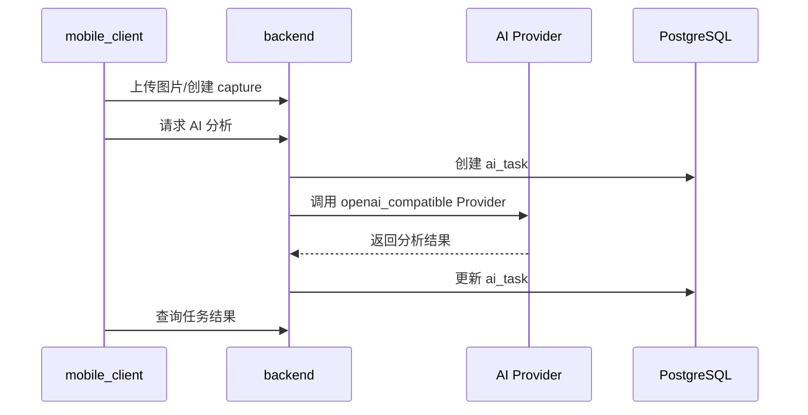

# AI 照片分析链路说明

项目里有两类 AI 链路：业务后端 AI 和设备端本地 AI。两者用途不同，不应混用。

## 业务后端 AI

后端 AI 服务于手机端独立拍摄和历史记录。

主要接口：

- `POST /api/mobile/ai/analyze-photo`
- `POST /api/mobile/ai/analyze-background`
- `POST /api/mobile/ai/batch-pick`
- `GET /api/mobile/ai/tasks/{task_id}`

流程：

Provider 配置在管理后台维护，移动端不持有 API key。

## 设备端本地 AI

设备端 AI 服务于设备联动现场控制：

- 角度搜索。
- 背景锁定。
- 应用角度建议。
- 应用锁定建议。
- 抓拍后设备本地分析。

主要接口：

- `POST /api/device/ai/angle-search/start`
- `POST /api/device/ai/background-lock/start`
- `POST /api/device/ai/background-lock/unlock`
- `GET /api/device/ai/status`
- `POST /api/device/ai/apply-angle`
- `POST /api/device/ai/apply-lock`

设备端 AI 状态会显示在设备联动 HUD 中，不写入后端 `ai_tasks`。

## 设备抓拍后的 AI 现状

当前设备联动页的“设备本地 AI 分析”只设置设备端 `gesture.auto_analyze_enabled` 或触发设备端分析流程。它不会调用后端 `/api/mobile/ai/analyze-photo`，因为设备抓拍不再自动入后端历史。

如果未来要让设备抓拍进入后端 AI，应先设计清楚：

1. 设备抓拍文件如何上传到后端。
2. 是否创建后端 session/capture。
3. 用户如何选择同步哪些设备抓拍。
4. 失败时如何重试和提示。

## 管理后台 Provider

管理后台提供 AI Provider 配置页面，后端支持多配置：

- Provider code。
- API base URL。
- API key。
- 模型名。
- openai compatible 格式。
- 是否启用。

套餐可通过 `feature_flags` 指定默认 Provider 或可用 Provider 列表。
