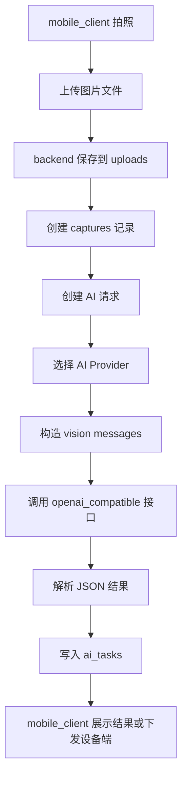
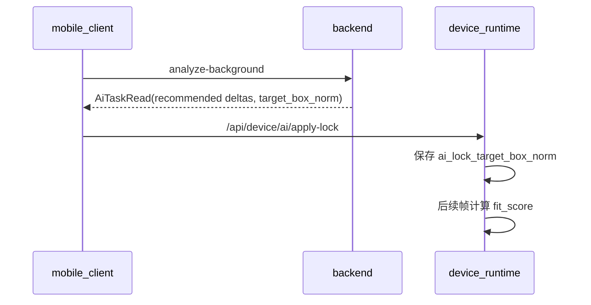

# AI 照片分析链路说明

## 1. 当前能力

后端当前实现三类真实 AI 任务：

| 任务 | 接口 | 结果 |
| --- | --- | --- |
| 单图分析 | `POST /api/mobile/ai/analyze-photo` | 构图摘要、评分、可选角度建议 |
| 背景分析 | `POST /api/mobile/ai/analyze-background` | 背景锁目标框和云台角度建议 |
| 连拍选优 | `POST /api/mobile/ai/batch-pick` | 最佳 `capture_id`、摘要和评分 |

AI 调用发生在 `backend/app/services/ai_provider_service.py`，任务创建和落库发生在 `backend/app/services/mobile_service.py`。

## 2. 总体流程



## 3. 图片上传与抓拍记录

手机端先调用 `POST /api/mobile/captures/file` 上传真实图片文件。后端按用户和日期保存：

```python
relative_path = Path("captures") / f"user_{current_user.id}" / date_folder / f"{uuid4().hex}{suffix}"
storage_path = Path(settings.uploads_dir) / relative_path
storage_path.parent.mkdir(parents=True, exist_ok=True)
storage_path.write_bytes(upload.file.read())
```

返回的 `file_url` 再作为 `POST /api/mobile/captures/upload` 的入参，创建 `captures` 记录。这样文件和业务记录是两步完成，便于上传失败、业务写库失败分别处理。

## 4. Provider 选择

`MobileService._resolve_ai_provider()` 的选择顺序：

1. 当前用户订阅套餐中的 `feature_flags.default_ai_provider_code`。
2. 当前套餐 `feature_flags.available_ai_provider_codes` 中第一个存在的配置。
3. 系统默认配置 `is_default=true`。

Provider 必须满足：

- `enabled=true`
- 有 `api_base_url`
- 有 `model_name`
- 非 `ollama` 厂商必须有 `api_key`
- `provider_format` 当前必须是 `openai_compatible`

如果不满足，后端会创建 `failed` 状态的 `ai_tasks`，并把失败原因写入 `error_message`。

## 5. 请求格式

单图分析和背景分析都会构造视觉模型 messages。图片来源支持本地路径、`file://`、后端本地静态 URL 等。后端会尽量解析成本地文件，并在可用时用 OpenCV 压缩到最长边 720 像素附近，降低 Provider 调用成本。

核心调用入口：

```python
def analyze_background(self, capture: Capture, provider_metadata: dict[str, Any]) -> dict[str, Any]:
    return self._invoke_structured_vision_task(
        capture=capture,
        provider_metadata=provider_metadata,
        prompt=(
            "Analyze the background and framing of this portrait image. "
            "Return only JSON for a better camera lock position. "
            "Keep `summary` in Simplified Chinese."
        ),
        expected_task_type="background_lock",
    )
```

## 6. 结果解析

模型应返回 JSON。后端会先尝试直接解析 JSON；如果模型包了 Markdown 代码块或在文字里夹了 JSON，也会提取第一个对象。单图/背景任务会归一化这些字段：

- `task_type`
- `recommended_pan_delta`
- `recommended_tilt_delta`
- `target_box_norm`
- `summary`
- `score`

`target_box_norm` 会被限制在 `[0, 1]` 范围内，宽高也有最小值兜底，避免设备端拿到异常目标框。

连拍选优更严格：`best_capture_id` 必须是本次请求的抓拍 ID 之一，否则任务失败。

## 7. 与设备端协同

背景分析结果可以通过移动端下发到设备运行时：



设备端不会重新调用云端 AI，它只应用后端已经返回的结构化建议。

## 8. 当前特点

- AI Provider 配置完全由管理端维护，不需要在手机端写密钥。
- Provider 失败会落库，后台可以看到失败任务。
- 支持多 Provider 配置和套餐级默认 Provider。
- 对 LongCat 类视觉格式做了多种 payload 变体重试。
- 日志默认只记录 payload 摘要，设置 `BACKEND_VERBOSE_AI_PROVIDER_LOGS=1` 才记录更完整的调试信息。

## 9. 当前限制

- AI 调用是同步执行，接口超时取决于 Provider。
- 结果解析依赖模型遵守 JSON 约定，虽有兜底但仍建议使用稳定 Prompt。
- HTTP 远程图片如果无法解析为本地文件，压缩逻辑可能无法生效。
- 暂未实现任务队列、重试队列和异步轮询。

## 10. 建议优化

1. 把 AI 调用改为后台任务，接口先返回 `pending`。
2. 为每个 Provider 增加一次性连通性测试。
3. 对 `extra_config` 增加结构化校验。
4. 统一记录 Provider 请求 ID、耗时、token 用量，方便排障和成本分析。
5. 对图片上传增加大小限制和 EXIF 清理。
