# draw.io graph LR 导入图

本文专门用于导入 draw.io / diagrams.net。

使用方式：

1. 打开 draw.io。
2. 选择 `Arrange` -> `Insert` -> `Advanced` -> `Mermaid`。
3. 每次只复制一张图的 `graph LR` 代码，不要复制 Markdown 的 ```mermaid 标记。
4. 导入后全选连接线，把线型设置为 `Orthogonal`，关闭 `Rounded`，即可得到横平竖直效果。
5. 方块和菱形如果大小不一致，导入后统一设置宽高即可。

统一出图要求：

- 从左到右排布。
- 方块表示动作或状态。
- 菱形表示判断。
- 箭头文字只写必要的“是 / 否 / 功能名”。
- 不使用回环箭头，循环逻辑用“继续扫描 / 继续检测 / 回到可拍摄”节点表达。

---

## 一、简洁时序图组

### 1. 总体时序图

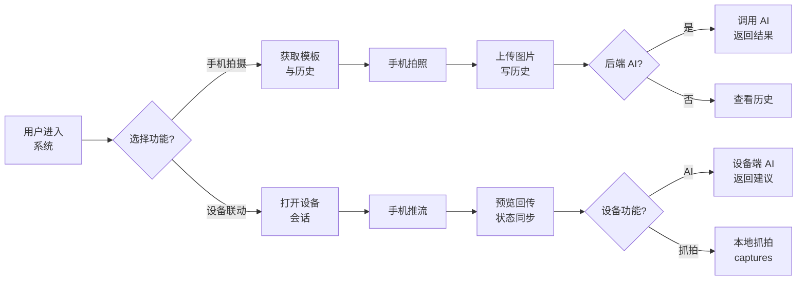

### 2. 手机独立拍摄时序图

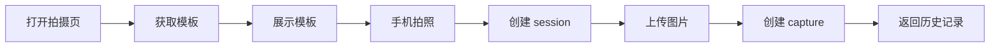

### 3. 后端 AI 分析时序图

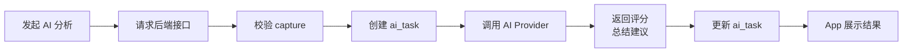

### 4. 设备联动主链路时序图

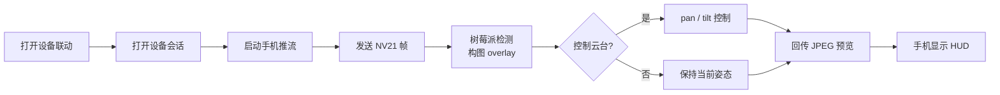

### 5. 自动找角度时序图

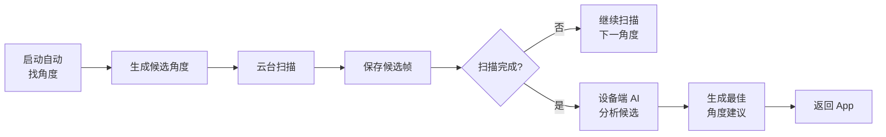

### 6. 背景锁机位时序图

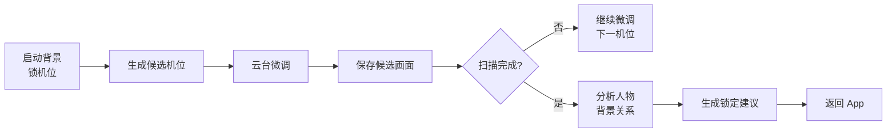

### 7. 手势抓拍时序图

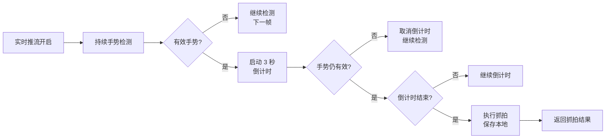

### 8. 历史与缓存回退时序图

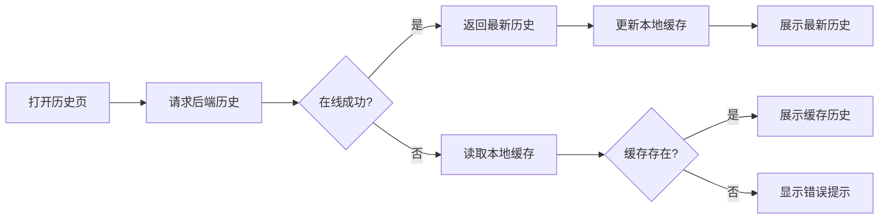

---

## 二、简洁流程图组

### 1. 总体流程图

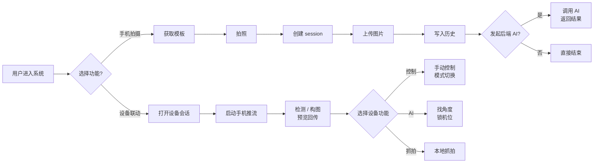

### 2. 手机独立拍摄流程图

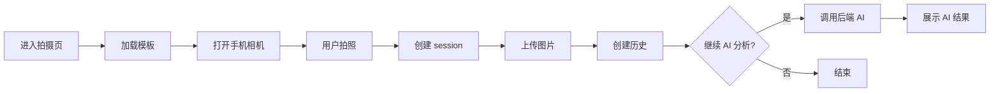

### 3. 后端 AI 分析流程图

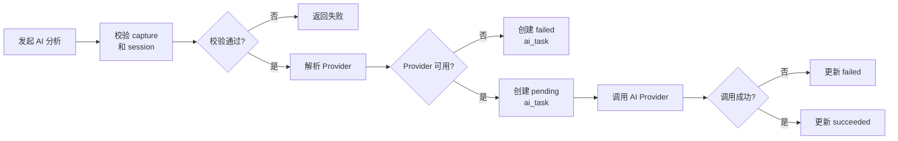

### 4. 设备联动主流程图

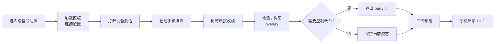

### 5. 自动找角度流程图


### 6. 背景锁机位流程图

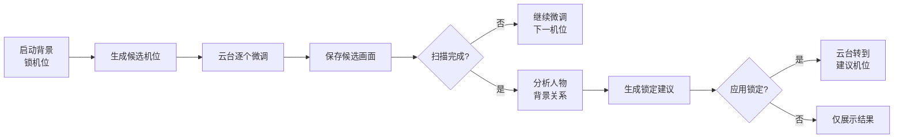

### 7. 手势抓拍流程图

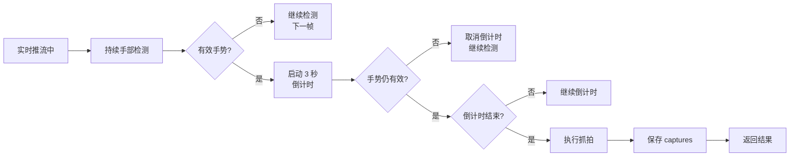

### 8. 模板流程图

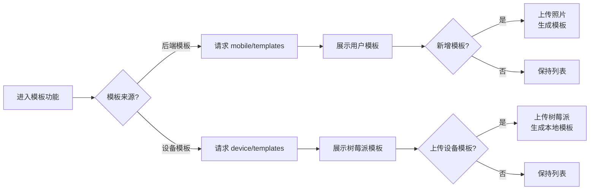

### 9. 历史与缓存流程图

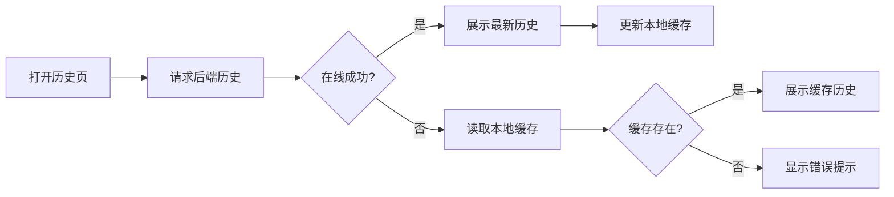

---

## 三、详细状态图中的全局总状态图

### 全局总状态图

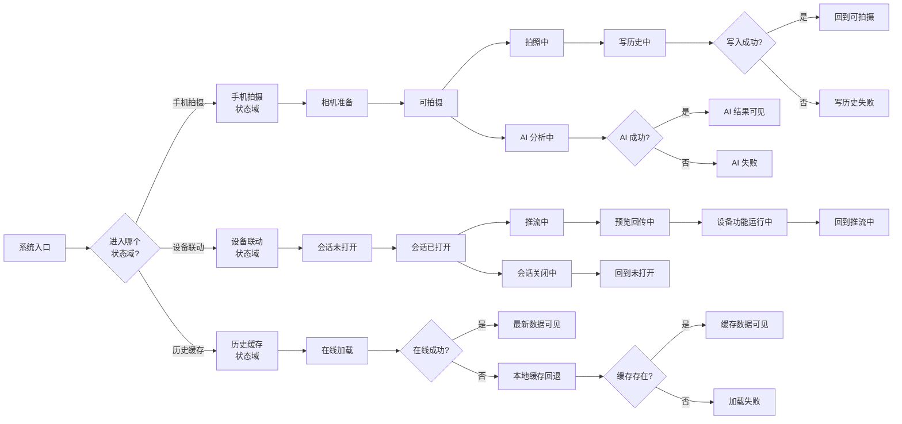
