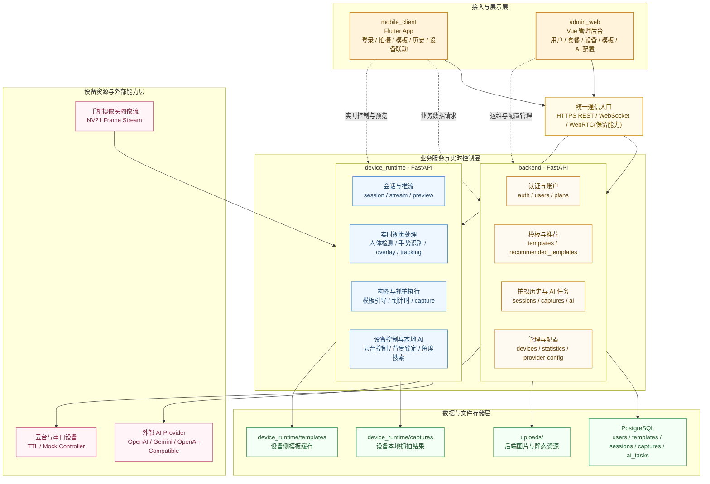

# 云影随行总体架构图

这张图用于展示项目的分层结构与跨端协作关系，表达方式参考常见“分层块状架构图”，但内容完全按当前仓库实现整理，适合放进答辩材料、汇报文档或项目总览页。

## 分层总体架构

静态图片版：

如果当前阅读环境不支持 Mermaid，请优先使用上面的 PNG 图片；下面保留 Mermaid 源图，方便后续继续修改。

## 阅读要点

- `mobile_client` 是用户侧主入口，既负责手机独立拍摄，也负责设备联动控制。
- `admin_web` 是运营管理入口，只对 `backend` 发起管理型请求，不直接进入设备实时链路。
- `backend` 承担业务主数据管理，是用户、套餐、模板、抓拍历史、AI 任务和 Provider 配置的中心。
- `device_runtime` 承担实时视觉与设备执行，是推流处理、姿态检测、云台控制、模板构图和本地抓拍的执行平面。
- AI 能力分成两类：后端侧通过 Provider 编排调用外部大模型；设备侧通过本地运行时完成实时分析与辅助决策。
- 图片与记录并不是单一落点：后端图片走 `uploads/`，设备本地抓拍走 `device_runtime/captures/`。

## 适用说明

- 如果要做汇报首页，直接使用“分层总体架构”这一张图即可。
- 如果要继续展开实现细节，建议和 [源码级技术文档](./源码级技术文档.md) 搭配阅读。
