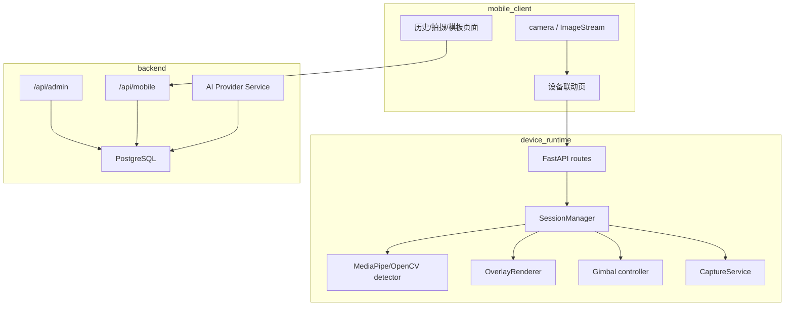

# 技术架构与运行机制详解

本文补充项目内部运行机制，重点说明当前真实链路和关键状态。

## 服务分层

## device_runtime 会话模型

设备端由 `SessionManager` 管理当前会话。核心状态包括：

- 当前视频源：`stream_url`。
- 当前模式：手动、跟随、智能构图等。
- 云台状态和跟随状态。
- 最新检测结果。
- overlay 配置。
- 手势抓拍状态。
- 设备端 AI 状态。

打开新 session 会替换旧 session。关闭 session 会释放推流、检测器和状态。

## 帧处理循环

当前默认手机推流路径：

1. 手机端通过 Android camera 获取 NV21 帧。
2. WebSocket 发送到 `/api/device/stream/mobile-ws`。
3. 设备端写入 `mobile_push_frame_store`。
4. 帧循环读取最新帧并转成 OpenCV BGR。
5. detector 根据配置做人体、手部、人脸检测。
6. frame processor 计算目标、构图状态和云台控制。
7. overlay renderer 绘制骨骼、手部、锚点、倒计时等信息。
8. 预览通过 `/api/device/preview-ws` 回传给手机。

## 检测器重建

`PATCH /api/device/config` 修改以下配置时，运行中的 session 会重建 detector/frame processor：

- `enable_pose_landmarks`
- `enable_face_landmarks`
- `enable_hand_landmarks`
- `tracking_anchor_mode`

这样可以避免开关骨骼/手部检测后帧循环继续持有旧 detector，导致 overlay 不显示或手势检测失效。

关闭某类检测时，设备端会清理对应最新结果，避免 UI 显示过期状态。

## overlay 和检测的区别

检测开关决定是否计算 landmarks；overlay 开关决定是否绘制。

例如：

- `enable_hand_landmarks=false`：不会计算手部关键点，手势抓拍不可用。
- `show_hands=false`：仍可计算手部关键点，但不在预览中绘制手部线条。

如果需要手势抓拍，必须开启手部检测，而不仅仅打开手部绘制。

## 手势抓拍倒计时

手势抓拍状态由 `GestureCaptureState` 和 `SessionManager` 维护。

流程：

1. 检测到有效手势。
2. 写入 `last_event`。
3. 启动 3 秒倒计时。
4. overlay 绘制倒计时。
5. `/api/device/status` 暴露 `gesture_status.capture_countdown`。
6. 倒计时结束后调用 `trigger_capture`。
7. 结果写入 `last_capture_result` 或 `last_capture_error`。

如果关闭手势抓拍或关闭手部检测，倒计时会被清理。

## 抓拍存储

设备端抓拍保存到 `device_runtime/captures`。手机端从设备接口读取结果：

- `POST /api/device/capture/trigger`
- `GET /api/device/capture/list`
- `GET /api/device/capture/file`

设备抓拍当前不自动创建后端 `capture`，也不自动调用后端 AI。

## 后端数据模型

后端核心表：

- `users`
- `plans`
- `user_subscriptions`
- `devices`
- `templates`
- `capture_sessions`
- `captures`
- `ai_tasks`
- `ai_provider_configs`

`captures.capture_type` 在 ORM 中允许 `device_link`，但默认设备联动流程不写入该类型。

## 性能瓶颈

树莓派卡顿通常来自多个任务叠加：

- 手机帧解码和颜色转换。
- MediaPipe 人体/手部/人脸检测。
- overlay 绘制。
- 云台控制和状态轮询。
- JPEG/WebRTC 编码回传。
- Wi-Fi 抖动。

优化优先级：

1. 使用 `DEVICE_RPI_PROFILE=performance`。
2. 降低检测输入尺寸和检测频率。
3. 降低预览缩放和帧率。
4. 关闭不必要的 face mesh、hand landmarks、body skeleton。
5. 使用更稳定的 5GHz 网络或树莓派热点。

## WebRTC 状态

仓库中有完整 WebRTC 相关依赖和接口：

- Flutter `flutter_webrtc`
- 设备端 `aiortc`
- `POST /api/device/webrtc/offer`
- `DeviceWebRtcService`

但当前手机端默认启动路径仍是 WebSocket NV21 fallback。文档和排查应以当前默认路径为准。
