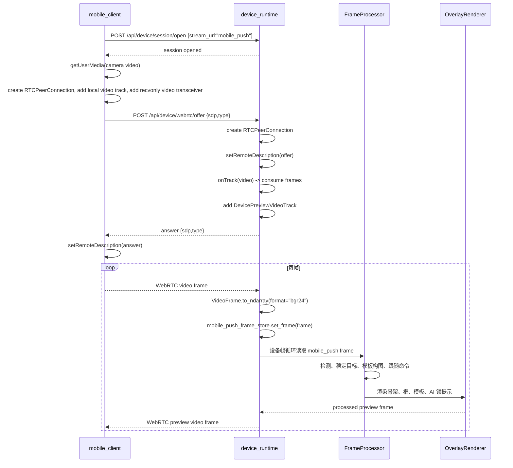
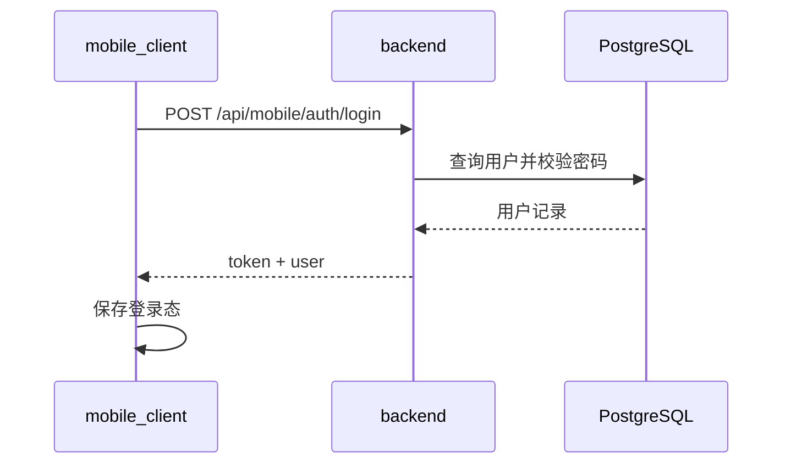
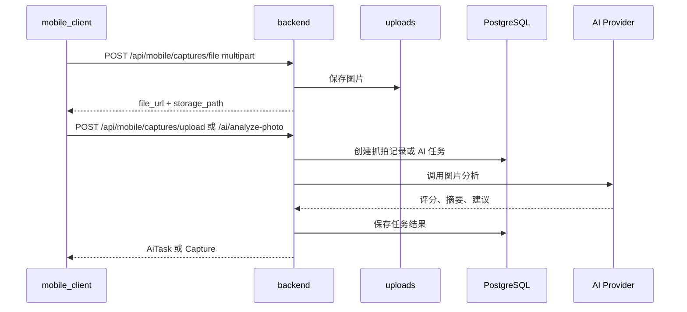
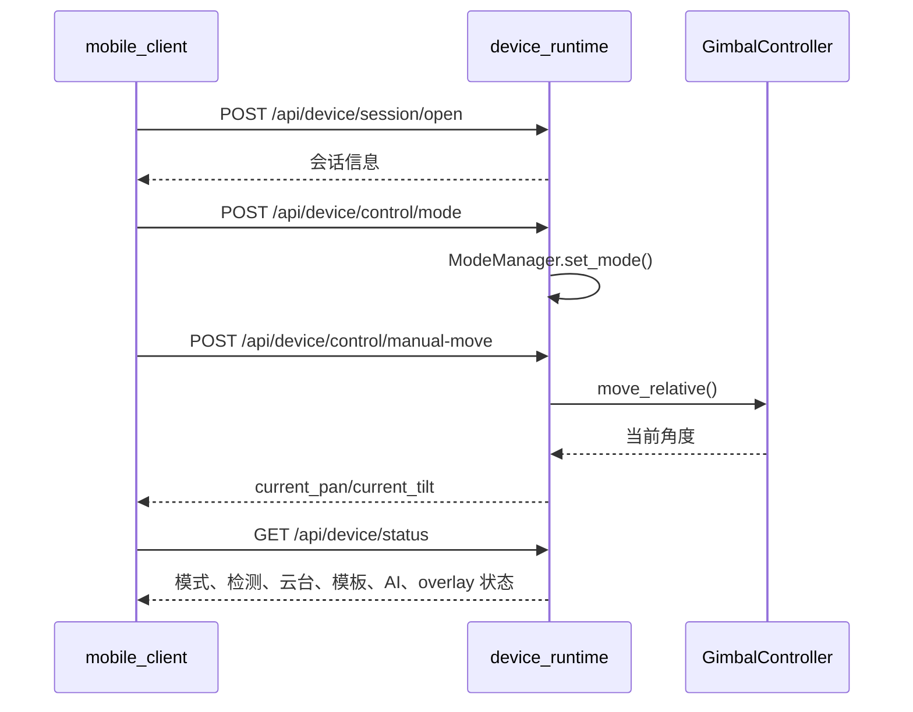

# 云影随行 技术架构与运行机制详解

本文档按当前代码整理，覆盖 `backend`、`mobile_client`、`device_runtime`、`admin_web`、`database` 的职责边界、通信链路、运行逻辑和协作方式。它是项目内最详细的技术文档；其他 README 和专题文档只保留启动、接口或演示所需的压缩信息。

## 1. 项目定位

云影随行 是一个“手机拍摄 + 本地设备联动 + AI 分析 + 管理后台”的多端系统。它既支持手机独立完成拍摄、模板叠加、照片上传和 AI 分析，也支持手机把摄像头画面推到树莓派或本机设备运行端，由设备端执行实时人体检测、构图判断、云台控制、抓拍、AI 背景锁和预览回传。

当前项目的关键变化是：设备联动主视频链路已经改为 WebRTC。手机端通过 `flutter_webrtc` 推送手机摄像头 video track 到 `device_runtime`；设备端通过 `aiortc` 接收 track，把视频帧转为 OpenCV BGR frame，继续进入原有检测、骨架、构图、云台、预览渲染流程；设备端再通过同一个 WebRTC PeerConnection 返回处理后的预览 video track。旧的 WebSocket NV21 推流、WebSocket JPEG 预览、`preview.jpg` 和单帧上传接口继续保留为 fallback。

## 2. 顶层模块

| 模块 | 技术栈 | 主要职责 | 默认端口 |
| --- | --- | --- | --- |
| `backend` | FastAPI, SQLAlchemy, PostgreSQL | 账号、套餐、订阅、模板、抓拍记录、AI 任务、上传文件、管理端 API | `8000` |
| `mobile_client` | Flutter, camera, flutter_webrtc, ML Kit | 手机登录、拍摄、模板、历史、设备联动、WebRTC 推流和预览 | 运行在手机/模拟器 |
| `device_runtime` | FastAPI, OpenCV, MediaPipe, aiortc, pyserial | 本地设备会话、视频源、检测、构图、云台控制、抓拍、设备 AI 编排、预览 | `8001` |
| `admin_web` | Vue 3, Vite, Element Plus, Pinia | 运营后台、用户/套餐/设备/模板/AI Provider/记录管理 | `5173` |
| `database` | PostgreSQL SQL | 业务后端数据库表结构、索引、触发器 | `5432` |

## 3. 总体架构

```mermaid
flowchart LR
  Mobile["mobile_client\nFlutter App"] -->|/api/mobile/* JSON + multipart| Backend["backend\nFastAPI"]
  Admin["admin_web\nVue 管理后台"] -->|/api/admin/* JSON + multipart| Backend
  Backend -->|SQLAlchemy| DB["PostgreSQL"]
  Backend -->|/uploads 静态文件| Uploads["uploads 目录"]
  Mobile -->|/api/device/* 控制接口| Device["device_runtime\nFastAPI + OpenCV"]
  Mobile <-->|WebRTC /api/device/webrtc/offer| Device
  Mobile -. fallback .->|WS /api/device/stream/mobile-ws\nPOST /api/device/stream/frame| Device
  Device -. fallback .->|WS /api/device/preview-ws\nGET /api/device/preview.jpg| Mobile
  Device -->|TTL bus 或 mock| Gimbal["云台/舵机"]
  Device -->|本地保存| Captures["captures 目录"]
```

系统分为两条主线：

1. 业务主线：手机和管理后台访问 `backend`，所有登录、用户数据、套餐、模板、业务抓拍记录和 AI 任务都通过业务后端落库。
2. 设备主线：手机设备联动页直接访问 `device_runtime`，设备运行时保持单个本地会话，负责实时视频、控制和预览。该链路不经过 `backend`，因为它要求低延迟和局域网直连。

## 4. 地址与网络模型

手机端保存两类地址：

| 配置 | 代码位置 | 用途 | 示例 |
| --- | --- | --- | --- |
| 业务后台地址 | `AppConfig.apiBaseUrl` | `/api/mobile/*` 登录、模板、历史、AI 任务 | `http://192.168.1.20:8000/api` |
| 设备运行时地址 | `AppConfig.deviceApiBaseUrl` | `/api/device/*` 控制、WebRTC signaling、fallback 流 | `http://192.168.1.30:8001` |

`mobile_client/lib/features/settings/server_config_page.dart` 中的设置页会保存这两个地址；设备联动 WebRTC 复用“设备运行时地址”，不会新增单独的 WebRTC 地址。

真机必须使用电脑或树莓派在同一局域网内的 IP，例如 `http://192.168.1.30:8001`。`127.0.0.1` 指向手机自己，`10.0.2.2` 只适用于 Android 模拟器访问宿主机。

## 5. 手机端运行逻辑

### 5.1 入口与配置

Flutter 入口是 `mobile_client/lib/main.dart`，应用壳在 `lib/app/camera_assistant_app.dart`。运行时配置由 `lib/services/app_config.dart` 管理：

- `API_BASE_URL`：业务后端地址，默认 Android 模拟器为 `http://10.0.2.2:8000/api`。
- `DEVICE_API_BASE_URL`：设备运行时地址，默认 Android 模拟器为 `http://10.0.2.2:8001`。
- 设置页保存后优先使用 `SharedPreferences` 中的地址。
- `normalizeApiBaseUrl()` 会确保业务地址以 `/api` 结尾。
- `normalizeDeviceApiBaseUrl()` 会移除末尾 `/api`，因为设备端接口真实路径是 `/api/device/*`，base URL 应是服务根地址。

### 5.2 服务层

| 服务 | 职责 |
| --- | --- |
| `ApiClient` | 通用 HTTP JSON envelope、multipart 上传、错误消息翻译。 |
| `MobileApiService` | 访问 `backend` 的 `/api/mobile/*`。 |
| `DeviceApiService` | 访问 `device_runtime` 的 `/api/device/*` 控制、状态、模板、抓拍和 fallback。 |
| `DeviceWebRtcService` | 用 `flutter_webrtc` 建立手机到设备的 WebRTC 推流和预览回传。 |
| `MobileCacheService` | 本地缓存模板、历史等数据。 |
| `MediaPipePoseDetectorService` | 手机侧姿态检测能力，用于手机独立拍摄和 overlay。 |

### 5.3 手机独立拍摄

手机独立拍摄页使用 `camera` 插件打开本机摄像头，在 Flutter UI 上叠加模板、姿态/构图辅助信息，并把最终照片上传给业务后端。

典型流程：

1. 用户登录，App 通过 `MobileApiService` 获取用户、套餐、模板和历史。
2. 拍摄页打开手机摄像头。
3. 用户选择模板或使用推荐模板。
4. 本地 overlay 按镜像和画面裁剪规则绘制，不依赖设备端。
5. 拍照后先上传文件到 `POST /api/mobile/captures/file`。
6. 再用返回的文件 URL 创建抓拍记录或 AI 分析任务。
7. 历史页从 `backend` 读取拍摄会话、抓拍记录和 AI 任务结果。

### 5.4 设备联动页

设备联动页是 `mobile_client/lib/features/device_link/device_link_page.dart`。它承担四类工作：

- 打开/关闭设备会话：`POST /api/device/session/open`、`POST /api/device/session/close`。
- 控制设备：模式切换、云台方向、回中、跟随模式、模板选择、AI 背景锁、设备抓拍。
- 视频链路：优先 WebRTC，失败自动切换到 WebSocket/JPEG fallback。
- 预览显示：WebRTC 返回 `RTCVideoView`；fallback 返回 JPEG frame 并用 `Image.memory` 显示。

设备联动使用固定 `stream_url = "mobile_push"` 时，设备端视频源来自手机。也可以传入 RTSP、摄像头编号等 OpenCV 支持的视频源，但手机推流和 WebRTC 只在 `mobile_push` 模式下生效。

## 6. WebRTC 视频链路

### 6.1 主链路

当前主链路改为 WebRTC：

- 手机推送真实 video track，而不是手动拆帧。
- 设备端用 `aiortc` 接收 `VideoFrame` 并转为 OpenCV frame。
- 设备端把处理后的预览作为 video track 返回。
- signaling 仍走普通 HTTP，接口为 `POST /api/device/webrtc/offer`。
- WebSocket/JPEG 仍保留为 fallback，方便旧设备、调试和故障兜底。

### 6.2 WebRTC 端到端时序



### 6.3 Flutter WebRTC 实现

`DeviceWebRtcService.start()` 做以下事情：

1. 初始化 `RTCVideoRenderer`。
2. 创建 `RTCPeerConnection`，使用 `unified-plan`。
3. 调用 `navigator.mediaDevices.getUserMedia()` 获取手机摄像头 video stream。
4. 根据 `CameraLensDirection` 选择 `facingMode: user` 或 `environment`。
5. 把本地 video track 加入 peer connection。
6. 增加一个 `RecvOnly` video transceiver，用于接收设备端预览。
7. 创建 offer，设置 local description，并等待 ICE gathering 完成或超时。
8. 把 SDP offer POST 到设备端 `/api/device/webrtc/offer`。
9. 收到 answer 后设置 remote description。
10. `onTrack` 收到设备端 video stream 后绑定到 `remoteRenderer.srcObject`。

设备联动页用 `RTCVideoView` 显示远端预览。

### 6.4 设备端 WebRTC 实现

`device_runtime/api/routes/webrtc.py` 提供：

```text
POST /api/device/webrtc/offer
```

设备端要求当前会话的 `stream_url` 必须是 `mobile_push`。这是为了明确当前视频源来自手机推流，而不是本地摄像头或 RTSP。否则接口返回 `409`。

收到移动端 video track 后，设备端执行：

```text
await track.recv()
VideoFrame.to_ndarray(format="bgr24")
mobile_push_frame_store.set_frame(image)
```

返回预览由 `DevicePreviewVideoTrack` 负责。它每隔约 `1 / ui_refresh_fps` 秒从当前 session 读取 `get_preview_frame()`，转换成 `av.VideoFrame`，通过 WebRTC 发回手机。没有画面时返回黑底占位帧，避免远端 track 断流。

### 6.5 WebRTC 与旧 fallback 的关系

当前设备联动页启动手机画面推送时：

1. 先尝试 WebRTC。
2. WebRTC 成功后，手机显示 `WebRTC 预览`，状态显示 `WebRTC 推流`。
3. 如果 WebRTC signaling、权限、网络或设备端依赖失败，则停止 WebRTC，切到旧 fallback。
4. fallback 上行使用 `WS /api/device/stream/mobile-ws`，发送 Android NV21 帧。
5. fallback 下行使用 `WS /api/device/preview-ws`，返回 JPEG bytes。
6. `POST /api/device/stream/frame` 和 `GET /api/device/preview.jpg` 继续保留给调试和降级。

## 7. device_runtime 运行逻辑

### 7.1 启动入口

设备端真实 API 入口是：

```powershell
uvicorn device_runtime.api.app:app --host 0.0.0.0 --port 8001
```

`device_runtime/main.py` 是占位提示，不是当前 FastAPI 服务入口。

`api/app.py` 初始化 FastAPI，挂载 `ai`、`capture`、`session`、`control`、`status`、`stream`、`templates` 和 `webrtc` 路由。应用关闭时会执行 `close_webrtc_peers()`，释放仍在运行的 WebRTC PeerConnection。

### 7.2 单会话管理

`device_runtime/api/session_manager.py` 中的 `SessionManager` 管理一个当前 session。打开新会话会先关闭旧会话，这意味着设备端是“单设备、单活会话”的本地运行时。

打开会话时构建 `DeviceSessionContext`：

1. 保存 `session_code`、`stream_url`、`mirror_view`、`start_mode`。
2. 加载 `DeviceRuntimeConfig`。
3. 创建 `RuntimeState`。
4. 创建 `ModeManager`，初始模式来自请求。
5. 创建 `TrackingController`。
6. 创建 `GimbalController`，根据环境变量使用 mock 或 TTL bus。
7. 创建 `ControlService`。
8. 创建模板仓库、模板库和模板服务。
9. 创建 `CaptureService` 和 `AIOrchestrator`。
10. 根据 `stream_url` 创建 `VideoSource`。
11. 创建异步检测器、帧处理器和 overlay renderer。
12. 启动帧循环线程。

关闭会话会停止帧循环、停止视频源、释放检测器和设备资源。

### 7.3 视频源

视频源在 `device_runtime/vision/video_source.py` 中统一抽象：

| 视频源 | 触发条件 | 说明 |
| --- | --- | --- |
| `MobilePushVideoSource` | `stream_url == "mobile_push"` | 从 `mobile_push_frame_store` 读取手机推来的最新帧。WebRTC 和 WebSocket fallback 都写入同一个 store。 |
| `OpenCVVideoSource` | 其他 `stream_url` | 用 `cv2.VideoCapture` 读取摄像头编号、RTSP、HTTP 视频流或文件。 |

`MobilePushFrameStore` 是线程安全的 latest-frame store。WebRTC 接收协程或 WebSocket handler 写入最新帧，设备帧处理线程读取最新帧。该设计避免了队列积压，适合实时预览和控制。

### 7.4 帧处理管线

设备帧循环在 `DeviceSessionContext` 内运行。核心管线是：

```text
VideoSource.read()
-> mirror/capture frame normalization
-> AsyncDetector / Detector
-> FrameProcessor.process_frame()
-> ControlService / GimbalController
-> CaptureService / AIOrchestrator
-> DeviceOverlayRenderer
-> latest_preview_frame
```

`FrameProcessor` 只负责算法决策，不负责 UI 渲染和硬件执行：

- 从检测结果中按 follow mode 选择目标。
- 通过 `reliable_detection()` 做稳定检测过滤。
- 在 `SMART_COMPOSE` 模式下评估模板构图。
- 计算模板目标点和是否达标。
- 在 `AUTO_TRACK` 或需要自动构图时计算云台跟随命令。
- AI 背景锁开启时阻止自动跟随，避免锁定机位被自动追踪打破。

### 7.5 检测与姿态

检测能力由 `device_runtime/vision/detector.py` 和 `app_core.py` 提供。运行时会按环境和依赖选择 MediaPipe、可选 YOLO 或 OpenCV HOG。设备端 overlay 会绘制人体框、骨架、手部、模板框、模板骨架、AI 锁机位框等。前摄镜像相关逻辑保留在 session 的 frame/overlay 处理里，WebRTC 改造只替换视频传输，不改变 overlay 坐标对齐策略。

### 7.6 模式

| 模式 | 行为 |
| --- | --- |
| `MANUAL` | 只做预览、检测和状态更新，云台由用户手动控制。 |
| `AUTO_TRACK` | 检测到稳定目标后，根据跟随算法自动移动云台。 |
| `SMART_COMPOSE` | 结合选中模板评估构图，可手势抓拍，也可按配置自动转动云台。 |

### 7.7 云台控制

控制入口位于 `device_runtime/api/routes/control.py`：

- `POST /api/device/control/manual-move`
- `POST /api/device/control/mode`
- `POST /api/device/control/home`
- `POST /api/device/control/follow-mode`

`ControlService` 封装模式、跟随模式、速度模式、手动移动、相对移动、绝对定位和回中。底层由 `GimbalController` 执行，mock 模式用于本机调试，TTL bus 模式用于树莓派和真实舵机。

### 7.8 抓拍与设备 AI

设备抓拍入口：

- `POST /api/device/capture/trigger`
- `GET /api/device/capture/list`
- `GET /api/device/capture/file?path=...`

`CaptureService` 从当前可保存帧写入本地 `captures` 目录。如果 `auto_analyze=true` 且设备端配置了 AI assistant，会同步分析该抓拍图片并返回分析摘要。设备端抓拍目前保存在设备本地；业务后端的移动端抓拍则保存在 `uploads`，两者是不同存储域。

设备端 AI 主要在 `AIOrchestrator` 中：

- `start_angle_search()`：控制云台扫描候选角度，保存临时图片，调用 AI 选出最佳角度，然后云台移动到最佳角度并保存结果。
- `start_background_lock()`：扫描背景候选，AI 选择推荐站位框，设备进入背景锁模式。
- `unlock_background_lock()`：解除背景锁。
- `update_lock_fit_score()`：根据当前检测框与 AI 推荐目标框的 IoU 更新匹配分数。

## 8. backend 运行逻辑

业务后端入口：

```powershell
uvicorn backend.app.main:app --host 0.0.0.0 --port 8000
```

`backend/app/main.py` 创建 FastAPI app，配置 CORS，挂载 `/uploads` 静态目录，并把 `api_router` 挂载到 `/api`。

`backend/app/api/router.py` 注册 `/api/health`、`/api/mobile/*` 和 `/api/admin/*`。

后端采用常见分层：

```text
routes -> services -> repositories/models -> database
```

`MobileService` 处理手机业务逻辑，包括创建会话、创建抓拍记录、创建 AI 任务、查询历史。`AdminService` 处理后台管理业务。`AuthService` 负责移动端和管理端登录注册。`AiProviderService` 负责 Provider 选择、图片分析和结果解析。

Provider 配置存在 `ai_provider_configs` 表中，由管理后台维护。套餐的 `feature_flags` 可以指定 `default_ai_provider_code` 和 `available_ai_provider_codes`。手机端不会直接持有 AI API key。

## 9. admin_web 运行逻辑

管理后台是 Vue 3 单页应用：

- `src/main.js` 初始化 Vue、Pinia、Element Plus 和 router。
- `src/router/index.js` 定义登录页和 `/admin/*` 后台路由。
- `src/stores/app.js` 保存 token、当前用户和 API 地址。
- `src/api/http.js` 封装 Axios。
- `src/api/admin.js` 封装后台 API。
- `src/views/*` 实现用户、套餐、设备、模板、抓拍、AI 任务和 Provider 配置页面。

管理后台只访问 `backend`，不直接访问 `device_runtime`。设备运行时地址由手机端设置页维护，管理后台的设备列表主要是业务登记和运营管理，不代表实时连接。

## 10. 数据库模型

核心表在 `database/schema.sql`：

| 表 | 说明 |
| --- | --- |
| `users` | 用户和管理员账号。 |
| `plans` | 套餐定义，含功能开关和额度。 |
| `user_subscriptions` | 用户订阅关系。 |
| `devices` | 设备登记信息。 |
| `templates` | 用户模板和推荐模板。 |
| `capture_sessions` | 拍摄会话。 |
| `captures` | 抓拍记录。 |
| `ai_tasks` | AI 分析、背景分析、连拍选优任务。 |
| `ai_provider_configs` | AI Provider 配置和密钥。 |

业务后端还会在 `backend/app/core/db.py` 中做少量兼容补丁，用于旧库补字段或约束。已有数据库升级时建议运行 `backend/init_db.py`。

## 11. 关键通信链路

### 11.1 登录链路



### 11.2 手机照片上传与 AI 分析



### 11.3 设备联动控制链路



### 11.4 模板与抓拍链路

设备模板有两种来源：

1. 手机业务模板：从 `backend` 获取模板数据，然后设备联动页下发给 `device_runtime`。
2. 设备本地模板：通过设备端 `/api/device/templates/upload` 导入图片并生成模板 profile。

设备抓拍不经过业务后端：

```text
mobile_client -> POST /api/device/capture/trigger -> device_runtime -> captures 目录
```

手机可通过 `/api/device/capture/list` 和 `/api/device/capture/file` 查看和下载设备端本地抓拍。若要把设备端抓拍也统一入业务库，需要额外做“设备抓拍上传 backend”的同步流程，目前代码没有自动执行。

## 12. 运行和重启规则

| 改动 | 需要执行 |
| --- | --- |
| `backend` Python 依赖或配置 | `pip install -r backend/requirements.txt`，重启 backend |
| `device_runtime` Python 依赖或 WebRTC/视频代码 | `pip install -r device_runtime/requirements.txt`，重启 device_runtime |
| Flutter 依赖 | `flutter pub get`，重新运行或重新安装 APK |
| Android Manifest、Gradle、插件 | 重新 `flutter build apk --debug` 或 `flutter run` |
| Vue 管理端依赖 | `npm install`，重启 `npm run dev` |

WebRTC 改造涉及 `flutter_webrtc` 和 `aiortc`，因此手机端需要重新构建安装 APK，设备端需要安装 Python 依赖并重启 `device_runtime`。

## 13. 真机联调检查清单

如果真机设备联动失败，按下面顺序检查：

1. 手机和电脑/树莓派是否在同一局域网。
2. 手机设置页的“设备运行时地址”是否是局域网 IP，例如 `http://192.168.1.30:8001`。
3. 不要在真机上使用 `127.0.0.1` 或 `10.0.2.2`。
4. 设备端是否用 `--host 0.0.0.0 --port 8001` 启动。
5. Windows 防火墙或路由器是否拦截 `8001`。
6. `GET http://设备IP:8001/api/device/health` 是否能从手机浏览器打开。
7. Android 是否授予摄像头权限。
8. Android Manifest 是否保留 `INTERNET`、`CAMERA`、`RECORD_AUDIO`、`ACCESS_NETWORK_STATE` 和 `usesCleartextTraffic=true`。
9. 设备端虚拟环境是否安装 `aiortc`、`av`、`websockets`。
10. 当前设备 session 是否用 `stream_url = "mobile_push"`。
11. 如果 WebRTC 不通，观察 App 是否自动落到 WebSocket/JPEG fallback。
12. fallback 仍失败时检查 `/api/device/stream/mobile-ws`、`/api/device/preview-ws` 是否能握手。

## 14. 当前已知边界

- `device_runtime` 是单会话模型，不支持多手机同时控制同一设备。
- WebRTC signaling 当前是 HTTP offer/answer，没有 TURN/STUN；设计目标是同一局域网直连。
- 设备抓拍和业务后端抓拍仍是两套存储域。
- AI 任务在业务后端仍是同步请求内执行，没有独立队列。
- 真实树莓派和 TTL 舵机需要现场校准串口、舵机 ID、方向、角度范围和供电。
- WebRTC 主链路不会改变前摄镜像和 overlay 对齐逻辑，后续改 UI 时仍需专门验证前摄、后摄、横竖屏和裁剪比例。

## 15. 推荐维护规则

- 改接口时同步更新 `docs/接口契约.md`。
- 改启动方式、依赖或网络要求时同步更新 `docs/部署说明.md`。
- 改模块职责或通信流程时同步更新本文档和 `docs/项目总览与架构说明.md`。
- 改 AI Provider、分析结果结构或任务流程时同步更新 `docs/AI照片分析链路说明.md`。
- 改设备联动或视频链路时同步更新 `device_runtime/README.md`、`mobile_client/README.md` 和 `docs/统一采集存储与协同流程.md`。
