# 横平竖直简洁图

本文用于生成更接近流程绘图工具风格的图表，整体参考“横平竖直、方块/菱形统一、箭头清楚”的画法。

与原来的简洁图相比，这份文档做了三个调整：

1. 所有图统一使用 `flowchart LR`，方便横向放置。
2. 不再使用标准 `sequenceDiagram` 的生命线形式，而是把时序逻辑改成“横向调用链路图”。
3. 尽量控制矩形与菱形的文字长度，让比例更接近、连接更规整。

## 绘图规范

建议渲染或二次绘制时遵守以下规则：

- 方向统一：从左到右。
- 连接统一：横线、竖线、直角折线，避免曲线。
- 矩形表示动作或状态。
- 菱形表示判断。
- “是 / 否”必须标在线上。
- 同一张图内矩形大小尽量接近。
- 同一张图内菱形大小尽量接近。
- 长文字使用换行，避免方块过宽。
- 避免跨越太多层级的斜线。

每张 Mermaid 图都内置了相同的渲染配置：

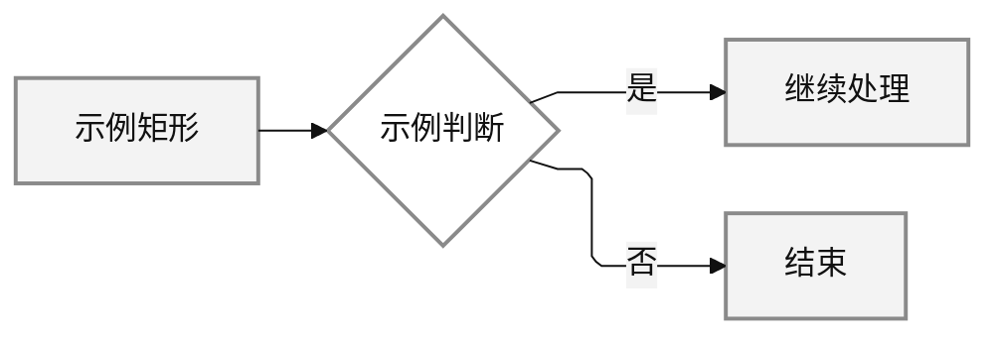

---

## 一、简洁时序图组

### 1. 总体时序图

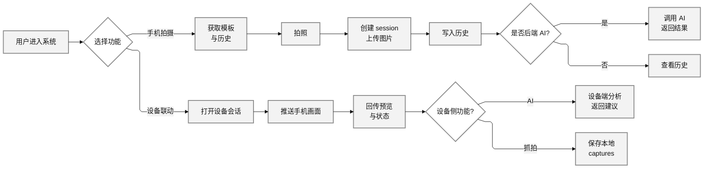

### 2. 手机独立拍摄时序图

```mermaid
%%{init: {"theme":"base","flowchart":{"defaultRenderer":"elk","curve":"linear","nodeSpacing":42,"rankSpacing":58},"themeVariables":{"fontFamily":"Microsoft YaHei, SimHei, Arial","primaryColor":"#f3f3f3","primaryTextColor":"#111111","primaryBorderColor":"#8a8a8a","lineColor":"#111111","tertiaryColor":"#ffffff"}}}%%
flowchart LR
  A[打开拍摄页] --> B[获取模板]
  B --> C[展示模板]
  C --> D[手机拍照]
  D --> E[创建 session]
  E --> F[上传图片]
  F --> G[创建 capture]
  G --> H[返回历史记录]

  classDef box fill:#f3f3f3,stroke:#8a8a8a,stroke-width:2px,color:#111111;
  class A,B,C,D,E,F,G,H box;
```

### 3. 后端 AI 分析时序图

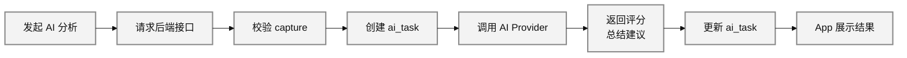

### 4. 设备联动主链路时序图

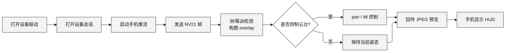

### 5. 自动找角度时序图

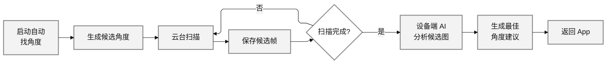

### 6. 背景锁机位时序图

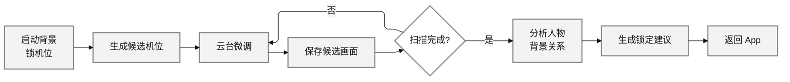

### 7. 手势抓拍时序图

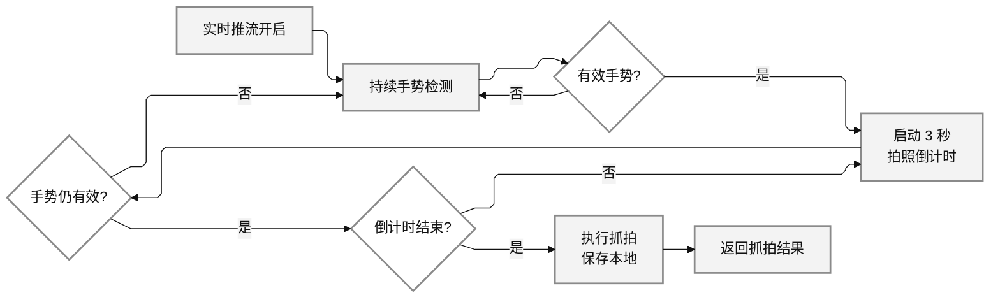

### 8. 历史与缓存回退时序图

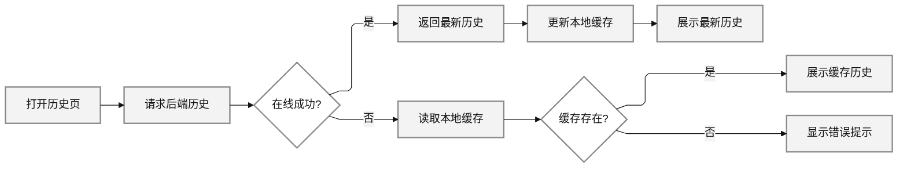

---

## 二、简洁流程图组

### 1. 总体流程图

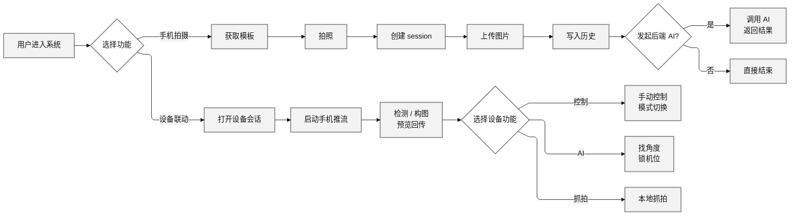

### 2. 手机独立拍摄流程图

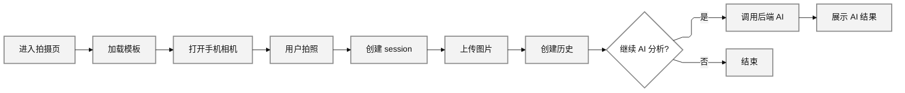

### 3. 后端 AI 分析流程图

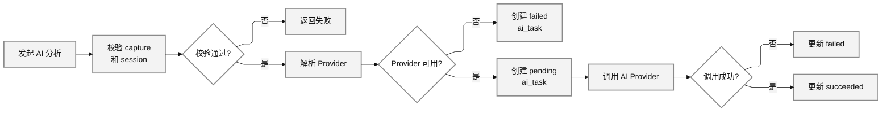

### 4. 设备联动主流程图

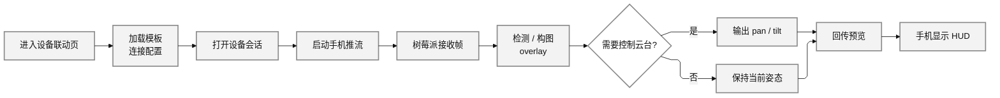

### 5. 自动找角度流程图

### 6. 背景锁机位流程图

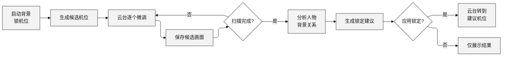

### 7. 手势抓拍流程图

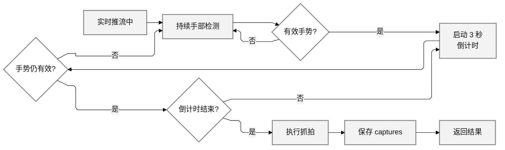

### 8. 模板流程图

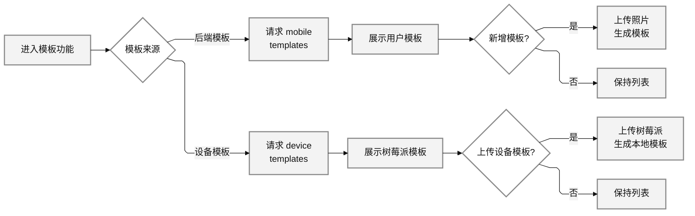

### 9. 历史与缓存流程图

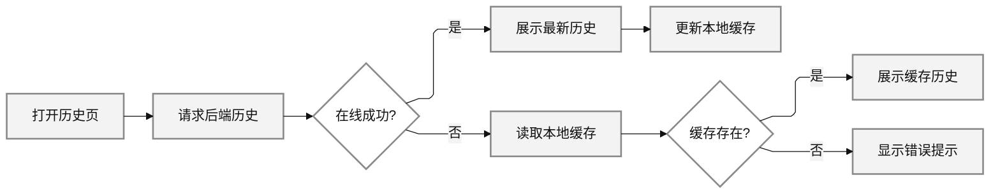

---

## 三、全局总状态图

> 这一张来自“详细状态图”的全局总状态图，但改成横向方块/菱形风格，便于和上面的图保持一致。

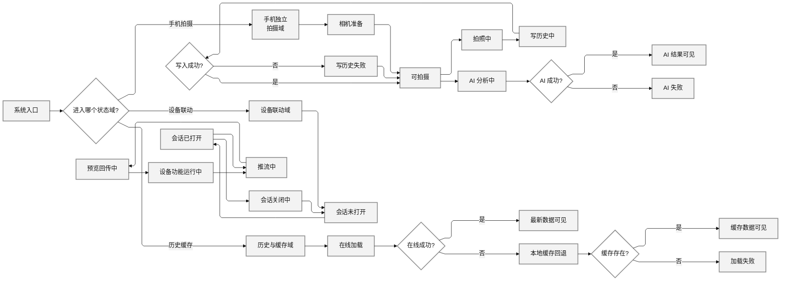
