# 正交直线图文档

本文是给 image2 / 其他绘图 AI 使用的“横平竖直版”图表文档。

这版不再优先使用 Mermaid，因为 Mermaid 会自动路由，遇到分支、回环时容易把线画成弯线或斜线。本文统一使用 Graphviz DOT 风格描述，核心约束是：

- `rankdir=LR`：所有图从左到右。
- `splines=ortho`：连接线使用正交折线，尽量横平竖直。
- `shape=box`：动作、状态统一用矩形。
- `shape=diamond`：判断统一用菱形。
- `width / height / fixedsize`：矩形和菱形尽量保持统一比例。
- 不画回环大弯线，循环逻辑改成“继续扫描 / 继续检测 / 回到可拍摄”等前向节点表达。

统一出图提示词：

> 请按照 DOT 图中的节点与连线生成一张简洁大气的技术流程图。画面从左到右横向排布，所有连接线必须横平竖直，优先使用 90 度折线，不要使用弯曲曲线。矩形和菱形比例尽量统一，矩形为浅灰底深灰边框，菱形为白底深灰边框，箭头为黑色，线宽一致，中文字体清晰。整体风格参考 draw.io / Visio 技术流程图，留白充分，排版整齐。

通用 DOT 样式：

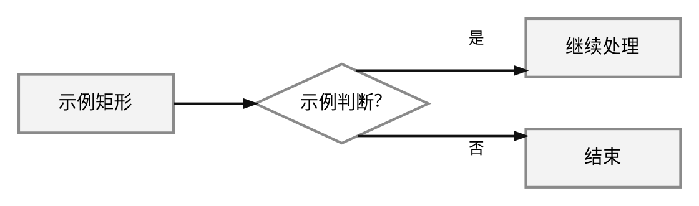

---

## 一、简洁时序图组

### 1. 总体时序图

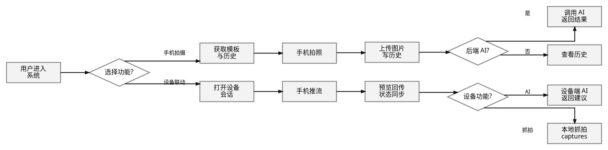

### 2. 手机独立拍摄时序图

```dot
digraph G {
  graph [rankdir=LR, splines=ortho, nodesep=0.55, ranksep=0.85, bgcolor="transparent", pad=0.2];
  node [fontname="Microsoft YaHei", fontsize=14, style="filled", fillcolor="#f3f3f3", color="#8a8a8a", penwidth=2, width=1.65, height=0.62, fixedsize=true];
  edge [fontname="Microsoft YaHei", fontsize=12, color="#111111", penwidth=1.8, arrowsize=0.8];

  A [label="打开\n拍摄页", shape=box];
  B [label="获取模板", shape=box];
  C [label="展示模板", shape=box];
  D [label="手机拍照", shape=box];
  E [label="创建\nsession", shape=box];
  F [label="上传图片", shape=box];
  G [label="创建\ncapture", shape=box];
  H [label="返回历史\n记录", shape=box];

  A -> B -> C -> D -> E -> F -> G -> H;
}
```

### 3. 后端 AI 分析时序图

```dot
digraph G {
  graph [rankdir=LR, splines=ortho, nodesep=0.55, ranksep=0.85, bgcolor="transparent", pad=0.2];
  node [fontname="Microsoft YaHei", fontsize=14, style="filled", fillcolor="#f3f3f3", color="#8a8a8a", penwidth=2, width=1.65, height=0.62, fixedsize=true];
  edge [fontname="Microsoft YaHei", fontsize=12, color="#111111", penwidth=1.8, arrowsize=0.8];

  A [label="发起 AI\n分析", shape=box];
  B [label="请求后端\n接口", shape=box];
  C [label="校验\ncapture", shape=box];
  D [label="创建\nai_task", shape=box];
  E [label="调用 AI\nProvider", shape=box];
  F [label="返回评分\n总结建议", shape=box];
  G [label="更新\nai_task", shape=box];
  H [label="App 展示\n结果", shape=box];

  A -> B -> C -> D -> E -> F -> G -> H;
}
```

### 4. 设备联动主链路时序图

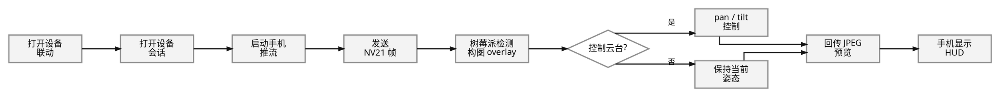

### 5. 自动找角度时序图

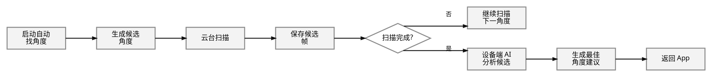

### 6. 背景锁机位时序图

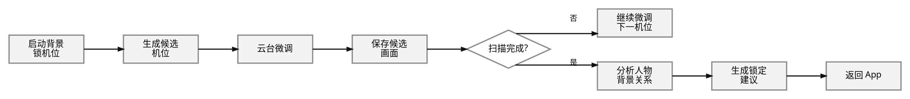

### 7. 手势抓拍时序图

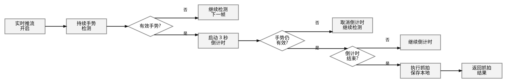

### 8. 历史与缓存回退时序图

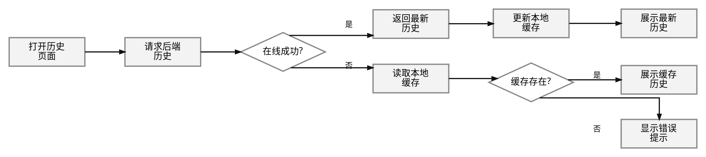

---

## 二、简洁流程图组

### 1. 总体流程图

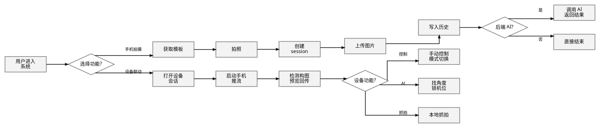

### 2. 手机独立拍摄流程图

```dot
digraph G {
  graph [rankdir=LR, splines=ortho, nodesep=0.55, ranksep=0.85, bgcolor="transparent", pad=0.2];
  node [fontname="Microsoft YaHei", fontsize=14, style="filled", fillcolor="#f3f3f3", color="#8a8a8a", penwidth=2, width=1.65, height=0.62, fixedsize=true];
  edge [fontname="Microsoft YaHei", fontsize=12, color="#111111", penwidth=1.8, arrowsize=0.8];

  A [label="进入\n拍摄页", shape=box];
  B [label="加载模板", shape=box];
  C [label="打开手机\n相机", shape=box];
  D [label="用户拍照", shape=box];
  E [label="创建\nsession", shape=box];
  F [label="上传图片", shape=box];
  G [label="创建历史", shape=box];
  H [label="继续 AI?", shape=diamond, fillcolor="#ffffff", width=1.85, height=0.85];
  I [label="调用后端\nAI", shape=box];
  J [label="展示 AI\n结果", shape=box];
  K [label="结束", shape=box];

  A -> B -> C -> D -> E -> F -> G -> H;
  H -> I [label="是"];
  I -> J;
  H -> K [label="否"];
}
```

### 3. 后端 AI 分析流程图

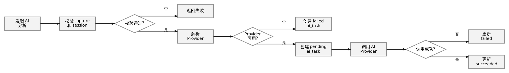

### 4. 设备联动主流程图

```dot
digraph G {
  graph [rankdir=LR, splines=ortho, nodesep=0.55, ranksep=0.85, bgcolor="transparent", pad=0.2];
  node [fontname="Microsoft YaHei", fontsize=14, style="filled", fillcolor="#f3f3f3", color="#8a8a8a", penwidth=2, width=1.65, height=0.62, fixedsize=true];
  edge [fontname="Microsoft YaHei", fontsize=12, color="#111111", penwidth=1.8, arrowsize=0.8];

  A [label="进入设备\n联动页", shape=box];
  B [label="加载模板\n连接配置", shape=box];
  C [label="打开设备\n会话", shape=box];
  D [label="启动手机\n推流", shape=box];
  E [label="树莓派\n接收帧", shape=box];
  F [label="检测构图\noverlay", shape=box];
  G [label="控制云台?", shape=diamond, fillcolor="#ffffff", width=1.85, height=0.85];
  H [label="输出\npan / tilt", shape=box];
  I [label="保持当前\n姿态", shape=box];
  J [label="回传预览", shape=box];
  K [label="手机显示\nHUD", shape=box];

  A -> B -> C -> D -> E -> F -> G;
  G -> H [label="是"];
  G -> I [label="否"];
  H -> J;
  I -> J;
  J -> K;
}
```

### 5. 自动找角度流程图

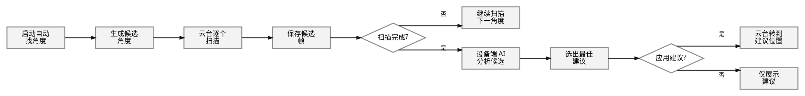

### 6. 背景锁机位流程图

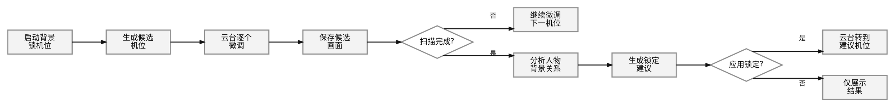

### 7. 手势抓拍流程图

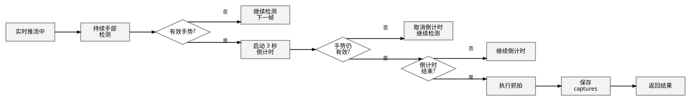

### 8. 模板流程图

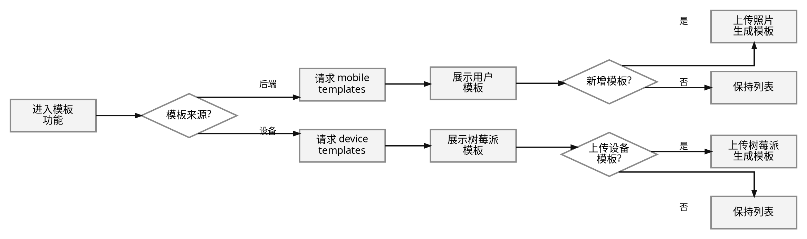

### 9. 历史与缓存流程图

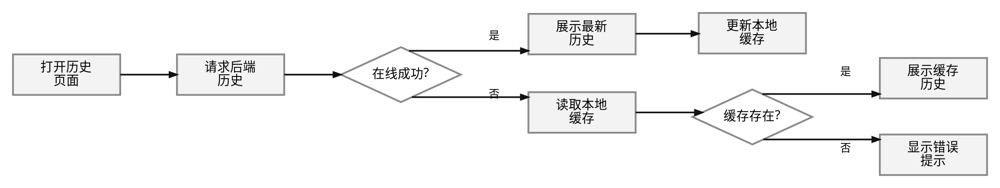

---

## 三、详细状态图中的全局总状态图

### 全局总状态图

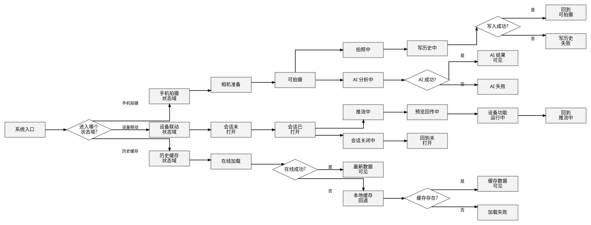
