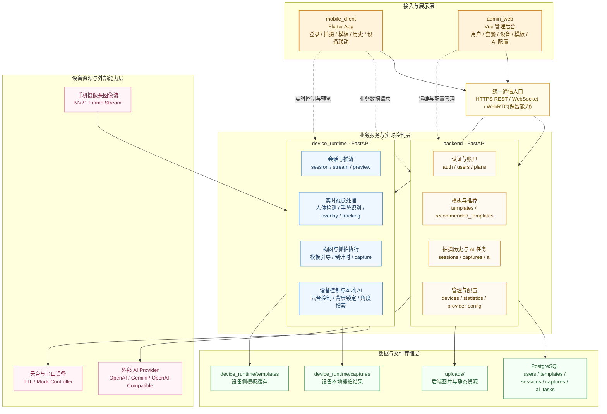

# 云影随行源码级技术文档

## 1. 文档定位

本文档基于当前仓库源码梳理，目标不是替代已有专题文档，而是补充一份“代码实现对齐版”的总技术说明，重点回答下面四类问题：

- 这套系统在代码层面到底由哪些模块构成。
- 各端之间真实的数据流、控制流和状态边界是什么。
- 哪些能力已经落到实现，哪些只是预留接口或兼容层。
- 当前实现里有哪些维护成本、技术债和演进风险需要提前注意。

适用范围：

- `backend`
- `device_runtime`
- `mobile_client`
- `admin_web`
- `database`

阅读建议：

1. 先看“总体架构”和“核心链路”。
2. 再按自己负责的模块阅读对应章节。
3. 最后重点看“实现约束与已识别风险”。

---

## 2. 总体架构

### 2.1 系统角色

仓库是一个多端协同的智能拍摄系统，分成四个运行平面：

| 平面 | 模块 | 主要职责 |
| --- | --- | --- |
| 用户交互平面 | `mobile_client` | 登录、拍摄、模板、历史、设备联动 |
| 设备执行平面 | `device_runtime` | 视频流处理、人体检测、云台控制、设备抓拍、本地 AI |
| 业务管理平面 | `backend` | 用户、套餐、模板、历史、AI 任务、Provider 配置 |
| 运营后台平面 | `admin_web` | 管理后台 CRUD 与 AI 配置管理 |

### 2.2 高层协作关系



单页展示版本可参考：[总体架构图](./总体架构图.md)。

### 2.3 两条核心业务链路

#### 链路 A：手机独立拍摄

`mobile_client -> backend -> uploads + database`

特点：

- 手机直接拍照。
- 图片先上传到后端静态目录。
- 后端再写入 `captures`、`capture_sessions`、`ai_tasks` 等业务记录。
- AI 分析主要走 `backend` 中的 Provider 编排。

#### 链路 B：设备联动拍摄

`mobile_client -> device_runtime`

特点：

- 手机负责推流、预览、远程控制和部分结果落库补录。
- 树莓派/设备运行时负责实时视觉、云台运动、模板引导、手势抓拍和本地 AI。
- 设备抓拍默认只保存在 `device_runtime/captures`，不会自动同步到后端历史。
- 手机联动页可以在设备抓拍后“补记”到后端历史会话中。

---

## 3. 仓库结构与模块职责

### 3.1 目录概览

| 目录 | 技术栈 | 代码职责 |
| --- | --- | --- |
| `backend` | FastAPI, SQLAlchemy | 业务 API、鉴权、AI 任务编排、静态上传 |
| `device_runtime` | FastAPI, OpenCV, MediaPipe, aiortc | 本地设备会话、推流处理、云台控制、模板与抓拍 |
| `mobile_client` | Flutter | 用户侧 App |
| `admin_web` | Vue 3, Vite, Element Plus, Pinia | 管理后台 |
| `database` | PostgreSQL SQL | 建表、索引、触发器 |
| `docs` | Markdown / drawio | 现有专题文档与图示 |

### 3.2 现有文档与本文关系

`docs` 中已经存在：

- `项目总览与架构说明.md`
- `技术架构与运行机制详解.md`
- `接口契约.md`
- `统一采集存储与协同流程.md`
- `AI照片分析链路说明.md`

这些文档更偏专题拆分。本文的价值在于：

- 按源码落地情况重新对齐。
- 把跨模块实现串起来。
- 显式标注实现差异、兼容补丁和风险点。

---

## 4. Backend 设计与实现

### 4.1 启动结构

后端入口在 `backend/app/main.py`：

- 创建 FastAPI 应用。
- 初始化 `uploads` 目录。
- 注册 CORS。
- 将 `uploads` 映射为静态目录。
- 挂载统一 API 路由。
- 注册统一异常处理器。

统一前缀为 `/api`，路由分为三组：

- `/api/health`
- `/api/mobile/*`
- `/api/admin/*`

### 4.2 分层结构

后端整体采用典型分层：

`route -> service -> repository -> model`

各层职责如下：

| 层级 | 目录 | 职责 |
| --- | --- | --- |
| 路由层 | `backend/app/api/routes` | 参数接收、鉴权注入、响应包装 |
| 业务层 | `backend/app/services` | 业务规则、AI 编排、订阅与模板逻辑 |
| 仓储层 | `backend/app/repositories` | ORM 查询封装 |
| 模型层 | `backend/app/models` | SQLAlchemy ORM 模型 |
| 协议层 | `backend/app/schemas` | Pydantic 输入输出模型 |

### 4.3 鉴权模型

鉴权实现比较轻量，核心在 `backend/app/core/auth.py`：

- 密码哈希：`pbkdf2_hmac("sha256")`
- 令牌格式：自定义 HMAC 签名 token，不是标准 JWT
- 载荷字段：`user_code`、`role`、`iat`、`exp`

依赖注入在 `backend/app/api/dependencies.py`：

- 普通用户：`get_current_user`
- 管理员：`get_current_admin`

特点：

- 管理端必须带 `Authorization: Bearer <token>`。
- 移动端除 Bearer 之外，还兼容 `X-User-Code` 作为兜底识别。
- 没有 refresh token、黑名单、吊销列表。

### 4.4 配置与环境变量

主要配置集中在 `backend/app/core/config.py`：

| 环境变量 | 用途 |
| --- | --- |
| `DATABASE_URL` | 数据库连接串 |
| `BACKEND_AUTH_SECRET` | 访问令牌签名密钥 |
| `BACKEND_ENV` | 运行环境 |
| `BACKEND_CORS_ORIGINS` | CORS 白名单 |
| `BACKEND_UPLOADS_DIR` | 静态上传目录 |
| `BACKEND_UPLOADS_URL_PATH` | 静态 URL 前缀 |
| `BACKEND_ACCESS_TOKEN_TTL_SECONDS` | token 过期时间 |

实现特点：

- 开发环境允许自动生成临时 `auth_secret`。
- 非开发环境如果未配置 `BACKEND_AUTH_SECRET` 会直接报错。

### 4.5 移动端 API 能力

移动端路由集中在 `backend/app/api/routes/mobile.py`。

能力范围：

- 登录、注册、获取当前用户
- 获取套餐与当前订阅
- 用户模板创建、列表、删除
- 拍摄会话创建
- 拍摄文件上传
- 抓拍记录写入
- AI 单图分析、背景分析、批量选优
- 历史会话、历史抓拍查询

移动端真实业务核心在 `MobileService`：

- `create_capture_session`
- `create_capture`
- `create_template`
- `create_analyze_photo_task`
- `create_analyze_background_task`
- `create_batch_pick_task`

关键实现特征：

- 用户模板既可直接提交 `template_data`，也可只传图片 URL，让服务端自动抽姿态。
- AI Provider 会先根据订阅套餐 `feature_flags` 选择，再回退到系统默认 Provider。
- 历史抓拍列表会追加每张图的“最新 AI 任务”。

### 4.6 管理端 API 能力

管理端路由集中在 `backend/app/api/routes/admin.py`。

能力范围：

- 管理员登录
- 用户管理
- 套餐管理
- 推荐模板管理
- 设备管理
- 抓拍记录管理
- AI 任务管理
- AI Provider 配置管理
- 统计总览

`AdminService` 负责主要业务规则：

- 用户创建/编辑时同步维护当前订阅
- 删除用户时级联清理关联业务数据
- 套餐删除前检查活动订阅
- 推荐模板支持图片上传后自动生成模板 JSON
- AI Provider 支持多条配置与默认项切换

### 4.7 AI Provider 编排

后端 AI 供应商调用逻辑在 `backend/app/services/ai_provider_service.py`。

已实现能力：

- 单图人像分析
- 单图背景分析
- 多图批量选优

当前支持状态：

- 主要按 `openai_compatible` 协议发请求。
- 对 `longcat` 做了多种 payload 兼容尝试。
- `ollama` 允许无 API key。

调用过程：

1. 读取 Provider 配置。
2. 组装统一视觉 prompt。
3. 将图片转 data URL 或本地压缩后再 base64。
4. 请求上游模型。
5. 解析 JSON。
6. 标准化为内部 AI 任务结果。

### 4.8 模板自动抽取

`backend/app/services/template_pose_service.py` 直接复用了设备端能力：

- `device_runtime.vision.detector.MediaPipeVisionDetector`
- `device_runtime.templates.template_compose.TemplateComposeEngine`

这意味着：

- 后端和设备端在“模板姿态抽取规则”上是一致的。
- 模板图识别失败时，错误根因往往来自视觉模型识别质量，而不是前后端协议差异。

### 4.9 异常与响应规范

异常统一转成：

```json
{
  "success": false,
  "message": "error message",
  "error_code": "HTTP_ERROR"
}
```

正常响应统一为：

```json
{
  "success": true,
  "message": "optional",
  "data": {}
}
```

这套 envelope 被 `mobile_client` 和 `admin_web` 共同依赖。

---

## 5. 数据库模型与持久化设计

### 5.1 核心实体

数据库定义在 `database/schema.sql`，ORM 定义在 `backend/app/models/*`。

核心表如下：

| 表名 | 作用 | 核心关系 |
| --- | --- | --- |
| `users` | 用户/管理员 | 关联订阅、设备、模板、会话、抓拍、AI 任务 |
| `plans` | 套餐定义 | 关联订阅 |
| `user_subscriptions` | 用户当前套餐快照 | 关联用户与套餐 |
| `devices` | 树莓派设备信息 | 归属用户 |
| `templates` | 用户模板与推荐模板 | 归属用户，关联拍摄会话 |
| `capture_sessions` | 拍摄会话 | 关联用户、设备、模板 |
| `captures` | 抓拍记录 | 归属会话和用户 |
| `ai_tasks` | AI 调用结果 | 可挂到会话、抓拍、设备 |
| `ai_provider_configs` | AI 供应商配置 | 管理端维护 |

### 5.2 数据建模特点

#### 会话与抓拍分离

- `capture_sessions` 表示一次拍摄过程。
- `captures` 表示过程中的具体照片。
- `ai_tasks` 既能挂到单张图，也能挂到整次会话。

这种结构同时支持：

- 单张 AI 分析
- 连拍后 AI 选优
- 设备联动场景中的会话级操作

#### 订阅快照化

`user_subscriptions.quota_snapshot` 会在用户绑定套餐时固化：

- 抓拍额度
- AI 额度
- feature flags
- 套餐名与周期

这样做的优点是运行时取值快，缺点是：

- 套餐变更不会自动回写历史快照。

#### 推荐模板与用户模板共表

推荐模板不是独立表，而是 `templates` 的一个子集：

- `is_recommended_default`
- `recommended_sort_order`

这降低了模型数量，但也让“默认模板”和“用户模板”共用一套状态枚举与结构。

### 5.3 初始化方式

数据库初始化有两条路径：

- `database/schema.sql`：手工 SQL 建表与触发器
- `backend/init_db.py`：调用 SQLAlchemy `create_all()` 再执行兼容补丁

这说明当前项目没有正式迁移框架，更多依赖：

- ORM 元数据
- 启动初始化补丁

### 5.4 已发现的模式差异

源码审查时发现若干“数据库定义与运行时逻辑不完全一致”的地方：

- `schema.sql` 中 `captures.capture_type` 检查约束原始值不含 `device_link`，但 ORM 与兼容补丁已支持。
- `schema.sql` 中 `templates` 原始建表语句不含 `is_recommended_default`、`recommended_sort_order`，但 `init_database()` 会补列。
- 运行时依赖 `_apply_schema_compatibility_patches()` 修正旧表结构。

结论：

- 新库用 `create_all() + patch` 可以跑通。
- 只执行 `schema.sql` 而不跑后端初始化时，可能与代码期望不完全一致。

---

## 6. Device Runtime 设计与实现

### 6.1 模块定位

`device_runtime` 是树莓派或本机上的实时执行引擎，不是纯 API 外壳，而是一个“单设备、单活动会话”的本地实时系统。

它负责：

- 接收视频流
- 做人体/手势/人脸检测
- 叠加引导层
- 计算云台跟随命令
- 触发设备抓拍
- 执行本地 AI 搜角度和背景锁定
- 暴露控制接口给手机

### 6.2 运行模式

当前会话模式由 `ModeManager` 管理，枚举为：

- `MANUAL`
- `AUTO_TRACK`
- `SMART_COMPOSE`

含义如下：

| 模式 | 行为 |
| --- | --- |
| `MANUAL` | 只接受手动云台控制 |
| `AUTO_TRACK` | 基于检测结果自动跟随 |
| `SMART_COMPOSE` | 按模板构图评估，并可选择自动微调 |

### 6.3 单会话架构

设备端的核心对象是 `DeviceSessionContext`，由 `SessionManager` 持有。

重要结论：

- 全局只允许一个当前活动会话。
- 打开新会话时会关闭旧会话。
- 所有控制、抓拍、预览、AI 状态都绑定在这一个上下文里。

上下文字段包含：

- 流源配置
- 检测器与帧处理器
- 云台控制器
- 模板库与模板服务
- 本地 AI 助手与 AI 编排器
- 手势状态
- 预览状态
- 最近抓拍与 AI 结果

### 6.4 视频输入链路

设备端支持两种主要输入模式：

#### 模式 A：手机 `mobile_push`

默认推荐链路。

流程：

`mobile_client camera ImageStream -> NV21 WS -> device_runtime -> OpenCV -> MediaPipe/Tracking`

对应接口：

- `POST /api/device/session/open`
- `WS /api/device/stream/mobile-ws`
- `POST /api/device/stream/frame`，调试用单帧上传

#### 模式 B：WebRTC

作为实验/兼容链路保留。

对应接口：

- `POST /api/device/webrtc/offer`

当前项目中，移动端已经有 `DeviceWebRtcService`，但仓库 README 明确默认走 `mobile_push`。

### 6.5 实时视觉处理流水线

设备端真正的帧处理核心在 `FrameProcessor`：

1. 读取最新帧。
2. 提交异步检测。
3. 从检测结果中选主目标。
4. 过滤掉面积过小或置信度过低的检测框。
5. 在模板模式下计算构图偏差。
6. 视模式决定是否产生自动跟随命令。
7. 更新运行时状态供预览、状态查询和抓拍使用。

主目标选择规则在 `TargetSelector`：

- `shoulders` 模式更偏人框中心
- `face` 模式更偏头部锚点
- 多人场景下使用“上一次中心附近优先”策略

### 6.6 云台控制

控制相关组件：

- `control/gimbal_controller.py`
- `control/tracking_controller.py`
- `services/control_service.py`

支持两类驱动：

- `mock`
- `ttl_bus`

控制方式：

- 绝对角度控制
- 相对角度控制
- 回中
- 自动跟随
- 按速度模式调节跟踪灵敏度

### 6.7 模板系统

设备端模板能力包括三部分：

| 组件 | 职责 |
| --- | --- |
| `TemplateService` | 模板导入、删除、选择、修复 |
| `TemplateComposeEngine` | 生成模板 profile、计算构图反馈 |
| `LocalTemplateRepository` | 本地模板存取 |

模板导入逻辑不是简单复制图片，而是：

1. 读图
2. 检测人体
3. 必要时启用 YOLO 裁剪兜底
4. 抽取关键点与人体框
5. 生成 `TemplateProfile`

还有一个非常实用的实现细节：

- `TemplateService` 会尝试自动修复“疑似坏掉的旧模板”，例如全图 bbox、点位坐标异常等。

### 6.8 抓拍与手势触发

设备抓拍主逻辑在 `CaptureService` 与 `DeviceSessionContext.trigger_capture()`：

- 优先使用最近帧。
- 如果没有最近帧，会尝试主动抓一帧。
- 默认写入本地 `captures` 目录。
- 可选异步启动本地 AI 分析。

手势抓拍依赖：

- `GestureCaptureState`
- 运行时配置中的 `gesture.capture_enabled`
- 倒计时逻辑保存在会话上下文

当前已实现：

- 开掌 -> 握拳触发拍摄
- `OK` 手势在 `force_ok_enabled` 时可强制拍摄
- 默认 3 秒倒计时

### 6.9 本地 AI 编排

设备本地 AI 由 `AIOrchestrator` 负责，能力主要有两类：

#### 自动找角度

- 扫描若干云台偏移点
- 逐个抓取候选画面
- 调用 AI 选最好的一张
- 把云台转到最佳角度
- 保存最佳候选结果

#### 背景锁定

- 同样先做批量扫描
- 选择最合适的背景角度
- 应用 `pan/tilt` 微调
- 记录目标框 `target_box_norm`
- 进入 AI lock 状态，后续实时计算 fit score

设备端 AI 默认配置来自环境变量：

- `SILICONFLOW_API_KEY`
- `SILICONFLOW_MODEL`
- `SILICONFLOW_ENDPOINT`
- `SILICONFLOW_TIMEOUT_S`

如果未配置，则退化到 `MockAIPhotoAssistant`。

### 6.10 设备状态与预览

设备端对外暴露的状态接口很完整：

- `GET /api/device/health`
- `GET /api/device/status`
- `PATCH /api/device/config`
- `GET /api/device/preview.jpg`
- `WS /api/device/preview-ws`
- `GET /api/device/ai/status`

`build_status()` 中会返回：

- 当前模式
- 跟随模式
- 云台角度
- 检测结果
- 模板状态
- 抓拍与分析结果
- 手势状态
- AI 锁定状态
- WebRTC 调试状态

### 6.11 设备端配置项

设备端配置来源分三层：

1. `default_config()`
2. 树莓派 profile，如 `performance / balanced / quality`
3. 环境变量覆盖

重要环境变量包括：

| 环境变量 | 作用 |
| --- | --- |
| `DEVICE_RPI_PROFILE` | 设备性能档 |
| `DEVICE_SERVO_DRIVER` | 云台驱动类型 |
| `DEVICE_TTL_SERIAL_PORT` | TTL 串口 |
| `DEVICE_DETECTOR_FPS` | 检测频率 |
| `DEVICE_MAX_INFERENCE_SIDE` | 推理输入边长 |
| `DEVICE_PREVIEW_SCALE` | 预览缩放 |
| `DEVICE_PREVIEW_JPEG_QUALITY` | 预览 JPEG 质量 |
| `DEVICE_ENABLE_*` | 各检测/overlay 开关 |

---

## 7. Mobile Client 设计与实现

### 7.1 启动与配置

Flutter 入口很薄：

- `main.dart` -> `CameraAssistantApp`

启动流程：

1. 读取服务器配置
2. 创建 `AuthController`
3. 若有保存过的会话则尝试恢复
4. 根据状态进入服务器配置页、登录页或首页

本地持久化使用 `SharedPreferences`：

- `server_config.api_base_url`
- `server_config.device_api_base_url`
- `auth.session`

### 7.2 移动端页面分工

核心页面如下：

| 页面 | 主要职责 |
| --- | --- |
| `LoginPage` / `RegisterPage` | 账号进入 |
| `HomePage` | 首页、套餐摘要、快捷入口 |
| `CameraCapturePage` | 手机独立拍摄与模板辅助 |
| `HistoryPage` | 历史会话、历史抓拍、AI 重分析、批量选优 |
| `DeviceLinkPage` | 与设备运行时联动 |
| `ServerConfigPage` | 配置后端与设备地址 |

### 7.3 本地缓存设计

`MobileCacheService` 会缓存三类数据：

- 模板列表
- 历史会话
- 历史抓拍

缓存作用：

- 网络失败时回显最近内容
- 提升页面启动体验
- 减少纯展示页对白屏网络结果的依赖

### 7.4 手机独立拍摄链路

`CameraCapturePage` 是移动端最复杂的页面之一，承担：

- 摄像头接入
- 模板叠加
- 本地姿态识别
- 单拍、背景拍、连拍选优
- 抓拍上传
- AI 分析结果展示

链路分为：

1. 创建后端拍摄会话
2. 本地拍照
3. 上传图片到后端
4. 创建抓拍记录
5. 按模式触发 AI 分析或批量选优

页面还支持两类模板识别路径：

- 后端识别：拍模板照后上传，由后端抽模板姿态
- 本地识别：使用 ML Kit 在手机上本地抽姿态，再上传模板图片和 `template_data`

### 7.5 历史页能力

`HistoryPage` 不只是展示，还承担轻量运营动作：

- 回看历史会话
- 回看历史抓拍
- 保存到手机相册
- 对单张历史图再次触发 AI 分析
- 勾选 2 到 9 张图执行 AI 批量选优

这说明历史记录在产品上不是只读，而是“二次处理入口”。

### 7.6 设备联动页能力

`DeviceLinkPage` 是整个移动端最重的控制台页面，功能覆盖：

- 设备健康检查
- 会话打开/关闭
- 状态轮询
- 设备预览流接收
- 手机推流到设备
- WebRTC 预览尝试
- 云台方向控制
- 模式切换
- 跟随模式切换
- 模板下发
- 设备模板管理
- AI 搜角度
- AI 背景锁定
- 设备抓拍
- 设备抓拍补录到后端历史
- 抓拍保存到本机相册

代码层面它已经近似“一个独立应用”。

### 7.7 设备联动的真实默认方案

虽然移动端保留了 WebRTC 相关代码，但当前主路径是：

1. 调用设备 `open_session`
2. 本地 camera `ImageStream`
3. 以 NV21 格式经 `mobile-ws` 推给设备
4. 设备返回 JPEG 预览 `preview-ws`
5. 手机显示设备预览并做控制

WebRTC 更像备用/实验方案，而不是当前主链路。

---

## 8. Admin Web 设计与实现

### 8.1 前端结构

管理后台技术栈：

- Vue 3
- Vite
- Element Plus
- Pinia
- Vue Router

主要结构：

- `src/router/index.js`：路由与登录守卫
- `src/stores/app.js`：token、本地用户、API base URL
- `src/api/http.js`：Axios 封装
- `src/api/admin.js`：后台接口调用
- `src/views/*`：具体页面

### 8.2 页面模块

当前管理后台真实开放的功能有：

- 工作台总览
- 用户管理
- 套餐管理
- 推荐模板管理
- 抓拍记录管理
- AI 任务管理
- AI Provider 配置

值得注意的是：

- 路由里 `devices` 目前重定向回 `overview`，说明设备页能力在代码层面并未独立开放成最终菜单页。

### 8.3 鉴权与会话

Pinia store 中维护：

- `accessToken`
- `currentUser`
- `apiBaseUrl`

请求拦截器会：

- 每次从 store 注入 `baseURL`
- 自动附带 `Authorization: Bearer`

路由守卫规则很简单：

- 非公开页且没有 token 时跳转登录页

### 8.4 管理后台的价值定位

从代码看，管理后台承担的是“运营与配置平面”，不是终端控制台：

- 对业务数据做 CRUD
- 管理套餐与用户订阅
- 管理推荐模板
- 管理 AI 供应商
- 查看历史抓拍与 AI 任务

设备实时控制仍然只存在于移动端 `DeviceLinkPage`。

---

## 9. 核心端到端链路

### 9.1 登录链路

1. 移动端或后台提交手机号和密码。
2. `AuthService` 校验密码哈希。
3. 生成自定义 HMAC token。
4. 客户端持久化会话信息。
5. 后续接口通过 Bearer token 识别用户。

### 9.2 模板创建链路

#### 路径 A：手机端创建用户模板

1. 手机选取模板照片。
2. 上传图片到后端静态目录。
3. 调用 `/api/mobile/templates`。
4. 若未带 `template_data`，后端自动抽姿态生成模板。
5. 模板写入 `templates` 表。

#### 路径 B：后台创建推荐模板

1. 后台上传模板图。
2. 调用推荐模板接口。
3. 后端自动抽姿态。
4. 设置 `is_recommended_default = true`。

#### 路径 C：设备端导入本地模板

1. 手机把模板图上传到设备运行时。
2. 设备本地识别人体姿态。
3. 写入本地模板库。

### 9.3 手机独立拍摄链路

1. 手机创建 `capture_session`。
2. 手机拍照。
3. 图片上传到 `/mobile/captures/file`。
4. 手机把文件 URL 回写到 `/mobile/captures/upload`。
5. 若用户触发 AI，则生成 `ai_task`。
6. 历史页读取 `/mobile/history/*`。

### 9.4 设备联动链路

1. 手机打开设备会话。
2. 手机推流到 `device_runtime`。
3. 设备做检测、跟随、模板评估、overlay 渲染。
4. 设备通过 `preview-ws` 返回 JPEG 预览。
5. 手机端执行控制指令、AI 搜角度、背景锁定或设备抓拍。

### 9.5 批量选优链路

1. 历史页勾选 2 到 9 张图。
2. 调用 `/api/mobile/ai/batch-pick`。
3. 后端根据订阅选择 AI Provider。
4. 上游模型返回最佳图片。
5. 后端把最佳图标记为 `is_ai_selected = true`。

### 9.6 设备抓拍补录链路

设备抓拍本身只落本地文件。

如果希望纳入后端历史，需要由手机联动页补做：

1. 读取设备抓拍文件列表
2. 下载文件
3. 上传到后端
4. 创建后端 `capture_session` 或复用历史会话
5. 写入 `capture` 记录

这就是为什么 `DeviceLinkPage` 内部存在“设备抓拍同步到历史”的补录逻辑。

---

## 10. API 分组总览

### 10.1 Backend API

| 前缀 | 说明 |
| --- | --- |
| `/api/health` | 后端健康检查与数据库状态 |
| `/api/mobile/*` | 移动端业务接口 |
| `/api/admin/*` | 管理后台接口 |

### 10.2 Device Runtime API

| 前缀 | 说明 |
| --- | --- |
| `/api/device/session/*` | 打开/关闭会话 |
| `/api/device/control/*` | 云台与模式控制 |
| `/api/device/stream/*` | 手机推流入口 |
| `/api/device/templates/*` | 设备模板管理 |
| `/api/device/capture/*` | 设备抓拍 |
| `/api/device/ai/*` | 设备本地 AI 操作 |
| `/api/device/status` | 设备完整状态 |
| `/api/device/preview.jpg` | 单张预览 |
| `/api/device/preview-ws` | 实时 JPEG 预览 |
| `/api/device/webrtc/offer` | WebRTC signaling |

---

## 11. 测试现状

当前仓库测试量偏少，但能看出维护者在守几个关键边界：

### 11.1 Backend

`backend/tests/test_capture_type.py`

覆盖点：

- `device_link` 抓拍类型可以入库

它实际上在验证一件重要事情：

- ORM 与约束修补逻辑是否已经兼容设备联动抓拍类型

### 11.2 Device Runtime

`device_runtime/tests/test_overlay_gesture.py`

覆盖点：

- overlay 渲染
- 预览编码
- 手势抓拍状态机
- 配置路由模型
- 性能 profile
- 检测器配置变化后的重建

### 11.3 测试结论

目前测试更偏：

- 冒烟测试
- 关键边界修复验证

尚未形成完整覆盖：

- 后端接口级集成测试
- 移动端 Widget/交互测试
- 管理后台组件测试
- 设备端多线程/多异常场景测试

---

## 12. 实现约束与已识别风险

这一节是本文最值得长期保留的部分。

### 12.1 手工分配主键存在并发风险

后端 `MobileService` 中多处使用 `_next_id()`：

- `Template`
- `CaptureSession`
- `Capture`
- `AiTask`

实现方式是：

- 先查当前 `max(id)`
- 再 `+1`

这在并发下有明显主键冲突风险。数据库本身已经支持 `BIGSERIAL` 自增，这里建议后续统一改为数据库生成主键。

### 12.2 没有正式迁移框架，模式漂移风险较高

当前数据库演进靠：

- `schema.sql`
- ORM `create_all()`
- `_apply_schema_compatibility_patches()`

风险：

- 新环境与旧环境可能结构不一致
- 手工执行 SQL 和应用初始化执行路径不完全一致
- 线上演进难以审计

建议后续引入 Alembic。

### 12.3 源码里存在明显字符编码污染

源码中多个字符串已经出现 mojibake：

- `backend/app/core/config.py`
- `backend/app/services/mobile_service.py`
- `backend/app/services/ai_provider_service.py`
- `device_runtime/config.py`
- `device_runtime/services/*`
- `mobile_client`、`admin_web` 中部分中文文案

影响：

- UI 文案会乱码
- 错误信息可读性下降
- 后续国际化和维护成本升高

这属于应该尽快清理的工程卫生问题。

### 12.4 AI 密钥当前是明文入库

`ai_provider_configs.api_key` 直接存数据库明文字段，管理端只做展示脱敏，不做存储加密。

风险：

- 数据库泄露即泄漏真实密钥
- 无法满足更高等级的密钥管理要求

建议：

- 至少做应用层加密
- 更理想的方案是接入外部 secrets 管理

### 12.5 设备运行时是单活动会话模型

`SessionManager` 只维护一个 `_session`。

含义：

- 当前实现天然假设“一台设备同一时刻只服务一个手机会话”
- 新会话会直接顶掉旧会话

这对单设备场景是合理的，但如果以后要做：

- 多用户抢占
- 多流输入
- 多摄像头并行

则需要整体重构。

### 12.6 设备抓拍与后端历史是两套事实来源

现在存在两个“抓拍真相源”：

- `device_runtime/captures`
- `backend captures + uploads`

设备抓拍不会自动同步后端，这本身是产品设计，但也带来维护成本：

- 历史不天然完整
- 设备断网时更合理，但联网场景下会出现数据分叉

当前移动端通过补录逻辑弥补，但不是强一致方案。

### 12.7 设备联动页单文件复杂度极高

`mobile_client/lib/features/device_link/device_link_page.dart` 已经非常大，承担了：

- 流媒体
- 轮询
- 推流
- HUD
- 控制台
- AI 结果展示
- 历史补录
- 模板管理

风险：

- 修改某个功能时容易牵一发动全身
- 页面状态耦合度高
- 测试难度大

建议后续拆成：

- 连接状态层
- 推流层
- 预览层
- 控制 HUD
- AI 操作面板
- 设备抓拍历史面板

### 12.8 Token 体系偏轻量

当前自定义 token 体系具备：

- 签名
- 过期时间

但不具备：

- 刷新机制
- 主动吊销
- 设备级会话管理
- 更细粒度权限声明

对当前 demo/内部系统足够，但如果面向生产用户扩展，需要升级。

### 12.9 测试覆盖仍偏薄

目前自动测试主要覆盖：

- 个别修复点
- overlay/gesture 冒烟

缺失较大：

- AI Provider mock 集成测试
- 管理端关键 CRUD 回归测试
- 移动端核心拍摄流程回归测试
- 设备联动全链路测试

---

## 13. 后续演进建议

建议按优先级处理：

1. 修复全仓中文乱码与编码问题。
2. 去掉后端手工 `_next_id()`，改回数据库自增主键。
3. 为数据库引入正式迁移工具。
4. 给 AI Provider 密钥增加安全存储方案。
5. 拆分 `DeviceLinkPage` 和部分设备端会话逻辑。
6. 为移动端拍摄、设备联动、后台 CRUD 增补最小可回归测试。

---

## 14. 总结

这套代码已经不是原型级单体页面，而是一套完整的多端协同拍摄系统，具备以下成熟特征：

- 明确的多端职责边界
- 可落地的后端业务模型
- 可运行的设备联动主链路
- 手机端与设备端两套模板与 AI 协作能力
- 管理后台可维护用户、套餐、模板、Provider

同时，它也还保留了明显的“快速演进痕迹”：

- 数据库迁移体系不正式
- 设备联动页复杂度过高
- 一些字符串编码被污染
- 局部实现仍偏单机场景与低并发假设

如果后续目标是继续内部迭代，这个基础是够用的。
如果目标是生产化和多人维护，建议优先处理“编码、主键、迁移、密钥、测试”这五个工程底座问题。
