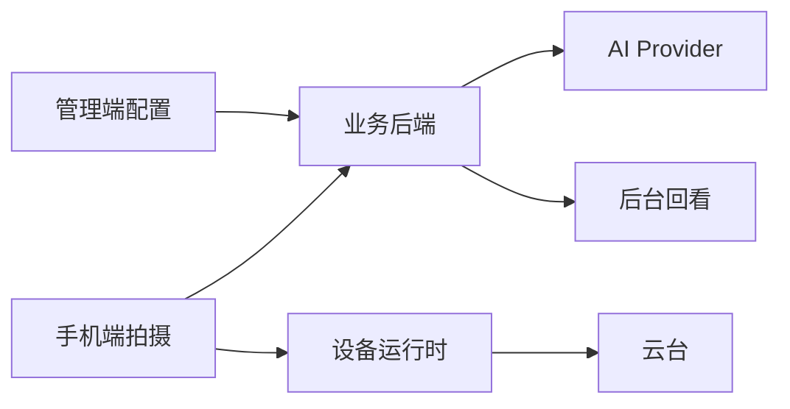

# 演示流程

## 1. 演示目标

用一条清晰路径展示 Camera Assistant 的四端协同：

1. 管理端准备用户、套餐、设备、推荐模板和 AI Provider。
2. 手机端登录，完成拍摄、上传和 AI 分析。
3. 手机端连接设备运行时，执行云台控制和 AI 建议应用。
4. 管理端回看抓拍记录和 AI 任务。

## 2. 演示前准备

启动服务：

- backend：`http://127.0.0.1:8000/api`
- device_runtime：`http://127.0.0.1:8001`
- admin_web：`http://127.0.0.1:5173`
- mobile_client：配置 `API_BASE_URL` 和 `DEVICE_API_BASE_URL`

准备数据：

- 至少一个管理员账号。
- 至少一个手机端用户。
- 一个启用中的套餐。
- 一个启用中的 AI Provider。
- 一个推荐默认模板或手机端用户模板。
- 设备运行时可以用 `DEVICE_SERVO_DRIVER=mock` 演示。

## 3. 演示顺序

### 一、管理端准备

1. 登录管理后台。
2. 在 AI 配置页确认有一个启用且默认的 Provider。
3. 在套餐页确认套餐绑定了默认 AI Provider。
4. 在用户页确认演示用户存在并绑定套餐。
5. 在推荐模板页上传或确认一个默认模板。
6. 在设备页确认设备控制地址，例如 `http://127.0.0.1:8001`。

讲解重点：管理端不是展示壳，它直接影响手机端可用模板、套餐能力和 AI Provider 选择。

### 二、手机端独立拍摄

1. 手机端登录。
2. 进入首页，查看当前订阅和套餐。
3. 进入拍摄页。
4. 选择普通拍摄或模板引导模式。
5. 拍照。
6. 上传并触发 AI 分析。
7. 打开详情抽屉，展示抓拍 ID、会话 ID、AI 摘要和评分。

讲解重点：手机端先创建会话，再上传图片，再写抓拍记录，最后创建 AI 任务。

### 三、连拍选优

1. 在拍摄页切到 AI 连拍模式。
2. 连续拍摄至少两张。
3. 点击上传并分析。
4. 展示 AI 选出的最佳图。
5. 进入历史页，展示 `AI 已选` 标记。

讲解重点：连拍选优不是本地挑图，而是后端把多张图片发给 AI Provider，返回最佳 `capture_id`。

### 四、设备联动

1. 启动 `device_runtime`。
2. 手机端进入设备联动页。
3. 填写设备 API 地址和视频流地址。使用本机摄像头可填 `0`。
4. 打开设备会话。
5. 查询状态，展示检测后端、当前角度、模式和模板状态。
6. 手动移动云台，执行回中。
7. 切换 `AUTO_TRACK` 或 `SMART_COMPOSE`。
8. 选择模板并下发到设备端。
9. 如果已有背景分析结果，点击应用最新 AI 背景锁或角度建议。

讲解重点：设备端是独立本地实时服务，手机端直接控制它；后端负责 AI 结果，设备端负责执行。

### 五、管理端回看

1. 回到管理后台。
2. 查看拍摄记录页，确认抓拍已经落库。
3. 查看 AI 任务页，确认任务状态、Provider 和结果摘要。
4. 查看概览页的统计变化。

讲解重点：后台可以回看业务事实，适合验收和排障。

## 4. 推荐讲解图

## 5. 演示风险与兜底

| 风险 | 兜底 |
| --- | --- |
| AI Provider 不可用 | 展示后台 `failed` 任务和错误信息，说明失败可观测 |
| 真机无法访问本机服务 | 改用局域网 IP，Android 模拟器用 `10.0.2.2` |
| 树莓派硬件未接入 | 使用 `DEVICE_SERVO_DRIVER=mock` |
| 摄像头不可用 | 使用手机端独立拍摄链路优先演示 |
| 模板检测失败 | 使用后台推荐模板或手动创建的演示模板 |

## 6. 演示结束后的材料

建议打开以下文档补充说明：

- `docs/项目总览与架构说明.md`
- `docs/接口契约.md`
- `docs/AI照片分析链路说明.md`
- `docs/部署说明.md`
