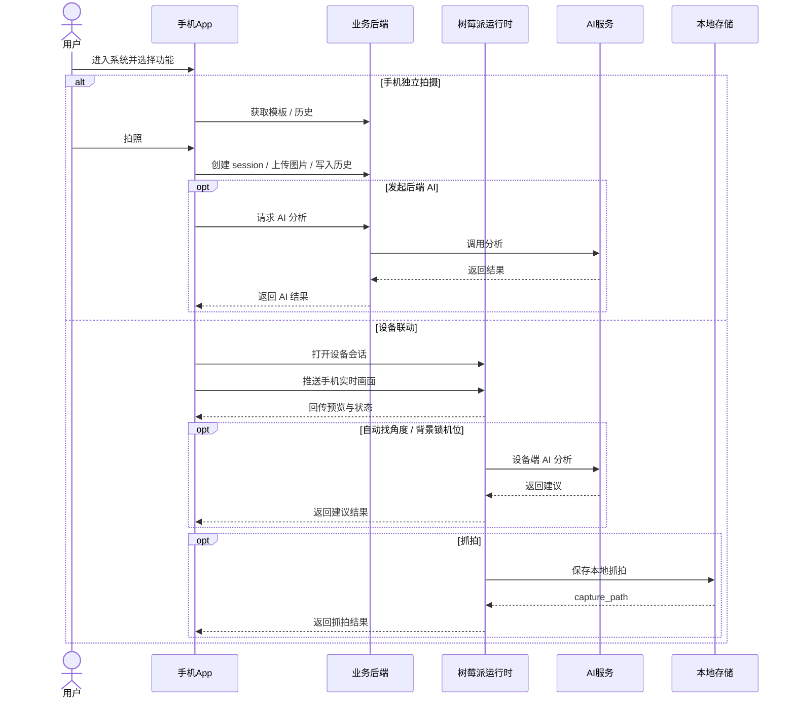
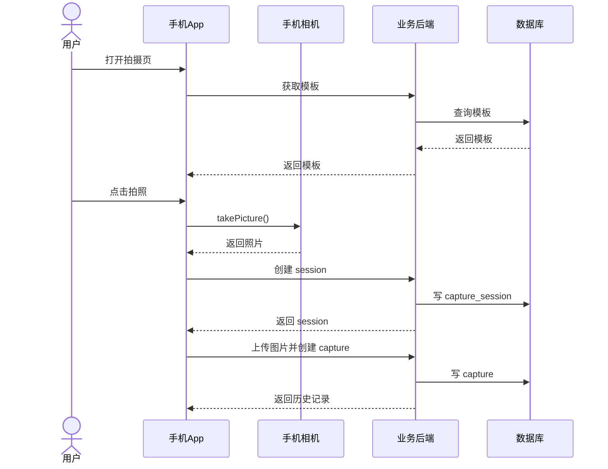
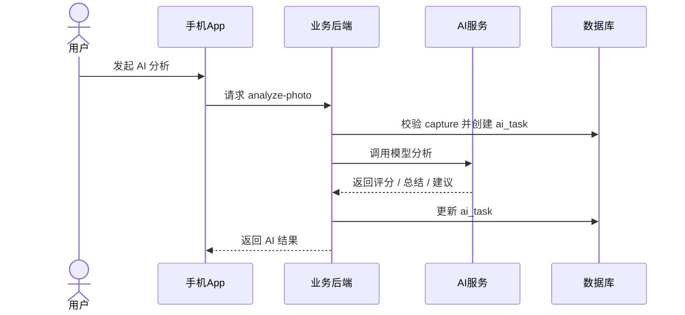
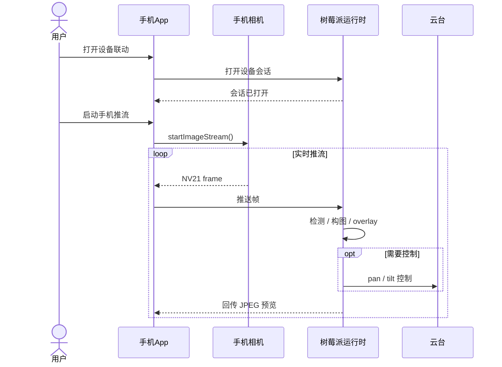
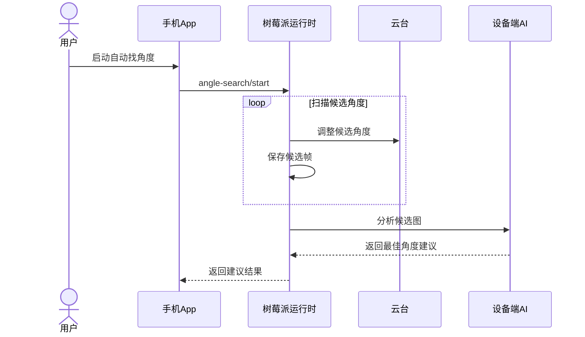
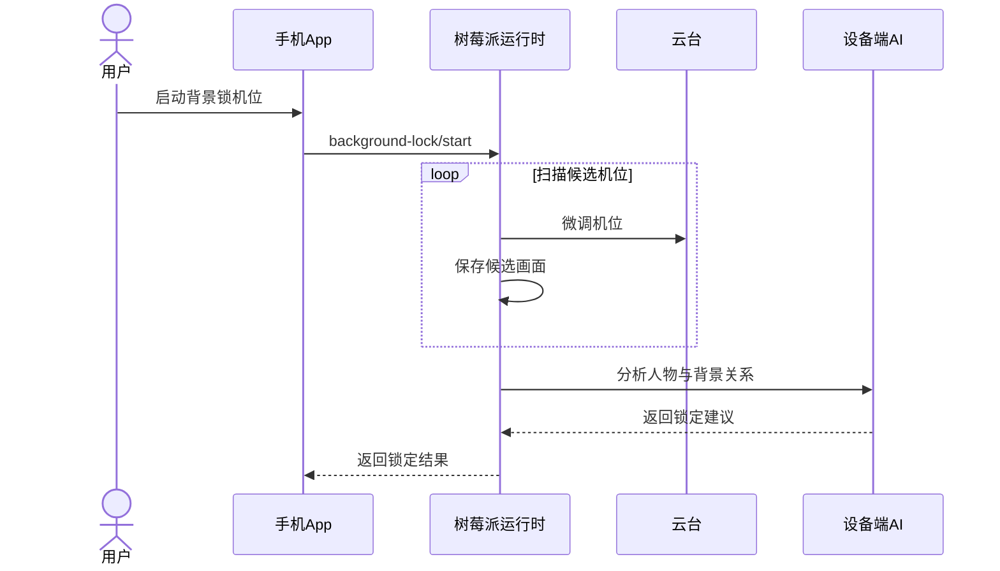
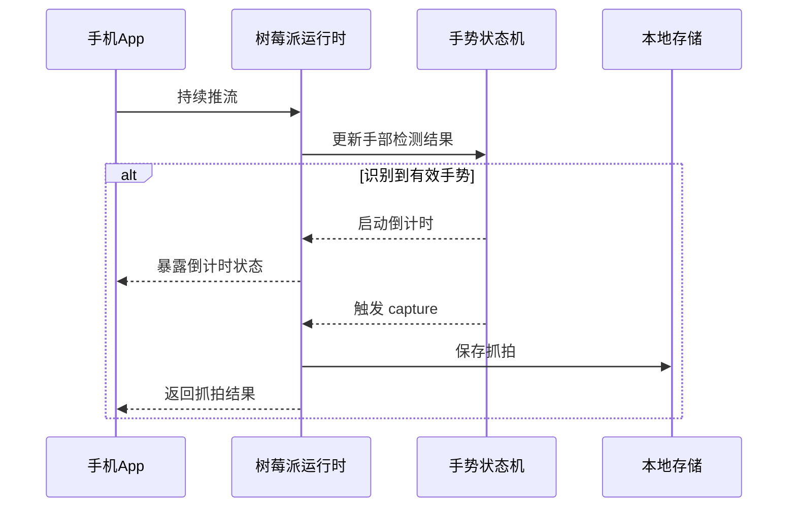
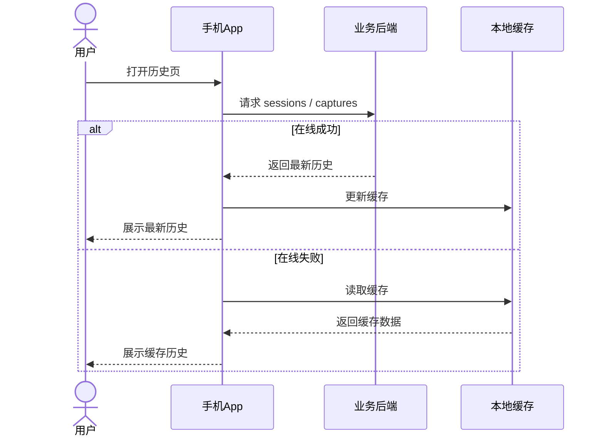

# 简洁时序图

本文提供适合横向排版的简洁版时序图。
目标是：

- 先有一张总体图
- 再按核心模块拆分
- 节点少、逻辑清楚、适合 PPT / 论文横向放置

---

## 1. 总体时序图

---

## 2. 手机独立拍摄时序图

---

## 3. 后端 AI 分析时序图

---

## 4. 设备联动主链路时序图

---

## 5. 自动找角度时序图

---

## 6. 背景锁机位时序图

---

## 7. 手势抓拍时序图

---

## 8. 历史与缓存回退时序图

