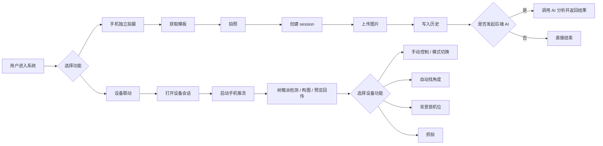
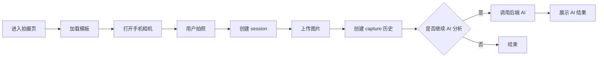
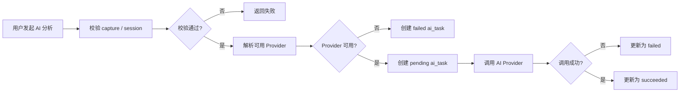
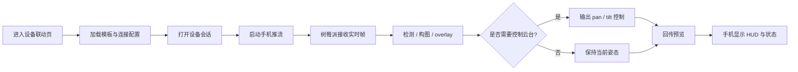
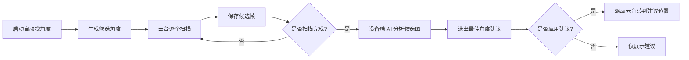
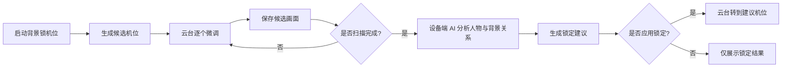
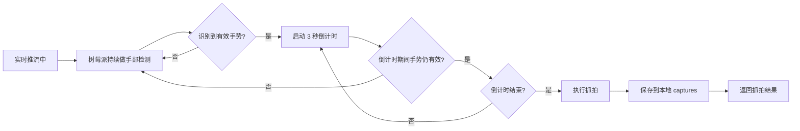
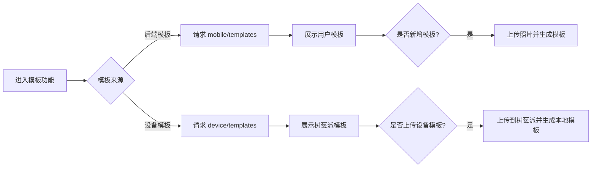
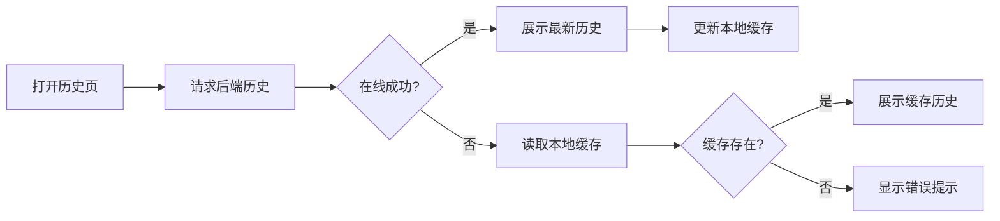

# 简洁流程图

本文提供适合横向放置的简洁版流程图。
结构采用“总图 + 模块图”，尽量减少节点数量，只保留最关键路径。

---

## 1. 总体流程图

---

## 2. 手机独立拍摄流程图

---

## 3. 后端 AI 分析流程图

---

## 4. 设备联动主流程图

---

## 5. 自动找角度流程图

---

## 6. 背景锁机位流程图

---

## 7. 手势抓拍流程图

---

## 8. 模板流程图

---

## 9. 历史与缓存流程图

