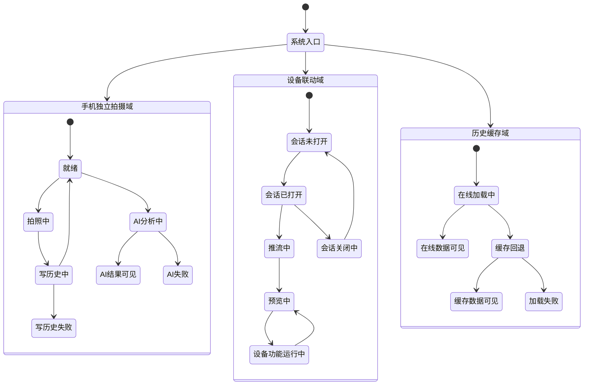
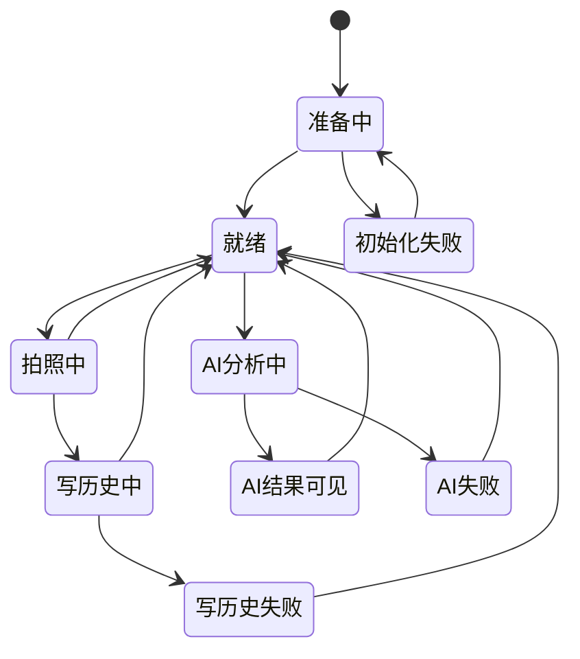
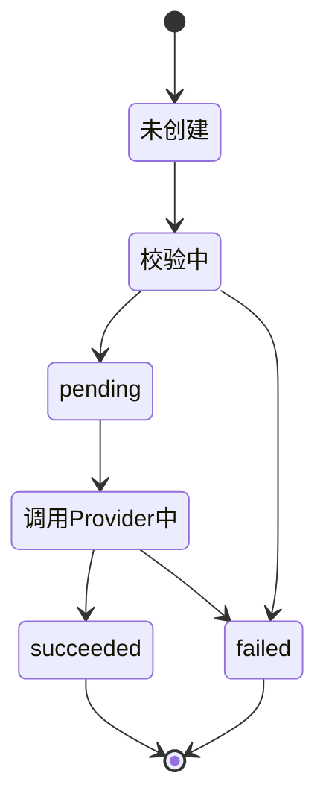
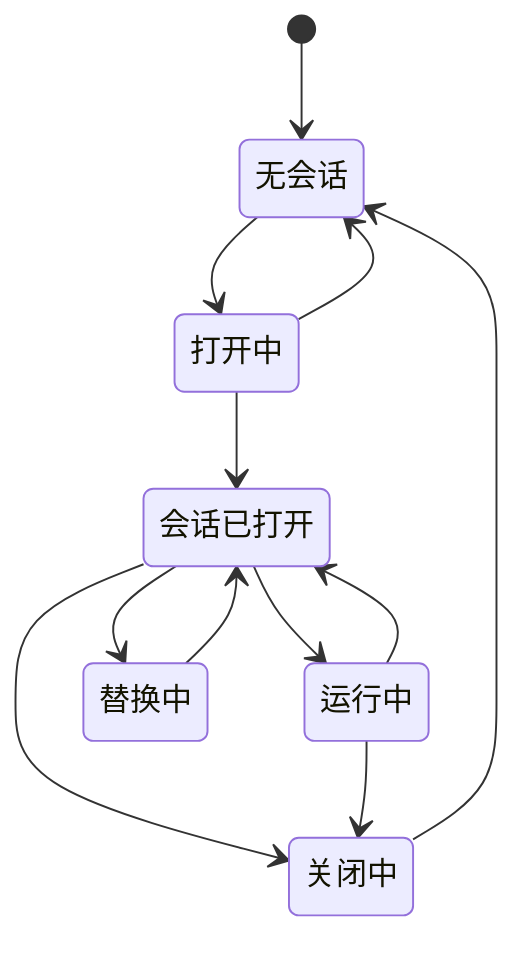
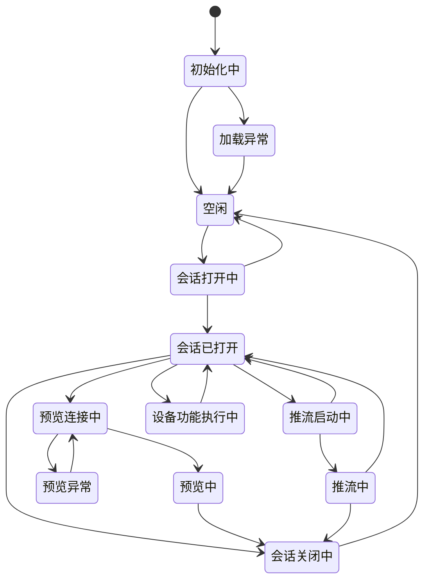
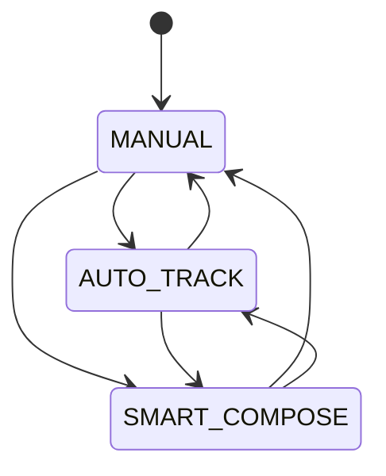
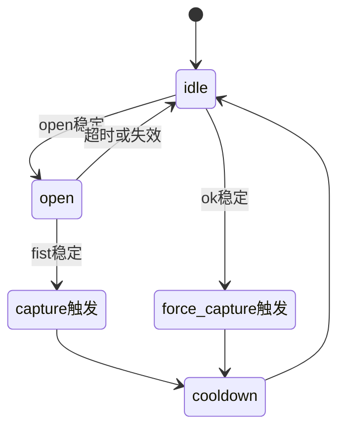
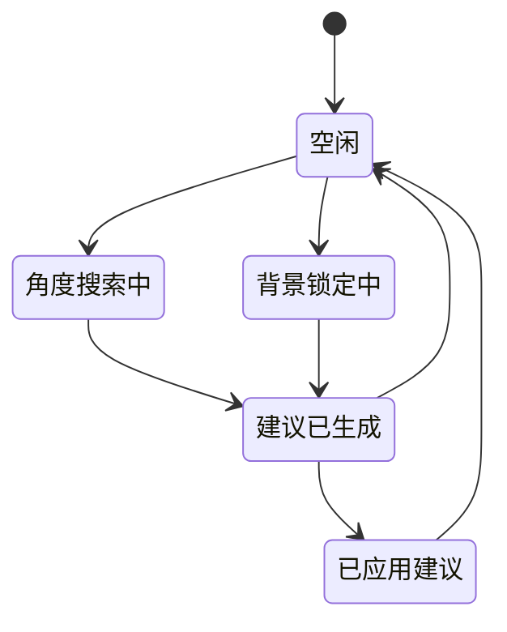
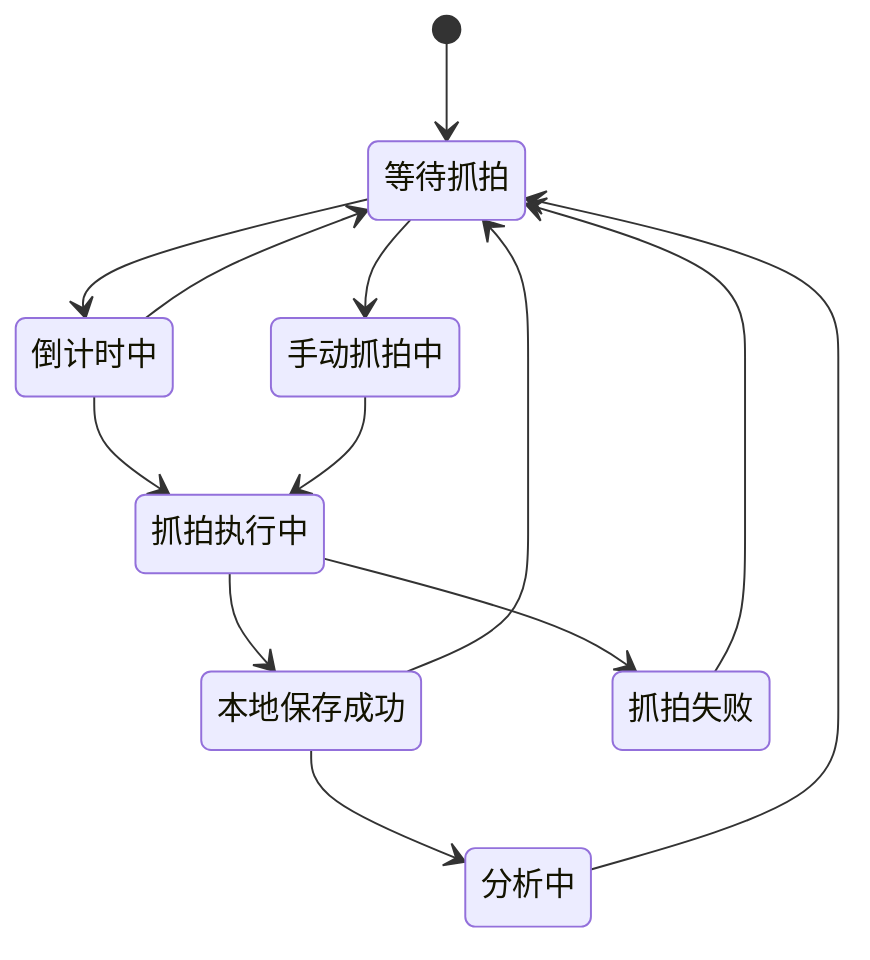
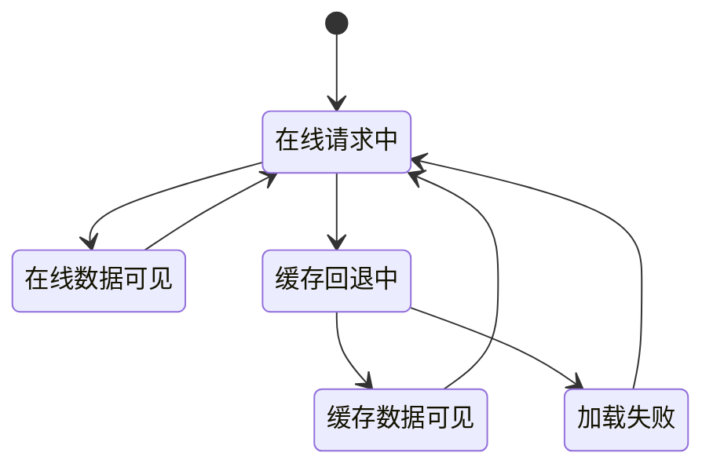

# 简洁状态图

本文提供适合横向排版的简洁版状态图。
目标是：

- 先有一张总体状态图
- 再拆关键模块状态
- 状态数量少，便于 PPT / 论文横向展示

---

## 1. 总体状态图

---

## 2. 手机拍摄页状态图

---

## 3. 后端 AI 任务状态图

---

## 4. 设备会话状态图

---

## 5. 设备联动页状态图

---

## 6. 设备运行模式状态图

---

## 7. 手势抓拍状态图

---

## 8. 设备端 AI 状态图

---

## 9. 设备抓拍状态图

---

## 10. 历史与缓存状态图

