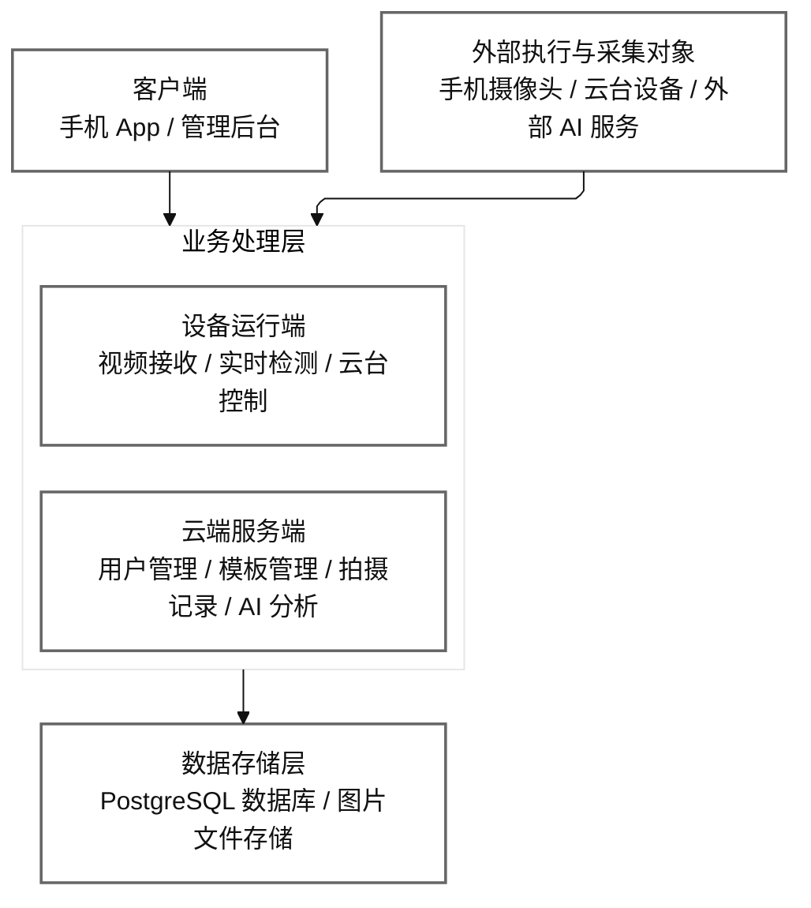

# 云影随行简洁系统图

本文提供两张适合放入技术文档、参赛说明书或答辩 PPT 的简洁图：

- 图 1：系统总体框架图
- 图 2：系统总功能模块图

两张图都基于当前实际代码结构整理，但刻意做了简化，便于非开发评审快速理解。

## 图 1 系统总体框架图

图注建议：

`图 1 系统总体框架图`

可直接配套说明：

系统由客户端、业务处理层、数据存储层和外部执行对象四部分组成。手机客户端负责用户交互与拍摄控制，设备运行端负责实时视觉处理和云台联动，云端服务端负责业务管理与 AI 分析，最终将用户数据、拍摄记录和图片文件统一存储。

## 图 2 系统总功能模块图

```mermaid
%%{init: {"theme":"base","flowchart":{"defaultRenderer":"elk","curve":"linear","nodeSpacing":34,"rankSpacing":48},"themeVariables":{"fontFamily":"Microsoft YaHei, SimHei, Arial","primaryColor":"#ffffff","primaryTextColor":"#111111","primaryBorderColor":"#666666","lineColor":"#111111","tertiaryColor":"#ffffff"}}}%%
flowchart TB
  classDef box fill:#ffffff,stroke:#666666,stroke-width:1.8px,color:#111111;

  A["云影随行智能拍照助手系统"]:::box

  A --> B["移动端模块"]:::box
  A --> C["设备端模块"]:::box
  A --> D["云端服务模块"]:::box
  A --> E["数据管理模块"]:::box

  B --> B1["用户登录注册"]:::box
  B --> B2["拍照与模板引导"]:::box
  B --> B3["设备联动控制"]:::box
  B --> B4["历史查看与 AI 结果"]:::box

  C --> C1["视频流接入"]:::box
  C --> C2["人体与手势检测"]:::box
  C --> C3["构图分析与抓拍"]:::box
  C --> C4["云台控制与预览回传"]:::box

  D --> D1["用户与套餐管理"]:::box
  D --> D2["模板与推荐管理"]:::box
  D --> D3["拍摄记录管理"]:::box
  D --> D4["AI 分析服务"]:::box

  E --> E1["用户数据存储"]:::box
  E --> E2["拍摄记录存储"]:::box
  E --> E3["图片文件存储"]:::box
  E --> E4["设备抓拍文件管理"]:::box
```

图注建议：

`图 2 系统总功能模块图`

可直接配套说明：

系统总功能由移动端模块、设备端模块、云端服务模块和数据管理模块构成。移动端承担用户交互与拍摄控制，设备端承担实时检测、构图分析和执行抓拍，云端服务模块承担业务管理和 AI 处理，数据管理模块负责各类业务数据与图片文件的统一存储和管理。

## 使用建议

- 如果放到比赛技术文档里，建议优先使用这两张简洁图。
- 如果放到源码文档里，建议继续保留更详细的 [总体架构图](./总体架构图.md)。
- 如果你后面要做成 Word 或 PPT 里的黑白线框风格，我可以继续把这两张图改成更接近 Visio 或 draw.io 的正交方框版。
