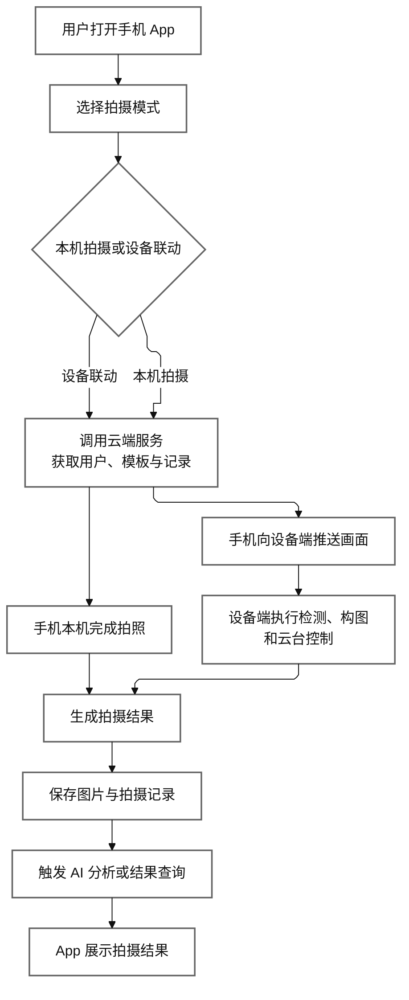

# 云影随行简约系统实现流程图

这张图用于说明系统从用户进入、拍摄控制、设备执行到结果存储与展示的核心实现流程，适合放在技术文档“系统实现流程”或“工作流程”小节。

## 图 系统实现流程图

图注建议：

`图 系统实现流程图`

配套说明可直接使用：

系统启动后，用户首先在手机客户端选择拍摄模式。若采用本机拍摄，系统从云端获取用户信息、拍摄模板和历史记录后，由手机直接完成拍照；若采用设备联动模式，手机将实时画面推送到设备端，由设备端完成检测、构图分析和云台控制，再生成抓拍结果。最终系统将图片文件和拍摄记录统一保存，并向用户展示拍摄结果及 AI 分析结果。
