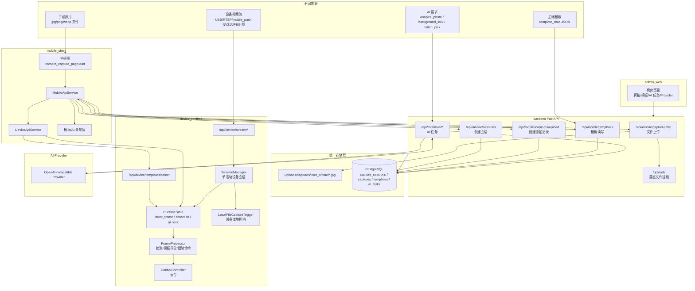
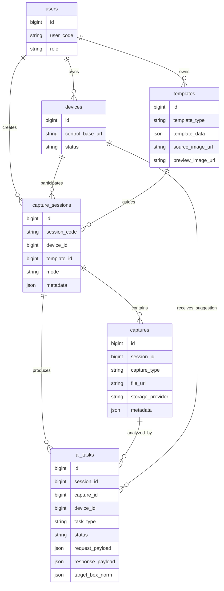
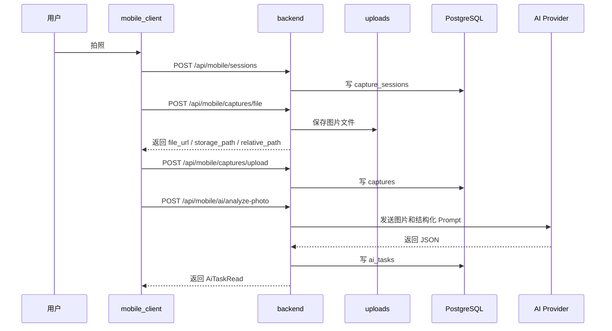
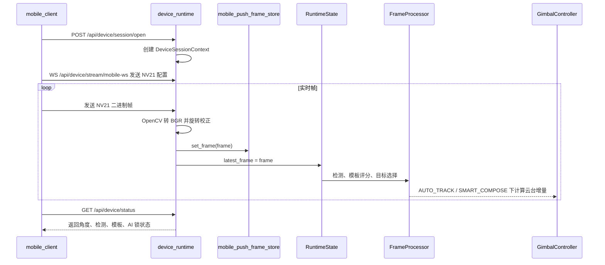
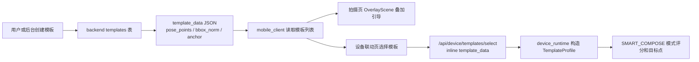
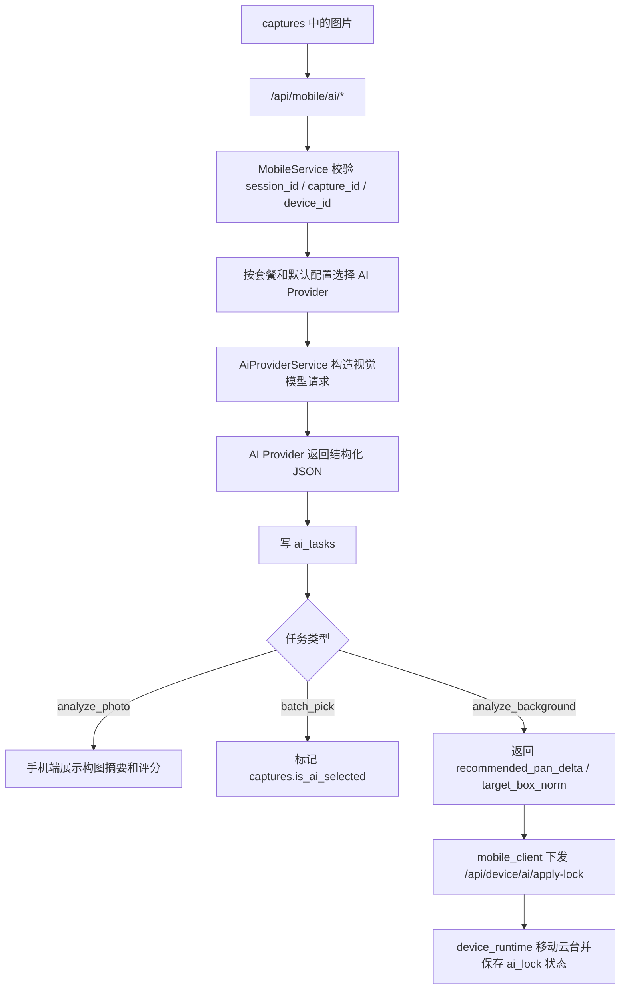
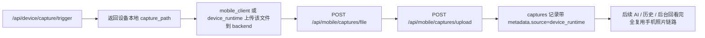

# Camera Assistant 统一采集、存储与协同流程

## 1. 这个问题在当前项目里怎么解决

手机照片、设备视频流、后端模板、AI 任务的原始格式确实不一样：照片是图片文件，视频流是连续帧，模板是结构化 JSON，AI 任务是请求/响应结果。当前项目没有强行把它们塞进同一种文件格式，而是采用“统一业务对象 + 分层存储 + 统一关联键”的方式解决。

核心思路是：

1. **文件和实时帧分开处理**：手机照片上传到 backend 的 `uploads` 静态目录；设备视频流留在 `device_runtime` 的实时内存状态中处理。
2. **业务事实统一落库**：会话、抓拍、模板、AI 任务等长期可追溯数据统一进入 PostgreSQL。
3. **结构化扩展统一用 JSON 字段承接**：模板数据、AI 请求/响应、会话元数据、抓拍元数据使用 JSON/JSONB，兼容不同来源和后续扩展。
4. **协同关系靠 ID 串起来**：`user_id`、`session_id`、`capture_id`、`template_id`、`device_id` 把手机端、后端、设备端和管理端连接成同一条业务链路。

对应代码落点：

| 层 | 当前项目位置 | 作用 |
| --- | --- | --- |
| 手机端入口 | `mobile_client/lib/services/mobile_api_service.dart` | 上传图片、创建会话/抓拍、触发 AI、读取模板和历史 |
| 设备端入口 | `mobile_client/lib/services/device_api_service.dart` | 打开设备会话、推送/控制设备、下发模板和 AI 建议 |
| 业务后端 API | `backend/app/api/routes/mobile.py` | 接收照片文件、创建业务记录、暴露 AI 和历史接口 |
| 业务服务 | `backend/app/services/mobile_service.py` | 校验会话/模板/设备，创建 `captures`、`ai_tasks` 等记录 |
| 静态文件 | `uploads/captures/...` | 保存手机端上传的真实图片文件 |
| 数据库结构 | `database/schema.sql` | 保存用户、设备、模板、会话、抓拍、AI 任务、Provider 配置 |
| 设备实时运行时 | `device_runtime/api/session_manager.py` | 单设备会话、视频源、检测、模板、云台控制、设备抓拍 |
| 视频帧入口 | `device_runtime/api/routes/stream.py` | 接收手机 NV21 WebSocket 帧或 JPEG 调试帧 |
| 模板入口 | `device_runtime/api/routes/templates.py` | 设备端本地模板导入，或接收手机端 inline 模板 |
| 帧处理管线 | `device_runtime/services/frame_processor.py` | 检测、目标选择、模板构图评分、跟随命令计算 |

## 2. 总流程图



## 3. 四类来源如何归一化

| 来源 | 原始格式 | 进入系统的入口 | 归一化后的业务对象 | 存储位置 |
| --- | --- | --- | --- | --- |
| 手机照片 | `jpg` / `png` / `webp` 文件 | `POST /api/mobile/captures/file` | `CaptureUploadRead`，包含 `file_url`、`storage_path`、`relative_path` | 文件在 `uploads/captures/...`，元数据继续进入 `captures` |
| 手机抓拍记录 | 文件 URL + 拍摄参数 | `POST /api/mobile/captures/upload` | `captures` 表记录 | PostgreSQL `captures` |
| 拍摄会话 | 手机端模式、设备、模板、平台元数据 | `POST /api/mobile/sessions` | `capture_sessions` 表记录 | PostgreSQL `capture_sessions` |
| 后端模板 | `template_data` JSON、原图 URL、预览 URL | `GET/POST /api/mobile/templates`、后台推荐模板接口 | `templates` 表记录 | PostgreSQL `templates.template_data` |
| 设备视频流 | USB/RTSP 帧，或手机推送 NV21/JPEG 帧 | `/api/device/stream/start`、`/api/device/stream/mobile-ws`、`/api/device/stream/frame` | `RuntimeState.latest_frame`、检测结果、设备状态 | 设备运行时内存态，不直接落 PostgreSQL |
| 设备本地抓拍 | 当前视频帧编码后的本地图片 | `/api/device/capture/trigger` | `CaptureResult.path` | 设备本地文件，目前不会自动创建 backend 的 `captures` 记录 |
| AI 任务 | AI 请求参数、Provider 响应 JSON | `/api/mobile/ai/analyze-photo`、`/api/mobile/ai/analyze-background`、`/api/mobile/ai/batch-pick` | `ai_tasks` 表记录 | PostgreSQL `ai_tasks` |
| AI 对设备建议 | 云台角度增量、目标框 `target_box_norm` | `/api/device/ai/apply-angle`、`/api/device/ai/apply-lock` | `RuntimeState.ai_lock_*` 和云台动作 | 设备运行时内存态；原始 AI 结果仍在 `ai_tasks` |

## 4. 统一数据模型

当前项目真正的“统一格式”不是图片格式或视频格式，而是下面这组业务对象：



这套模型让不同来源的数据可以按同一个会话维度回看：

- 一个 `capture_session` 表示一次拍摄流程。
- 多张手机照片或连拍结果进入多个 `captures`。
- 每次 AI 分析进入 `ai_tasks`，并关联对应 `capture_id`。
- 模板通过 `template_id` 绑定到会话，也可以通过 `template_data` inline 下发给设备端。
- 设备通过 `device_id` 和 `control_base_url` 参与会话，但实时帧不进业务库。

## 5. 手机照片链路



当前代码里，图片文件上传由 `backend/app/api/routes/mobile.py` 的 `_store_capture_upload()` 完成，按用户和日期保存到：

```text
uploads/captures/user_{user_id}/YYYY-MM-DD/{uuid}.jpg
```

随后 `MobileService.create_capture()` 创建 `captures` 记录。这样做的好处是：

- 图片二进制文件不塞进数据库。
- 数据库只保存可访问 URL、尺寸、类型、分数、扩展元数据。
- 后台可以直接通过 `captures.file_url` 回看照片。
- AI 任务可以稳定通过 `capture_id` 找到对应图片。

## 6. 设备视频流链路



设备流是实时控制数据，不适合作为每帧业务记录写库。当前项目把它放在 `device_runtime` 中处理：

- `/api/device/stream/mobile-ws` 接收手机端 NV21 帧。
- `/api/device/stream/frame` 保留 JPEG 单帧调试入口。
- `DeviceSessionContext` 将帧写入 `RuntimeState.latest_frame`。
- `FrameProcessor` 对当前帧做检测、模板构图评分和跟随命令计算。
- `/api/device/status` 给手机端返回当前状态。
- `/api/device/capture/trigger` 可以把当前帧保存为设备本地抓拍文件。

这里的统一点是“设备状态对象”和“会话上下文”，不是把视频流每帧都入库。

## 7. 模板协同链路



模板的统一格式是 `template_data`。它可以来自：

- 手机端用户创建模板。
- 后台推荐模板。
- 后端 `TemplatePoseService` 根据 `source_image_url` 自动生成基础姿态数据。
- 设备端本地 `.template_library` 导入的模板。

其中 backend 的模板是长期事实源，设备端 inline 模板是实时使用副本。手机端拿到模板后既能在本地相机预览上画引导线，也能把同一份 `template_data` 下发给设备端做 `SMART_COMPOSE`。

## 8. AI 任务协同链路



AI 任务的统一格式是 `ai_tasks`：

| 字段 | 作用 |
| --- | --- |
| `task_type` | 区分 `analyze_photo`、`analyze_background`、`batch_pick` 等 |
| `status` | 记录成功、失败、取消等状态 |
| `request_payload` | 保存请求参数 |
| `response_payload` | 保存 Provider 原始结构化响应 |
| `result_summary` / `result_score` | 抽取常用展示字段 |
| `recommended_pan_delta` / `recommended_tilt_delta` | 给设备端使用的云台建议 |
| `target_box_norm` | 背景锁目标框，设备端用于计算 fit score |

设备端不会自己调用云端 AI，而是接收后端已经落库的 AI 结果。这样 AI 密钥、Provider 选择、失败记录都集中在 backend 和 admin_web 管理。

## 9. 后台如何协同

`admin_web` 只连业务后端，不直接控制设备。它的角色是管理和回看：

- 在 `CapturesView.vue` 回看抓拍记录。
- 在 `AiTasksView.vue` 查看 AI 任务、结果和失败原因。
- 在 `RecommendedTemplatesView.vue` 管理推荐模板。
- 在 `AiProviderConfigsView.vue` 配置 AI Provider、模型、密钥和默认项。
- 在 `DevicesView.vue` 管理设备资料和控制地址。

所以后台参与的是“业务事实源”的维护，不参与实时帧处理。

## 10. 当前已经统一的部分

当前项目已经完成这些统一能力：

1. **接口响应统一**：backend 和 device_runtime 都采用 `success / message / data` envelope。
2. **业务对象统一**：会话、抓拍、模板、AI 任务都有明确表结构。
3. **照片存储统一**：手机图片进入 `uploads/captures`，数据库只保存 URL 和元数据。
4. **模板数据统一**：长期模板存 `templates.template_data`，手机叠加和设备构图都复用这份结构。
5. **AI 任务统一**：所有 AI 结果进入 `ai_tasks`，失败也落库，后台可追踪。
6. **设备实时态统一**：设备流、检测、模板评分、AI 锁状态集中在 `RuntimeState`。
7. **协同索引统一**：通过 `session_id` 把一次拍摄中的照片、模板、AI 结果串起来。

## 11. 当前还没有完全打通的部分

这部分很关键，不能混淆成已完成能力：

1. **设备本地抓拍尚未自动回流 backend**
   `/api/device/capture/trigger` 返回的是设备本地 `capture_path`，当前不会自动上传到 `uploads`，也不会自动创建 `captures` 记录。

2. **设备视频流不落库**
   设备流只作为实时控制输入处理。除非触发抓拍，否则不会形成长期业务记录。

3. **AI 任务是同步调用**
   当前 AI Provider 在接口请求内执行，Provider 慢会影响接口耗时，后续适合改成队列。

4. **backend 模板库和设备本地 `.template_library` 是两套来源**
   手机端可以把 backend 模板 inline 下发设备端，但设备本地导入模板不会自动同步回 backend。

## 12. 推荐的下一步统一方案

如果要把“设备抓拍”和“手机照片”进一步统一，建议新增一个设备抓拍回流流程：



推荐落库字段：

```json
{
  "capture_type": "photo",
  "storage_provider": "local_static",
  "metadata": {
    "source": "device_runtime",
    "device_capture_path": "captures/xxx.jpg",
    "session_code": "SES_20260424_001",
    "stream_url": "mobile_push"
  }
}
```

这样不需要重写 AI 和后台，只要把设备抓拍也转换成 backend 已经支持的 `uploads + captures + ai_tasks` 链路即可。

## 13. 一句话总结

当前项目解决多来源、多格式协同的方式是：**原始数据按特性分别处理，长期业务事实统一落 PostgreSQL，二进制图片落 `uploads`，实时视频留在设备运行时，所有协作通过会话、抓拍、模板、设备和 AI 任务 ID 串联。**
