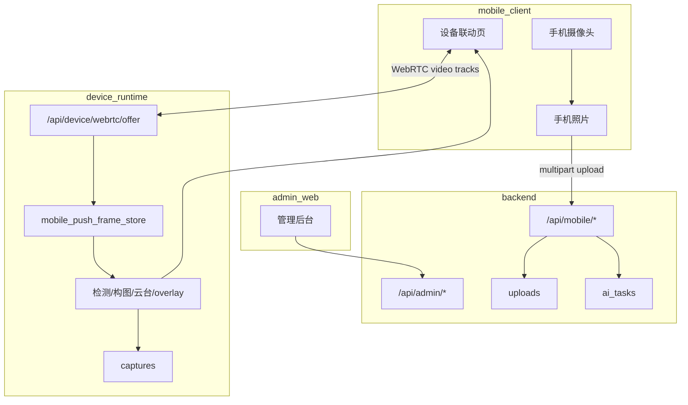

# Camera Assistant 统一采集、存储与协同流程

本文档说明当前“手机照片、设备视频、设备抓拍、AI 任务、模板”之间如何协同，以及哪些部分已经统一、哪些部分仍是边界。

## 1. 当前结论

- 手机独立拍摄和历史数据统一走 `backend` 和 PostgreSQL。
- 设备联动实时视频统一走 `device_runtime`，主链路是 WebRTC。
- 旧 WebSocket/JPEG 视频链路保留为 fallback。
- 业务抓拍文件保存在 `uploads`，设备抓拍文件保存在 `captures`。
- 模板可以从业务后端下发到设备，也可以在设备端本地导入。
- AI 分为业务后端图片任务和设备端实时编排两条路径。

## 2. 总流程图



## 3. 手机照片链路

手机独立拍摄产生的照片属于业务数据：

1. 手机本地拍照。
2. 上传图片到 `POST /api/mobile/captures/file`。
3. 后端保存到 `uploads`。
4. 手机创建抓拍记录或 AI 分析任务。
5. 后端写入 `captures`、`capture_sessions` 或 `ai_tasks`。
6. 历史页和管理后台都从后端读取。

这条链路已经统一到业务后端。

## 4. 设备视频链路

设备联动实时视频不进入后端数据库。当前主路径：

```text
手机摄像头
-> flutter_webrtc local video track
-> POST /api/device/webrtc/offer signaling
-> aiortc remote video track
-> OpenCV BGR frame
-> mobile_push_frame_store
-> DeviceSessionContext 帧循环
-> 检测、模板构图、云台控制、overlay
-> DevicePreviewVideoTrack
-> RTCVideoView
```

fallback 路径：

```text
手机 Android NV21 frame
-> WS /api/device/stream/mobile-ws
-> OpenCV BGR frame
-> mobile_push_frame_store
-> 设备处理流程
-> WS /api/device/preview-ws JPEG
```

`POST /api/device/stream/frame` 和 `GET /api/device/preview.jpg` 保留为调试接口。

## 5. 设备抓拍链路

设备抓拍属于设备本地数据：

1. 手机调用 `POST /api/device/capture/trigger`。
2. 设备从当前处理帧保存 JPEG。
3. 文件写入设备运行端 `captures`。
4. 手机可通过 `/api/device/capture/list` 和 `/api/device/capture/file` 查看或下载。

当前设备抓拍不会自动上传到 `backend`，所以不会出现在业务历史和管理后台抓拍列表中。后续如果要完全统一，需要增加“设备抓拍上传 backend”的同步逻辑。

## 6. 模板协同链路

模板有两个来源：

- 业务模板：由手机或管理后台在 `backend` 创建和管理。
- 设备模板：通过 `device_runtime` 本地导入或上传。

设备联动页可以把业务模板数据下发给设备端 `/api/device/templates/select`。设备端选中模板后，在 `SMART_COMPOSE` 模式中参与构图评分和 overlay 绘制。

## 7. AI 协同链路

业务后端 AI：

- 面向已经上传的图片。
- 结果写入 `ai_tasks`。
- 管理后台可回看任务。
- Provider 由管理后台配置。

设备端 AI：

- 面向当前实时画面和云台。
- 可自动扫描角度、锁定背景、计算匹配分数。
- 结果作用于设备 session 状态和云台。
- 不自动写入后端 `ai_tasks`。

## 8. 已统一的部分

- 手机照片上传、业务抓拍记录、AI 任务和历史记录统一在 `backend`。
- 管理后台统一读取 `backend` 的业务数据。
- 设备端 WebRTC 和 fallback 上行都统一写入 `mobile_push_frame_store`。
- 设备端预览统一来自 `session.get_preview_frame()`，WebRTC 和 JPEG fallback 共享处理后画面。
- 手机设置页统一维护业务后台地址和设备运行时地址。

## 9. 尚未完全统一的部分

- 设备本地抓拍没有自动回流到 `backend`。
- 设备端实时状态没有持久化到 PostgreSQL。
- WebRTC 会话状态只在 `device_runtime` 内存中维护。
- 业务后端 AI Provider 配置和设备端本地 AI 配置不是同一套配置。

## 10. 建议后续方向

1. 增加设备抓拍同步后端接口。
2. 为设备端 session 增加可选事件上报。
3. 把设备 AI 配置纳入统一 Provider 配置，或明确保持本地化。
4. 为 WebRTC signaling 增加更完整的连接状态和错误上报。
5. 如需跨公网使用 WebRTC，再引入 STUN/TURN 配置。
