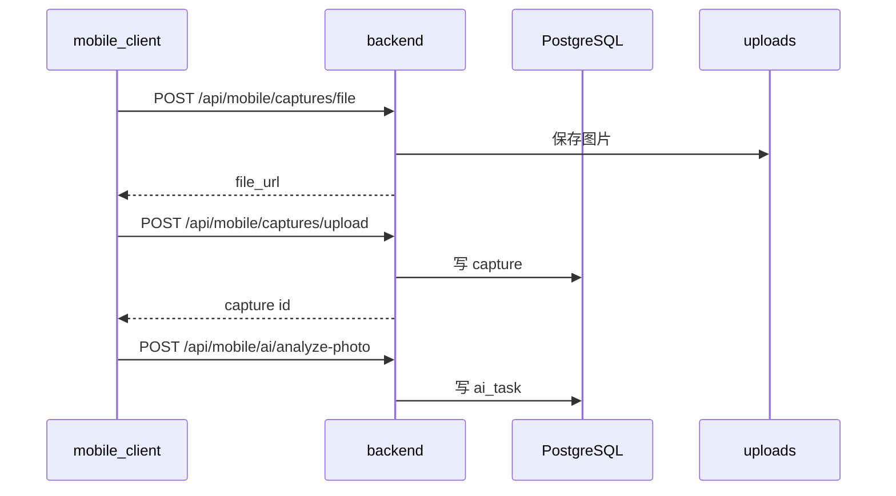
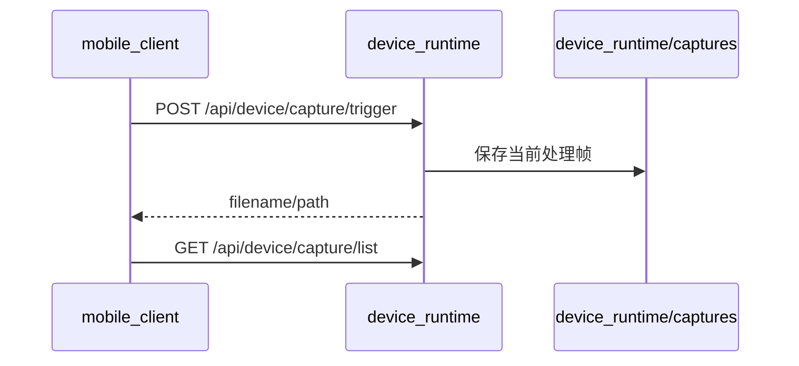
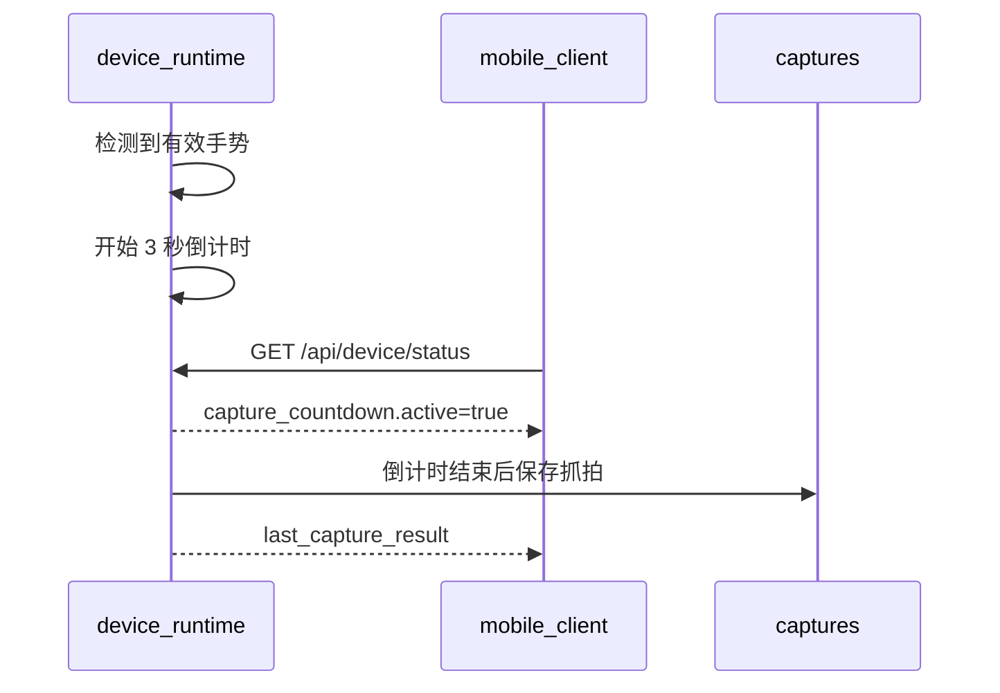

# 统一采集存储与协同流程

本文说明手机独立拍摄、设备联动抓拍和 AI 任务各自的存储边界。

## 存储边界

| 来源 | 文件位置 | 是否入后端历史 | 说明 |
| --- | --- | --- | --- |
| 手机独立拍照 | `uploads` | 是 | 上传到后端并创建 `captures` |
| 手机背景分析 | `uploads` | 通常是 | 创建后端 AI 任务 |
| 手机连拍选优 | `uploads` | 是 | 多张照片入库并标记优选 |
| 设备手动抓拍 | `device_runtime/captures` | 否 | 设备本地文件，手机 HUD 显示结果 |
| 设备手势抓拍 | `device_runtime/captures` | 否 | 3 秒倒计时后本地保存 |
| 设备端 AI | 设备运行时内存/本地状态 | 否 | 用于角度搜索、背景锁定、本地分析 |

## 手机独立拍摄流程

## 设备联动抓拍流程

手势抓拍会先进入倒计时：

## 为什么设备抓拍不再同步历史

设备抓拍和后端历史之前耦合过强：需要同时依赖设备端文件、后端 session、后端 capture 和后端 AI task。当前产品选择把设备抓拍保持为本地设备能力，先保证抓拍、提醒、倒计时和文件可访问稳定。

后续如果重新打通历史同步，建议增加明确的“导入到历史”动作，而不是在每次设备抓拍后自动同步。

## capture_type

后端 ORM 当前允许：

- `single`
- `photo`
- `burst`
- `best`
- `background`
- `device_link`

其中 `device_link` 保留给未来设备联动历史同步使用。当前默认流程不自动写入该类型。
