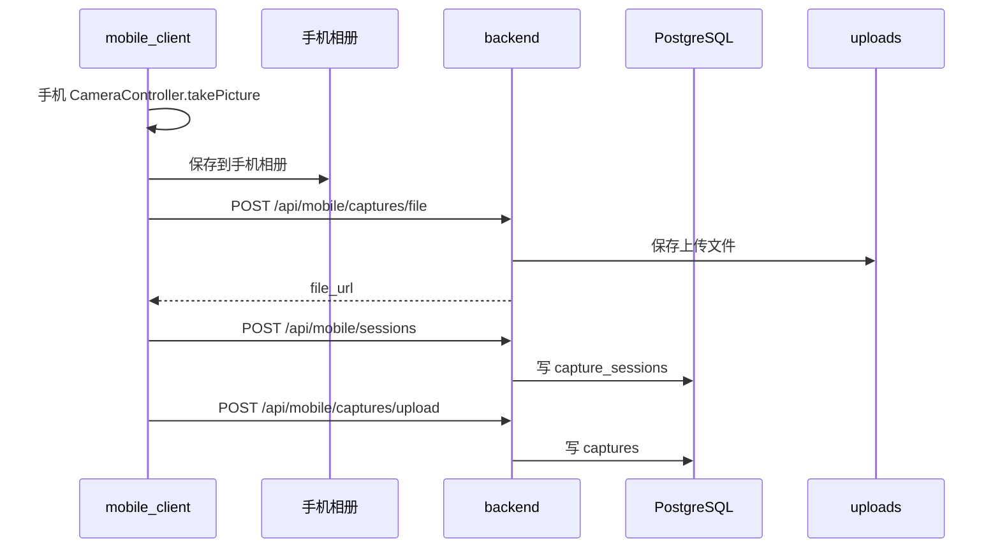
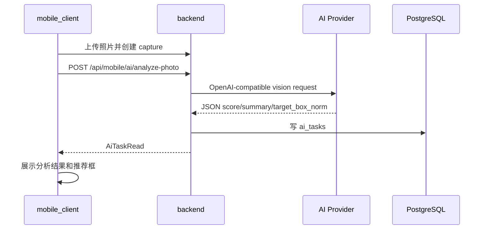
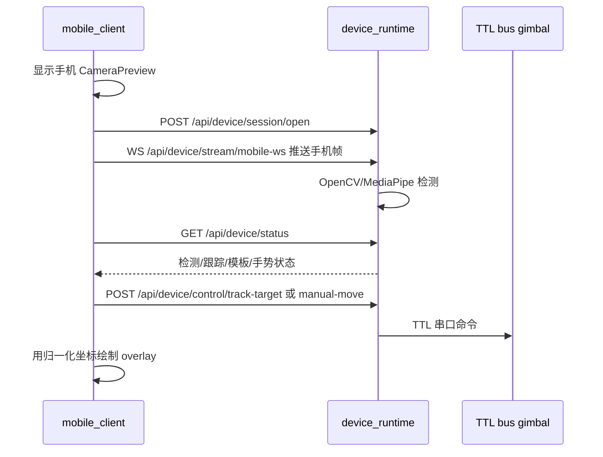
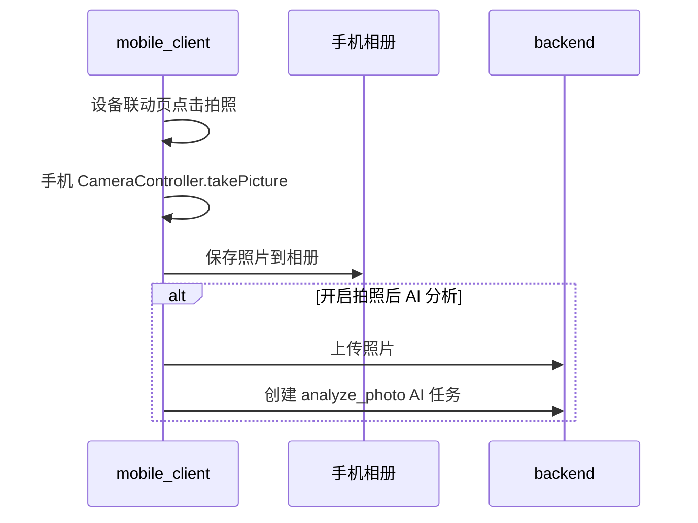
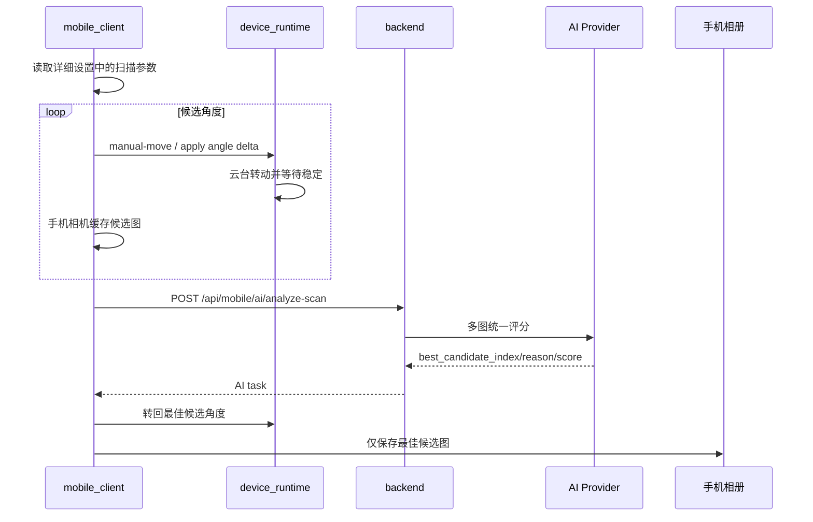

# 统一采集存储与协同流程

本文说明手机独立拍摄、设备联动、AI 扫描、历史记录和相册保存的边界。

## 总原则

```text
手机负责画面，树莓派负责转动，服务器负责智能，后台负责管理。
```

- 最终照片和视频由手机相机产生。
- 用户可见主画面来自手机本地预览。
- 树莓派不作为主预览画面来源。
- 树莓派负责云台和本地检测，不保存生产 AI Key。
- 后端负责 AI Provider、大模型调用、AI 任务和历史记录。
- 视觉坐标统一使用 `0..1` 归一化坐标。

## 存储边界

| 场景 | 文件产生位置 | 默认保存 | 是否写后端历史 | 说明 |
| --- | --- | --- | --- | --- |
| 普通拍照 | 手机相机 | 手机相册 | 可写入 | 拍摄页按设置上传后端并创建 `captures` |
| 普通录像 | 手机相机 | 手机相册 | 默认不强制 | 当前以本地相册为主 |
| 拍照后 AI 分析 | 手机相机 | 手机相册 | 是 | 先保存相册，再上传后端并创建 AI 任务 |
| AI 连拍选优 | 手机相机 | 可保存候选/结果 | 是 | 后端创建 `batch_pick` 任务 |
| 设备联动拍照 | 手机相机 | 手机相册 | 按设置 | 不在树莓派保存最终照片 |
| 设备联动录像 | 手机相机 | 手机相册 | 默认不强制 | 录像时云台跟随继续运行 |
| AI 自动找角度 | 手机缓存候选帧 | 最佳图保存相册 | 创建 AI 任务 | 候选帧统一上传后端分析，非全部保存相册 |
| 背景锁定 | 手机缓存候选帧 | 可不保存 | 创建 AI 任务 | 后端返回最佳角度和 `target_box_norm` |
| 设备本地抓拍兼容接口 | 树莓派运行时 | `device_runtime/captures` | 否 | 主要用于兼容、调试或手机拉取后保存 |

## 普通拍照流程


```mermaid
sequenceDiagram
  participant App as mobile_client
  participant Gallery as 手机相册
  participant Backend as backend
  participant DB as PostgreSQL
  participant Files as uploads

  App->>App: 手机 CameraController.takePicture
  App->>Gallery: 保存到手机相册
  App->>Backend: POST /api/mobile/captures/file
  Backend->>Files: 保存上传文件
  Backend-->>App: file_url
  App->>Backend: POST /api/mobile/sessions
  Backend->>DB: 写 capture_sessions
  App->>Backend: POST /api/mobile/captures/upload
  Backend->>DB: 写 captures
```

## 拍照后 AI 分析


```mermaid
sequenceDiagram
  participant App as mobile_client
  participant Backend as backend
  participant AI as AI Provider
  participant DB as PostgreSQL

  App->>Backend: 上传照片并创建 capture
  App->>Backend: POST /api/mobile/ai/analyze-photo
  Backend->>AI: OpenAI-compatible vision request
  AI-->>Backend: JSON score/summary/target_box_norm
  Backend->>DB: 写 ai_tasks
  Backend-->>App: AiTaskRead
  App->>App: 展示分析结果和推荐框
```

## 设备联动主流程


```mermaid
sequenceDiagram
  participant App as mobile_client
  participant Runtime as device_runtime
  participant Gimbal as TTL bus gimbal

  App->>App: 显示手机 CameraPreview
  App->>Runtime: POST /api/device/session/open
  App->>Runtime: WS /api/device/stream/mobile-ws 推送手机帧
  Runtime->>Runtime: OpenCV/MediaPipe 检测
  App->>Runtime: GET /api/device/status
  Runtime-->>App: 检测/跟踪/模板/手势状态
  App->>Runtime: POST /api/device/control/track-target 或 manual-move
  Runtime->>Gimbal: TTL 串口命令
  App->>App: 用归一化坐标绘制 overlay
```

## 设备联动拍照/录像


```mermaid
sequenceDiagram
  participant App as mobile_client
  participant Gallery as 手机相册
  participant Backend as backend

  App->>App: 设备联动页点击拍照
  App->>App: 手机 CameraController.takePicture
  App->>Gallery: 保存照片到相册
  alt 开启拍照后 AI 分析
    App->>Backend: 上传照片
    App->>Backend: 创建 analyze_photo AI 任务
  end
```

录像类似：手机端 `startVideoRecording` / `stopVideoRecording`，结束后保存到手机相册。录像期间，手机仍继续推送帧和目标点，自动跟随/模板构图可以继续控制云台。

## AI 自动找角度


```mermaid
sequenceDiagram
  participant App as mobile_client
  participant Runtime as device_runtime
  participant Backend as backend
  participant AI as AI Provider
  participant Gallery as 手机相册

  App->>App: 读取详细设置中的扫描参数
  loop 候选角度
    App->>Runtime: manual-move / apply angle delta
    Runtime->>Runtime: 云台转动并等待稳定
    App->>App: 手机相机缓存候选图
  end
  App->>Backend: POST /api/mobile/ai/analyze-scan
  Backend->>AI: 多图统一评分
  AI-->>Backend: best_candidate_index/reason/score
  Backend-->>App: AI task
  App->>Runtime: 转回最佳候选角度
  App->>Gallery: 仅保存最佳候选图
```

## 背景锁定

背景锁定与自动找角度共用扫描参数。区别是：

- `task_type` 使用 `analyze_background`。
- 后端 AI 必须尽量返回 `target_box_norm`。
- 手机端在画面中显示或隐藏 AI 推荐框。
- 扫描结束后，云台应转回评分最高的背景角度。

## 模板构图

```text
模板图片
-> 手机本地 ML Kit 识别人体关键点
-> 生成 template_data
-> 后端保存模板
-> 拍摄页/设备联动页读取模板
-> 手机端绘制模板框、模板线、肩部中心点、面部中心点
-> 设备联动时把实时目标点发送给树莓派
-> 树莓派云台对齐实时点和模板点
```

## 后端历史

后端历史主要记录：

- 手机普通拍照。
- 手机上传的背景分析图片。
- 手机连拍选优。
- 设备联动中用户选择上传并分析的照片。
- AI 自动找角度/背景锁定产生的 AI 任务。

后端历史不记录：

- 树莓派实时视频帧。
- 树莓派云台状态流。
- 未上传的手机本地视频。
- 未导入的设备本地抓拍文件。
