# 详细时序图

本文基于当前代码真实实现整理项目核心时序图，面向方案说明、技术答辩和后续文档沉淀。

注意：

- 业务后端链路与设备运行时链路是两套不同通道。
- 手机独立拍摄主要走 `backend`。
- 设备联动、自动找角度、背景锁机位、手势抓拍主要走 `device_runtime`。
- 当前默认设备视频链路是 `WebSocket NV21 上行 + JPEG preview 下行`，不是 WebRTC 主链路。
- 下列时序图优先遵循当前代码中的真实执行顺序，不把“可能存在的未来形态”混进当前实现。

---

## 0. 全局总时序图

这张图用于总览整个系统的关键参与者与主链路，适合作为本文件的入口图。

它不替代后续详细时序图，而是回答两个问题：

1. 这个系统里到底有哪些核心参与方。
2. 手机独立拍摄、设备联动、后端 AI、设备端 AI、本地抓拍分别发生在哪一侧。

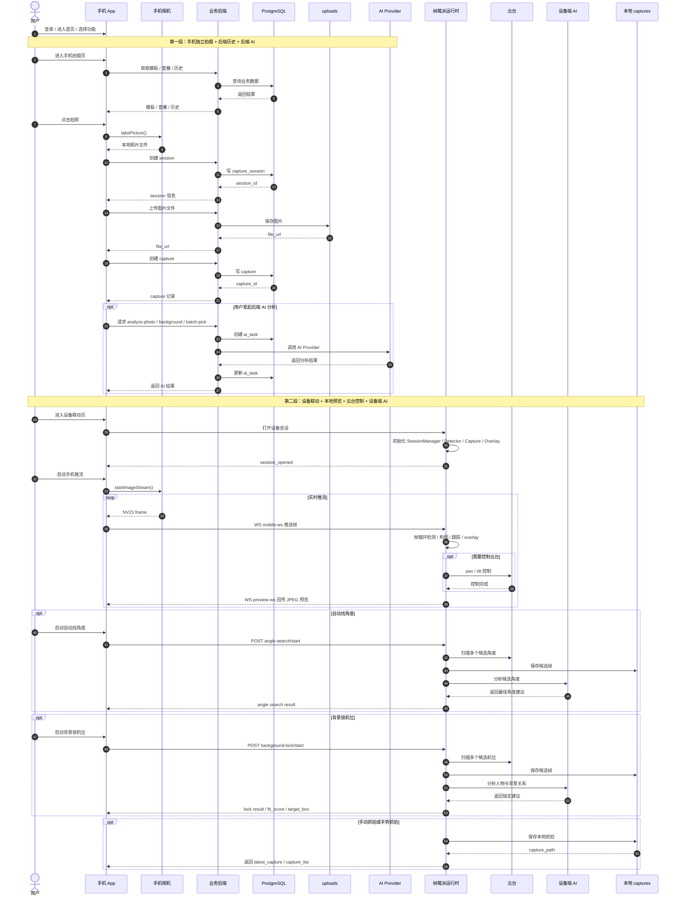

### 阅读方式

这张总图建议这样理解：

1. 上半段是手机独立拍摄链路。
2. 下半段是设备联动链路。
3. `backend + DB + Uploads + Provider` 组成业务后端闭环。
4. `Runtime + Gimbal + DeviceAI + Captures` 组成设备侧现场闭环。
5. 手机 App 是唯一同时连接这两套闭环的用户入口。

---

## 1. 手机独立拍摄并写入历史

这条链路对应手机端正常联网时的主业务流程。

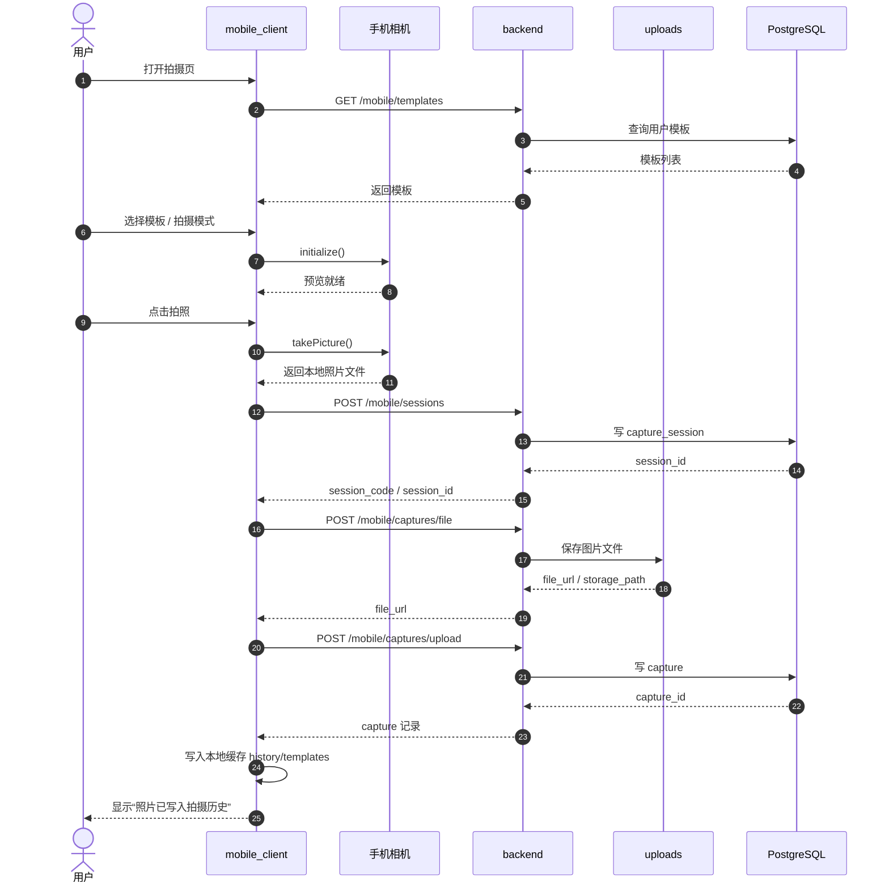

---

## 2. 手机独立拍摄后发起后端 AI 分析

这条链路对应后端 AI 分析，包括单张分析、背景分析和历史沉淀。

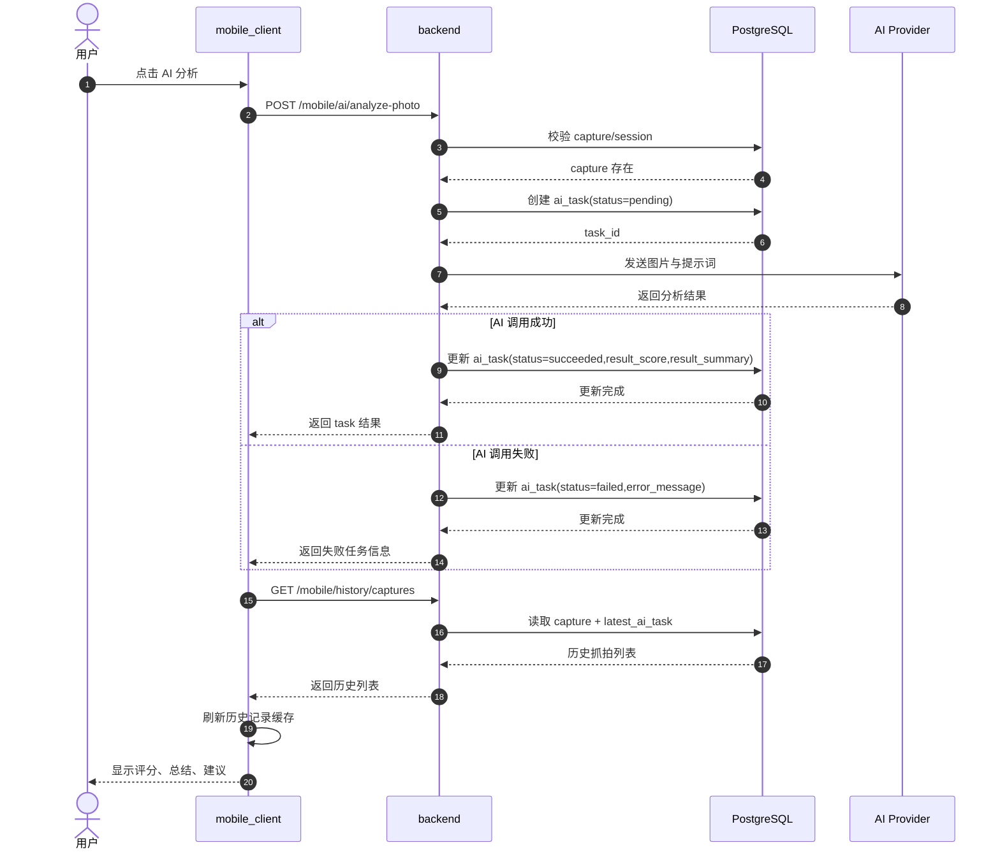

---

## 3. 设备联动会话建立与实时预览闭环

这条链路对应当前默认的设备联动模式：手机向树莓派推 NV21 帧，树莓派回传 JPEG 预览。

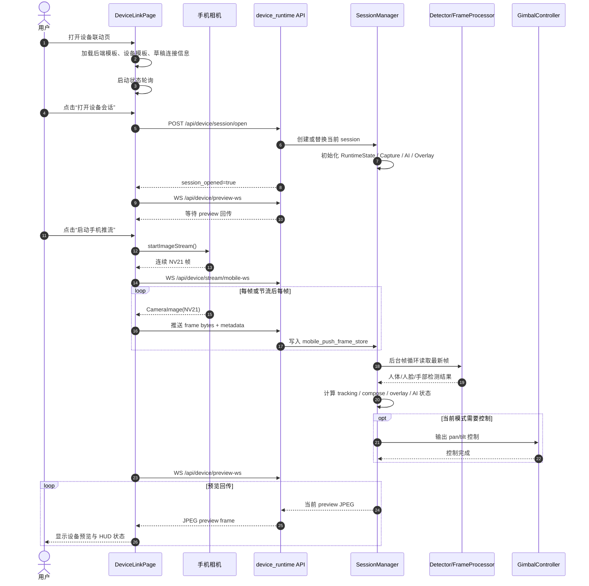

---

## 4. 设备联动中的状态轮询与 HUD 更新

这条链路补充说明设备联动页如何持续刷新状态、倒计时、AI 状态和模板状态。

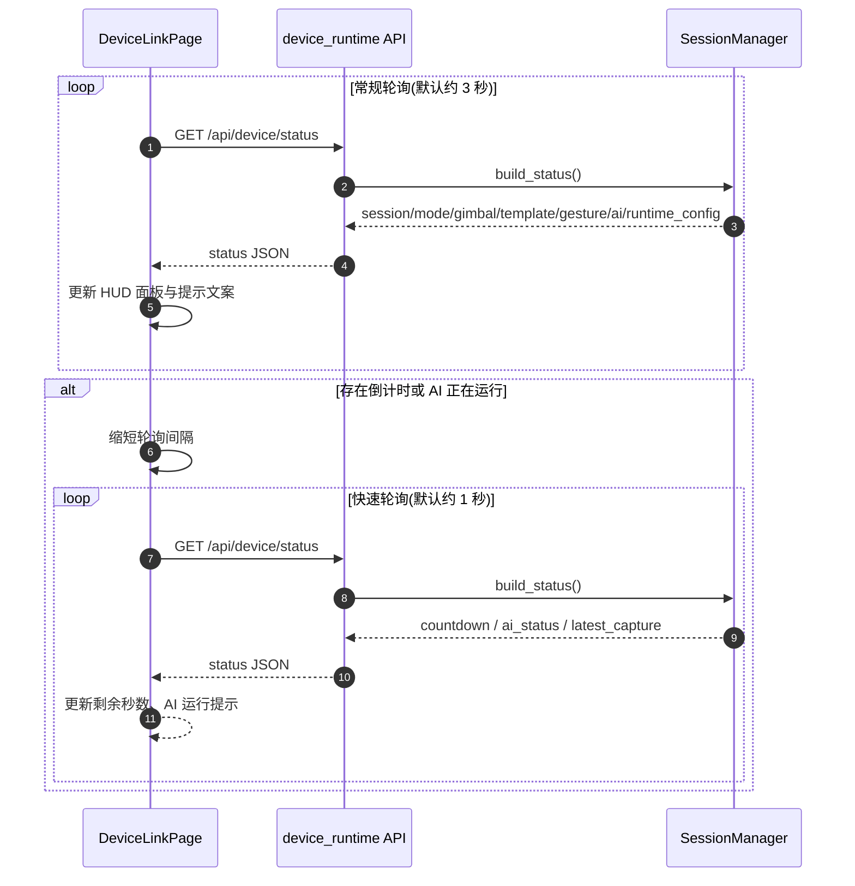

---

## 5. 自动找角度

这条链路对应设备端 AI 的“角度搜索”能力。它不是后端历史 AI，而是设备现场决策能力。

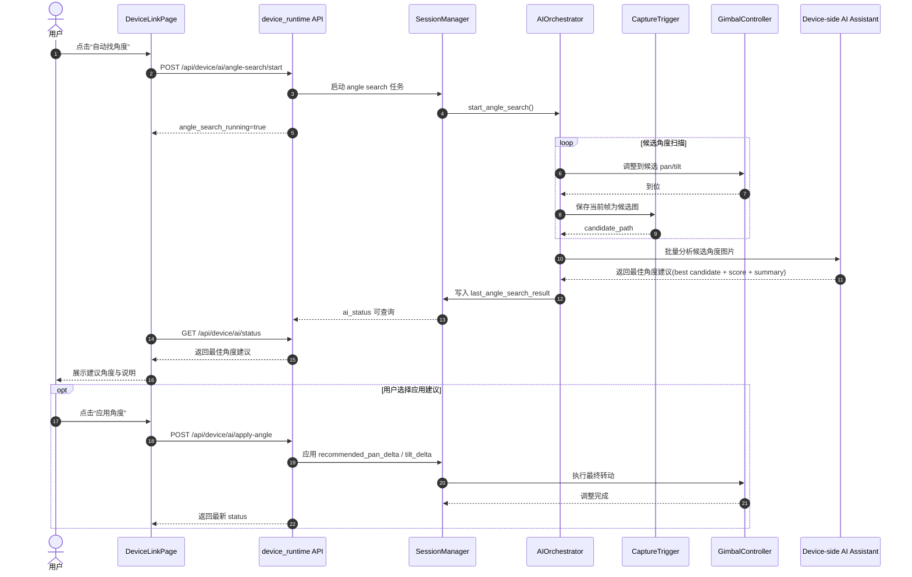

---

## 6. 背景锁机位

这条链路对应设备端 AI 的“背景锁定”能力，重点不是只找人物，而是结合人物与背景关系来确定机位。

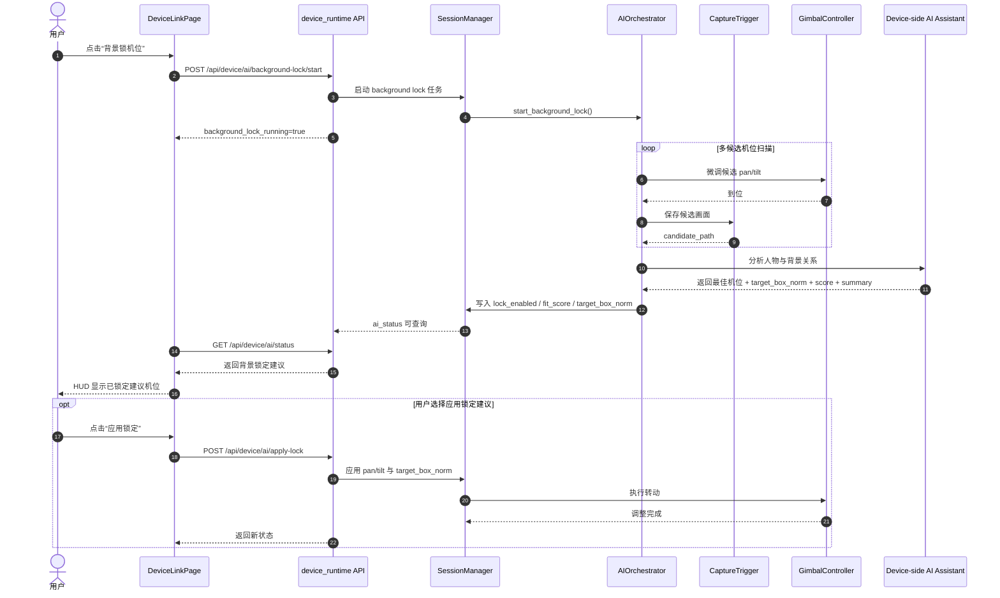

---

## 7. 手势抓拍与 3 秒倒计时

这条链路对应设备端实时手势识别后的自动抓拍。抓拍结果默认保存本地，不自动写后端历史。

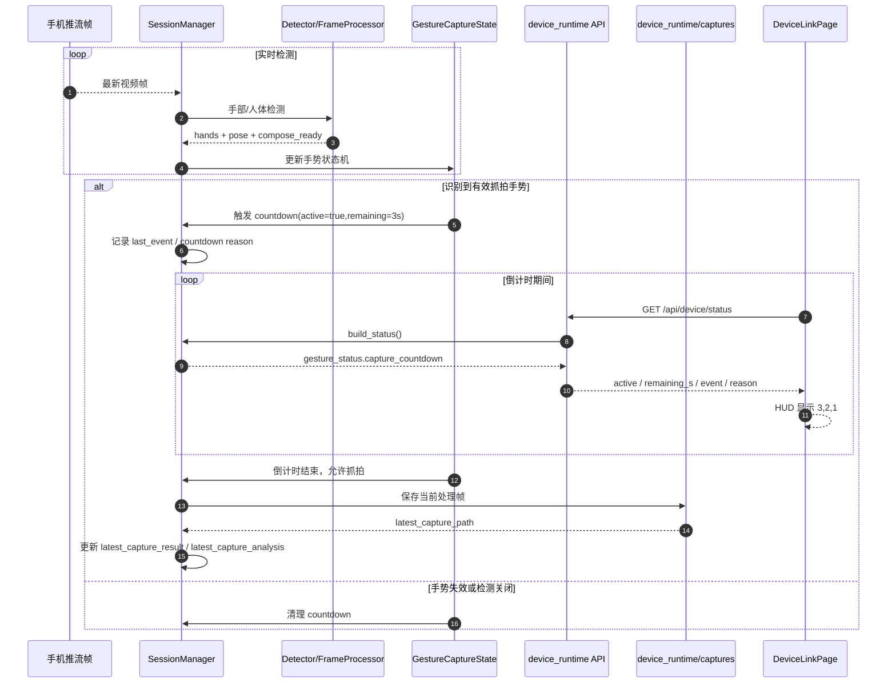

---

## 8. 设备手动抓拍与本地保底

这条链路对应用户在设备联动页主动点击抓拍按钮。其目标是弱化对后端的依赖，优先保证现场抓拍结果可落地。

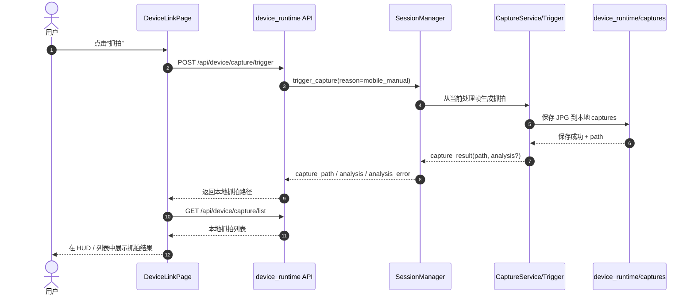

---

## 9. 模板加载与离线缓存回退

这条链路对应手机端访问模板列表失败时，如何回退到本地缓存。

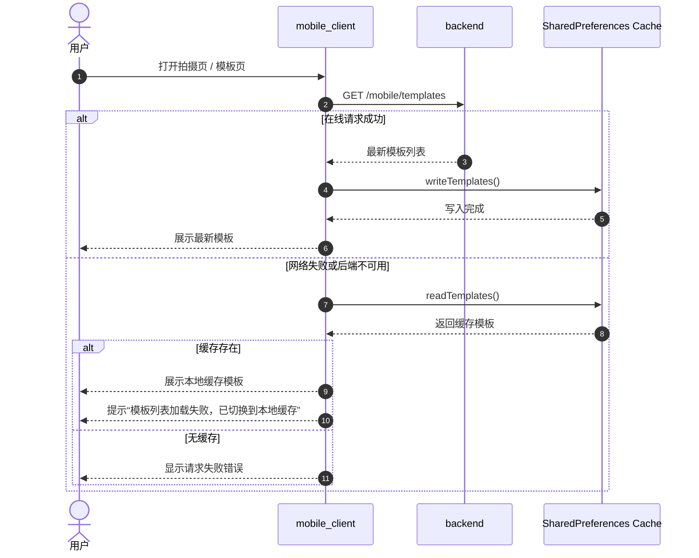

---

## 10. 历史记录加载与离线缓存回退

这条链路对应历史页在断网或后端不可用时的退化行为。

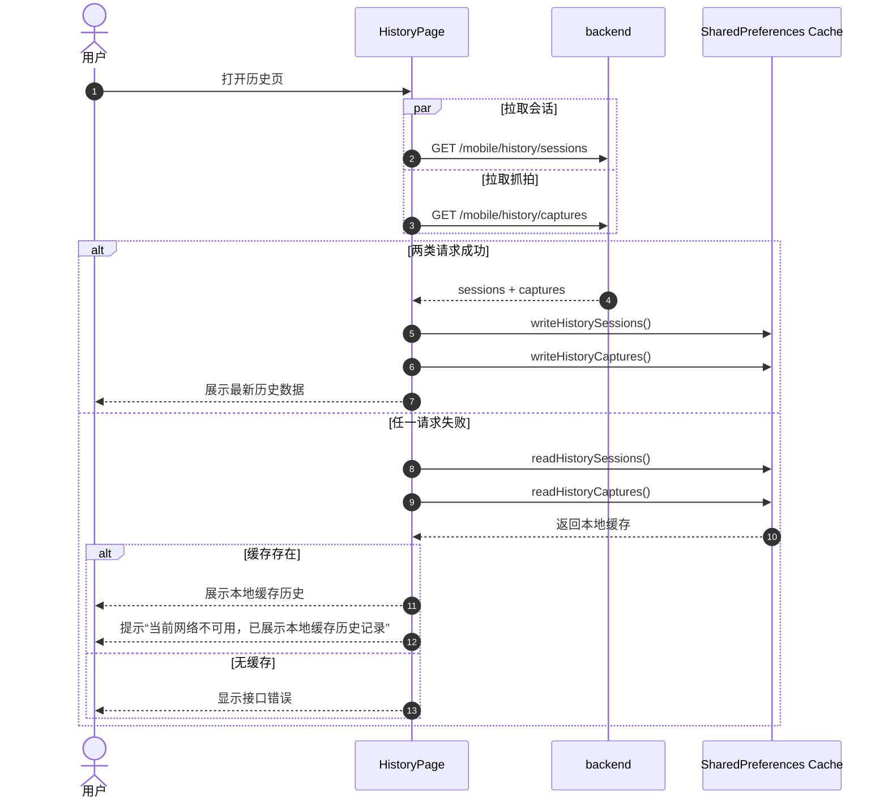

---

## 11. 手机独立拍照在断网下的当前现状

这张时序图不是“理想未来流程”，而是当前代码下的真实行为：照片拍得到，但不会自动进入离线待同步队列。

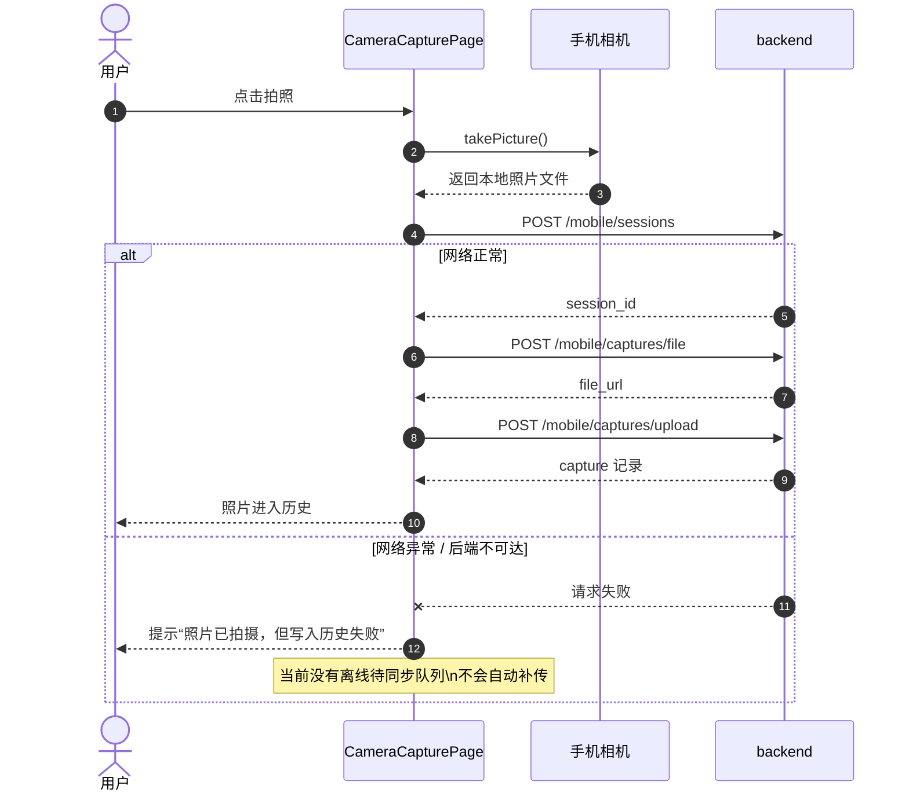

---

## 12. 关键结论

从当前时序上看，系统可以明确分成三类能力：

1. 联网强依赖链路
   手机独立拍摄写历史、后端 AI 分析、历史同步。
2. 设备本地保底链路
   设备抓拍、手势抓拍、设备端 AI、自动找角度、背景锁机位。
3. 本地缓存回退链路
   模板列表、历史记录读取失败后的缓存展示。

因此当前项目已经具备：

- 设备侧本地抓拍保底
- 历史与模板的本地缓存降级

但尚未具备：

- 手机独立拍照的完整离线补传闭环
- 设备抓拍自动同步到后端历史
