# 详细流程图

本文用于从“流程结构”的角度说明项目运行逻辑，和时序图互补：

- 时序图强调“谁先调用谁”
- 流程图强调“整体步骤如何推进、分支如何选择”

本文同样遵循当前代码的真实实现，不引入未来规划中的假设流程。

---

## 0. 全局总流程图

这张图用于先把整个系统的主路径分清楚：
手机侧有两条主线，分别是“手机独立拍摄”与“设备联动”；
AI 也分成“后端 AI”与“设备端 AI”两套逻辑。

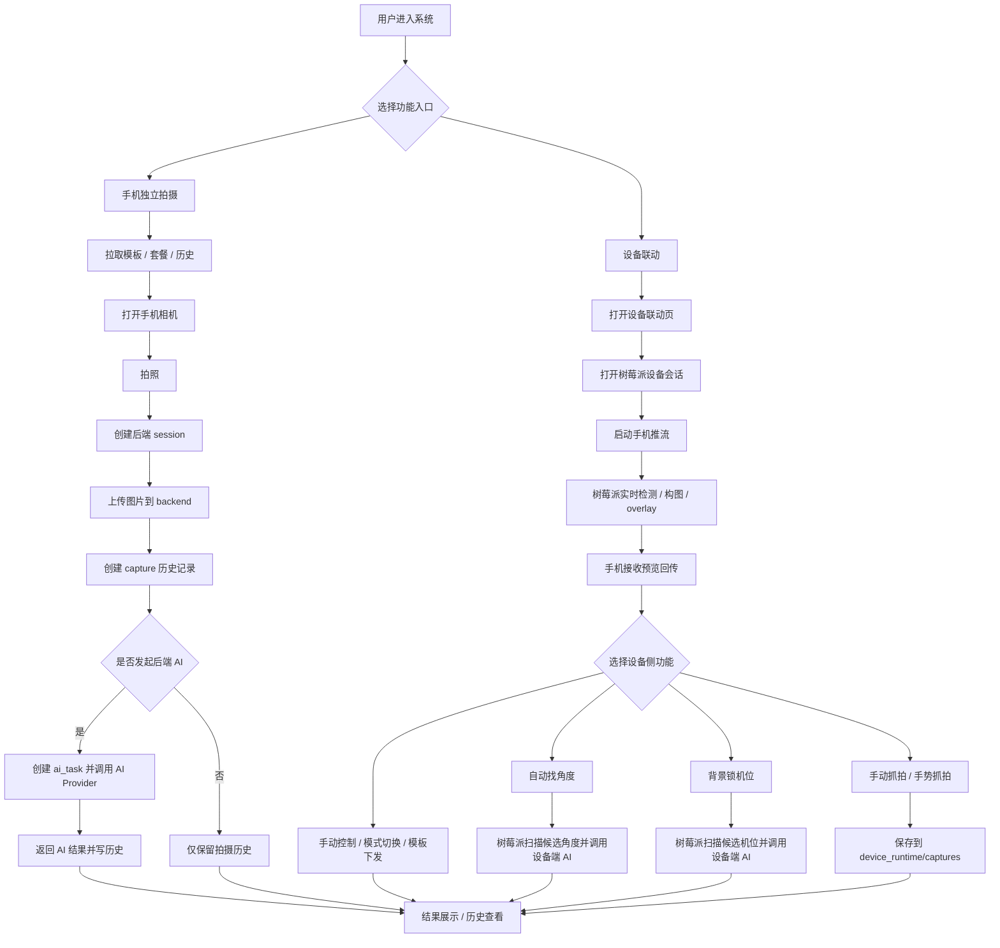

### 图意说明

这张总流程图对应三条关键结论：

1. 手机独立拍摄与设备联动是两条不同主线。
2. 后端 AI 与设备端 AI 是两种不同能力，不共享同一条运行流程。
3. 设备抓拍默认进入本地 `captures`，不是自动写后端历史。

---

## 1. 手机独立拍摄总流程

这张图只关注手机拍照、上传、入历史、可选 AI 分析。

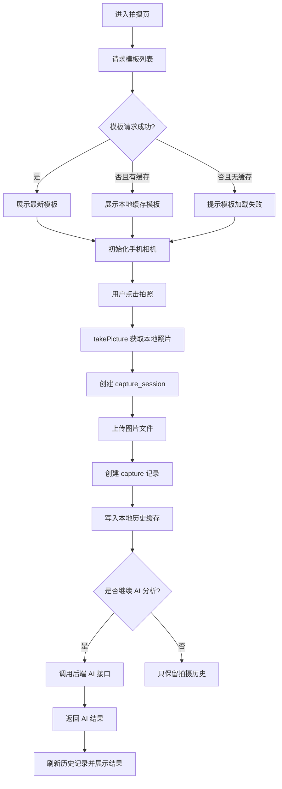

---

## 2. 后端 AI 分析流程

这张图对应手机独立拍摄后的 AI 任务创建与执行。

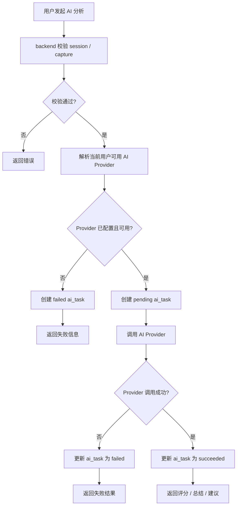

---

## 3. 设备联动总流程

这张图只关注设备联动主循环。

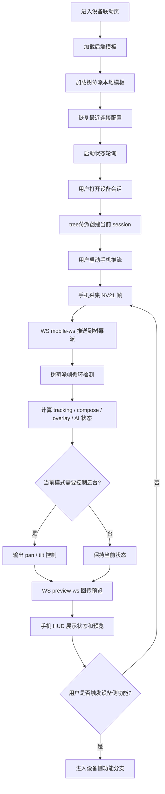

---

## 4. 设备联动功能分支图

这张图把设备联动里几个主要能力拆开。

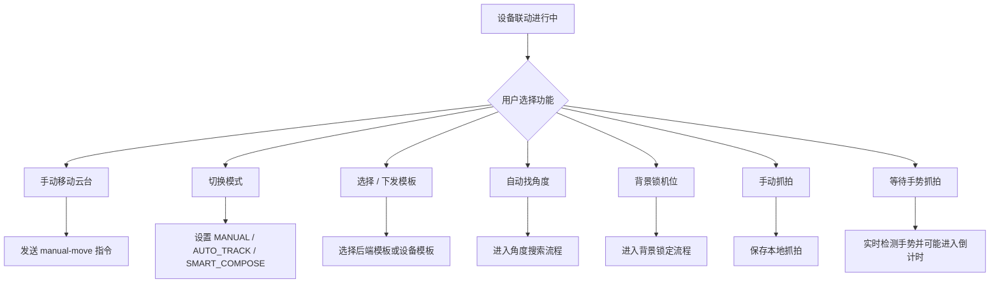

---

## 5. 自动找角度流程

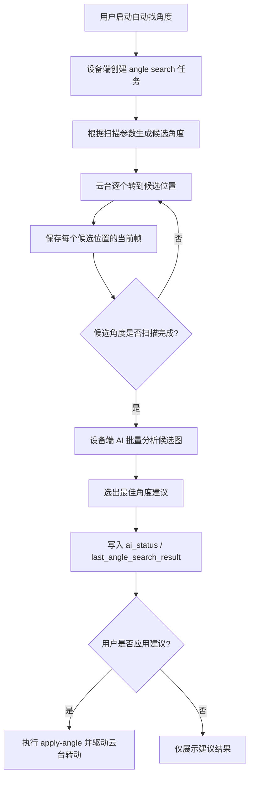

---

## 6. 背景锁机位流程

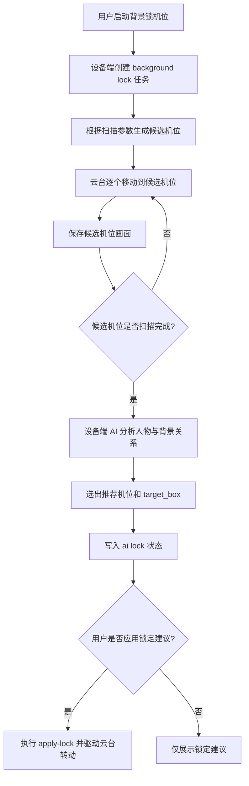

---

## 7. 手势抓拍流程

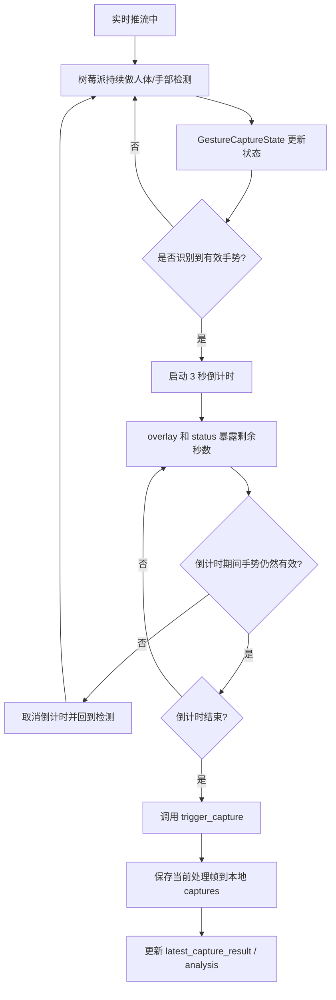

---

## 8. 设备手动抓拍流程

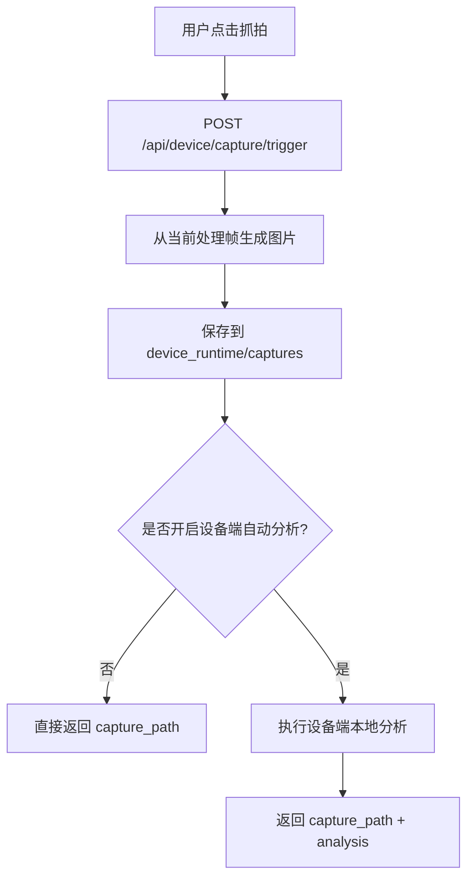

---

## 9. 模板处理流程

这张图把“手机模板”和“树莓派本地模板”区分开。

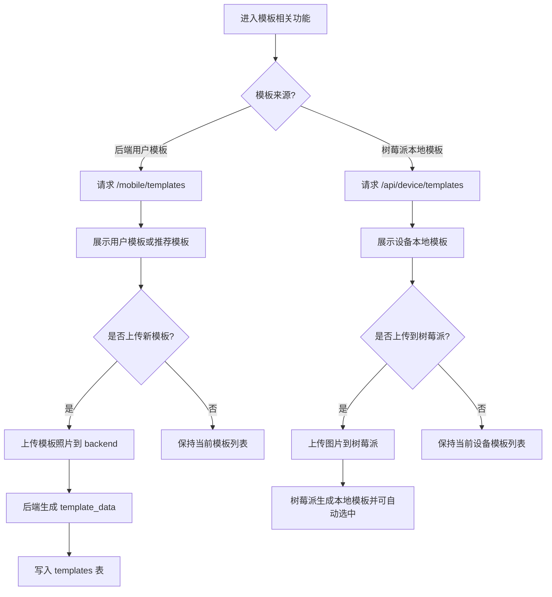

---

## 10. 历史记录与缓存回退流程

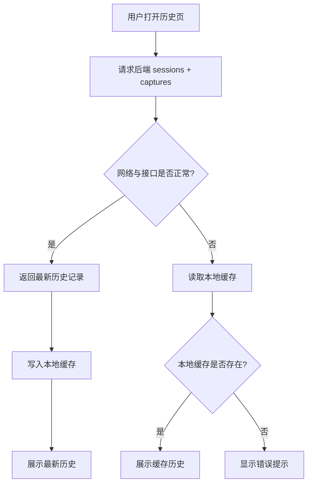

---

## 11. 当前项目的流程边界总结

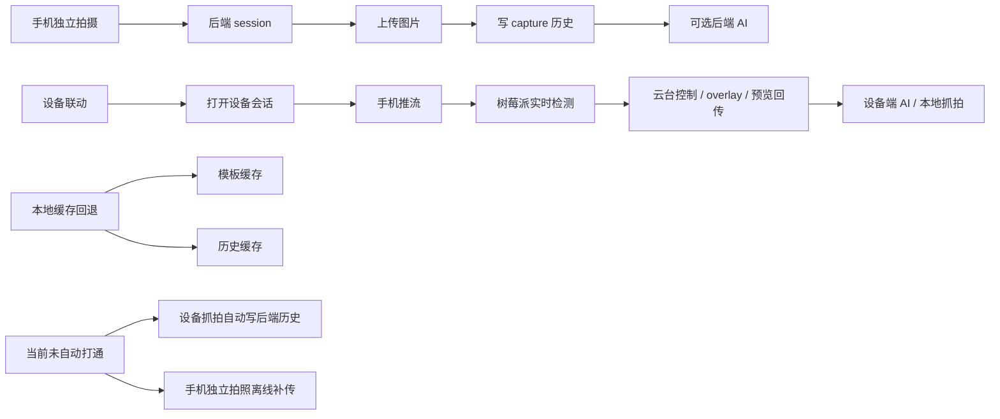

### 总结

当前流程图可以归纳成四句话：

1. 手机独立拍摄是“后端主导”的业务流程。
2. 设备联动是“树莓派运行时主导”的现场流程。
3. 设备端 AI 与后端 AI 是两套独立流程。
4. 当前已经有缓存回退与本地抓拍保底，但没有完整离线补传闭环。
