# 详细状态图

本文用于从“状态机”的角度说明项目关键模块如何在不同状态之间切换。

与前两份文档的关系：

- [详细时序图](./详细时序图.md)：回答“先后顺序”
- [详细流程图](./详细流程图.md)：回答“步骤推进与分支”
- 本文：回答“当前处于什么状态、由什么事件触发状态切换”

本文仍然以当前代码真实实现为准，不引入未来规划中的理想状态。

---

## 0. 全局总状态图

这张总图不追求字段级细节，而是先把系统最重要的状态域拆开。

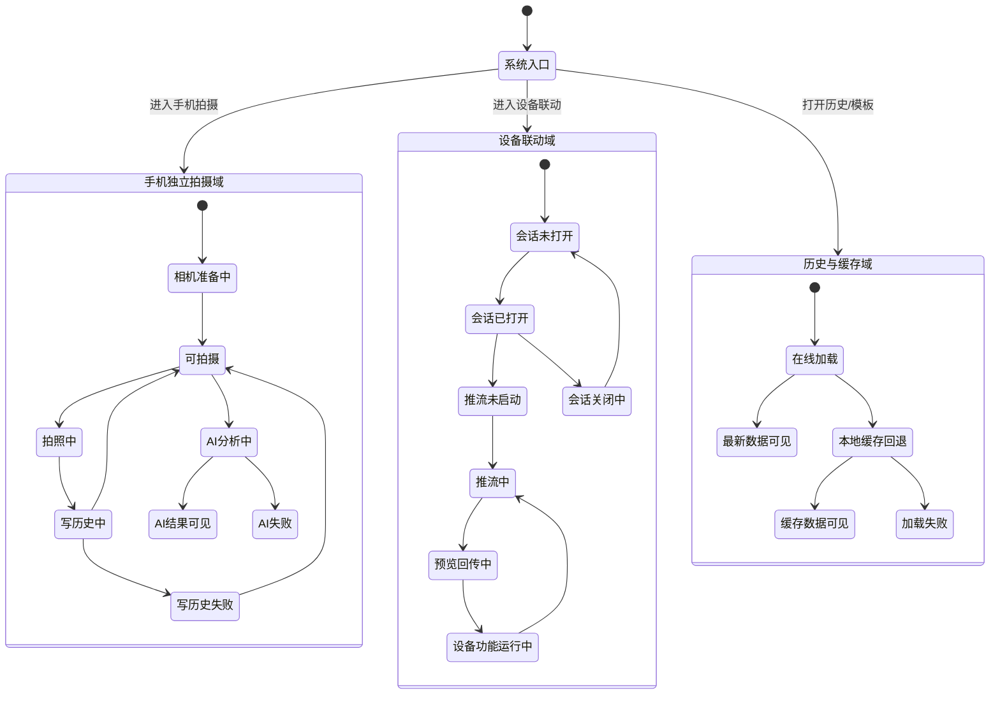

### 图意说明

这张图表达三个层次：

1. 手机独立拍摄域：围绕相机、拍照、写历史、AI 分析展开。
2. 设备联动域：围绕会话、推流、预览、云台和设备侧功能展开。
3. 历史与缓存域：围绕在线拉取与本地缓存回退展开。

---

## 1. 手机拍摄页状态图

这张图对应 `CameraCapturePage` 的核心用户态，不展开内部所有布尔字段，只保留对行为最重要的状态。

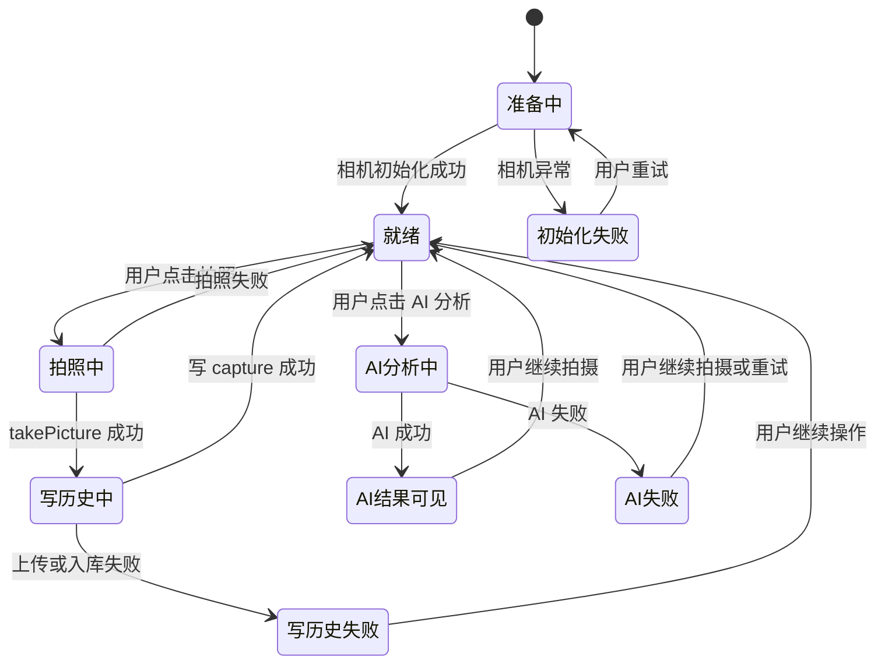

### 对应真实实现

- `准备中` 对应 `_isPreparing=true`
- `拍照中` 对应 `_isCapturing=true`
- `写历史中` 对应 `_isRecordingCapture=true`
- `AI分析中` 对应 `_isSubmitting=true`
- `写历史失败` 对应拍照成功但 `_uploadSingleCaptureRecord()` 失败

---

## 2. 手机拍摄页模板加载状态图

这张图只看模板加载与缓存回退。

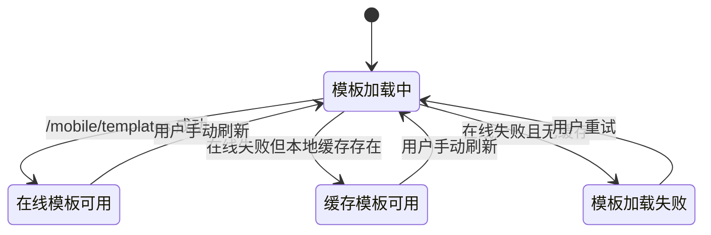

---

## 3. 后端 AI 任务状态图

这张图对应后端 `ai_tasks` 的真实状态演化。

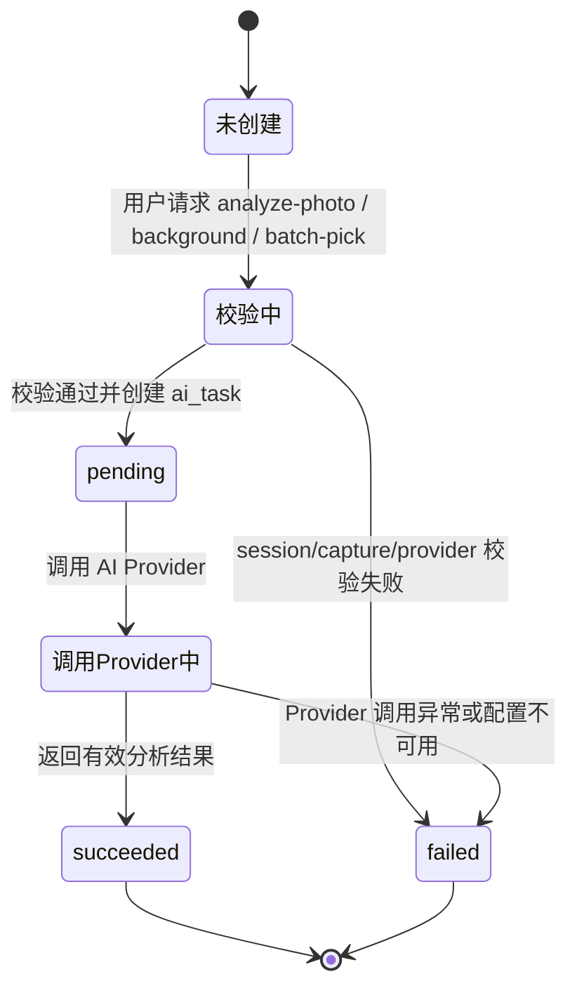

### 说明

这里的 `failed` 既可能来自：

- session / capture 不存在
- provider 未配置
- provider 配置不完整
- provider 调用失败

而 `succeeded` 对应数据库中任务已经写入结果摘要、分数和响应载荷。

---

## 4. 设备会话生命周期状态图

这张图对应 `device_runtime` 中 `SessionManager` 持有的单会话模型。

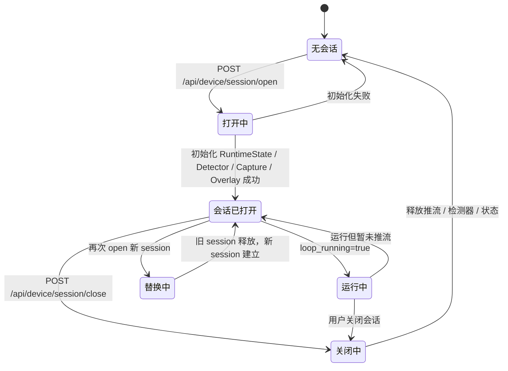

### 说明

- 当前实现是“单会话模型”
- 新会话会替换旧会话
- 会话已打开不等于一定已经有手机推流输入

---

## 5. 设备联动页状态图

这张图对应 `DeviceLinkPage` 的页面级状态，重点看会话、推流、预览和错误反馈。

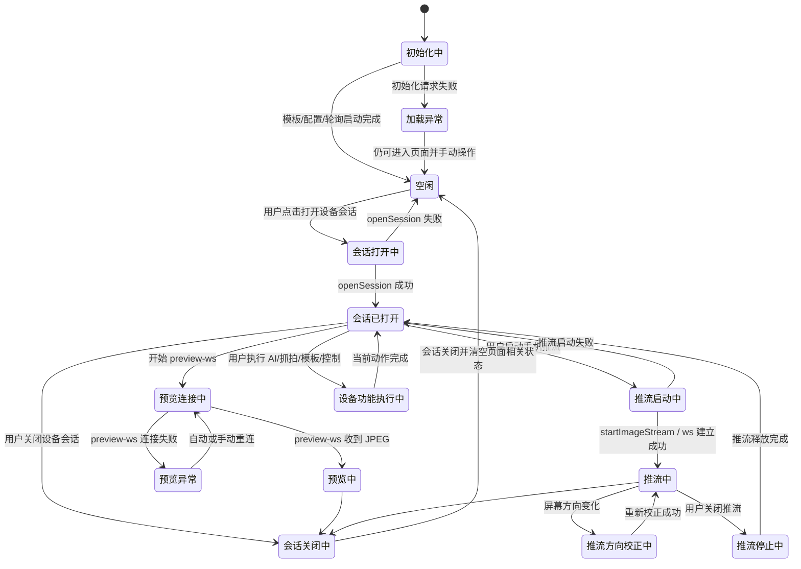

---

## 6. 设备运行模式状态图

这张图对应 `ModeManager` 中的控制模式切换。

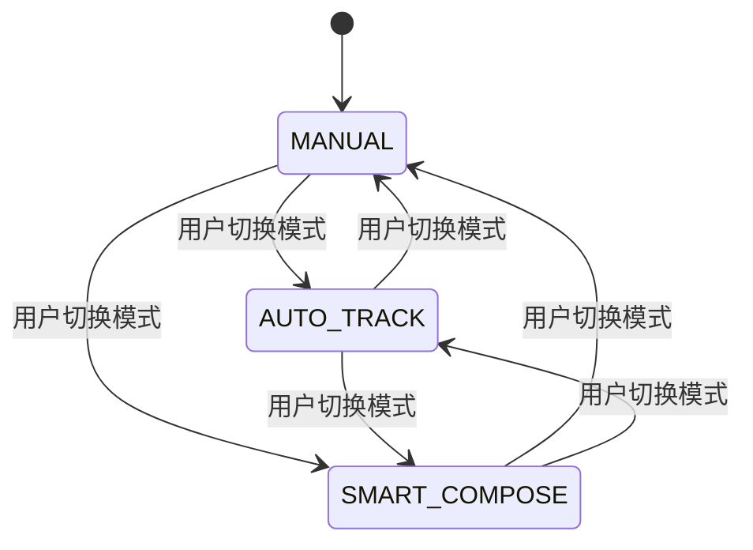

### 说明

当前代码中的模式枚举只有三种：

- `MANUAL`
- `AUTO_TRACK`
- `SMART_COMPOSE`

---

## 7. 手势抓拍状态机

这张图直接对应 `GestureCaptureState` 的 `_phase` 和关键转移。

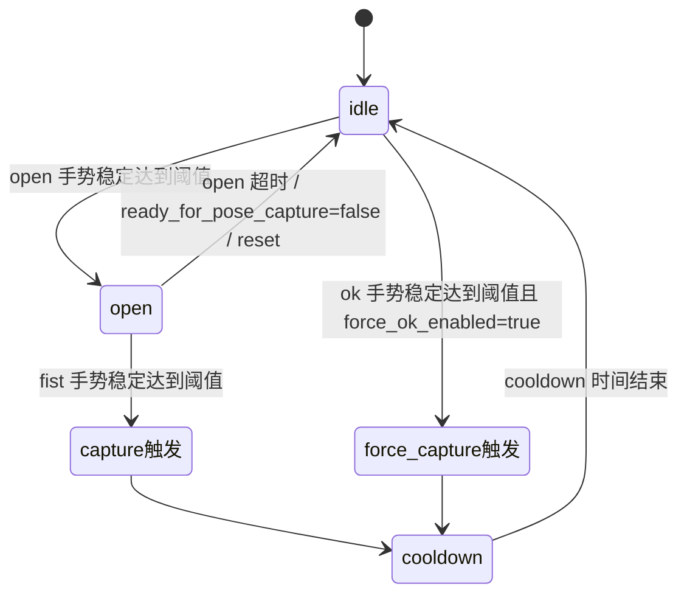

### 真实逻辑补充

- `idle -> open`
  需要 open 手势持续稳定若干帧
- `open -> capture触发`
  需要 fist 手势持续稳定若干帧
- `force_capture触发`
  是独立通道，不依赖 open -> fist
- `ready_for_pose_capture=false`
  会直接把 `open` 相关状态清回 `idle`

---

## 8. 设备端 AI 任务状态图

这张图统一表达自动找角度与背景锁机位的状态结构。

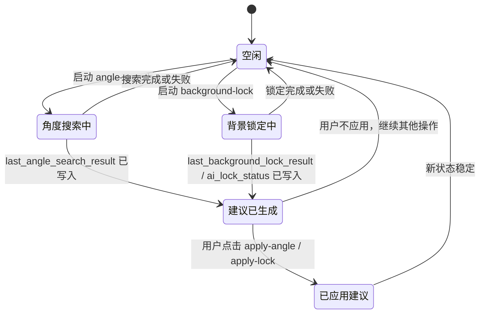

### 说明

在页面展示上，通常通过以下字段体现这些状态：

- `angle_search_running`
- `background_lock_running`
- `lock_enabled`
- `last_angle_search_result`
- `last_background_lock_result`

---

## 9. 设备抓拍状态图

这张图只看设备端本地抓拍行为。

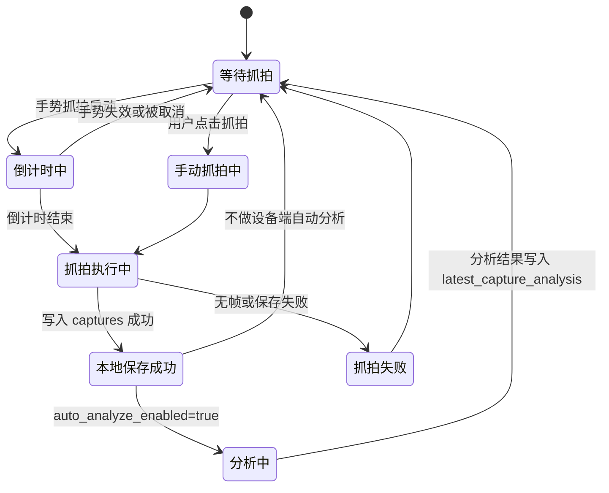

---

## 10. 历史与缓存状态图

这张图对应手机端模板/历史的在线与缓存回退逻辑。

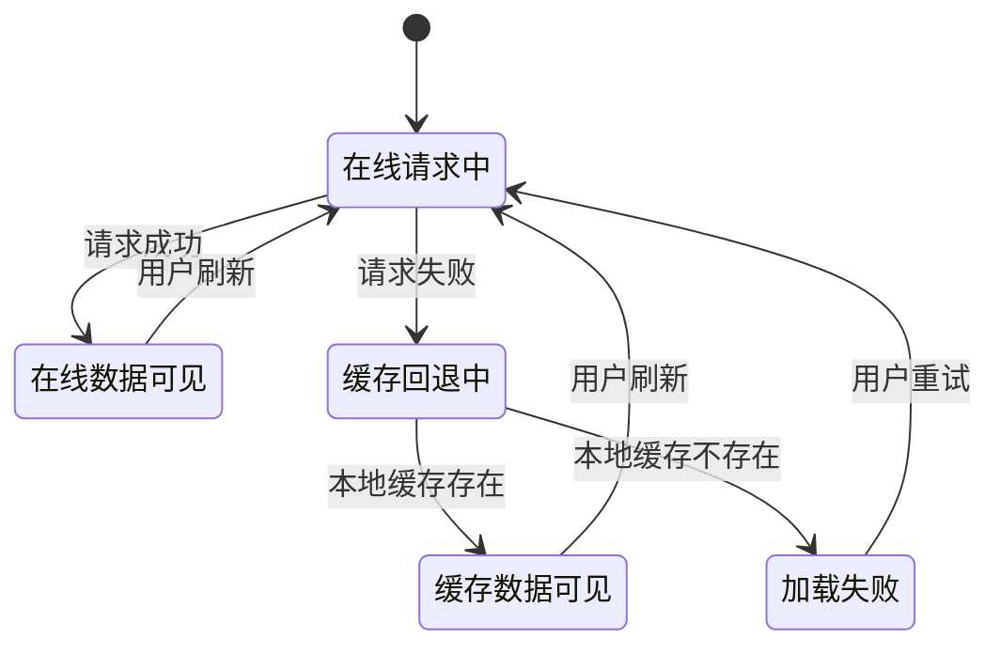

---

## 11. 当前项目状态边界总结

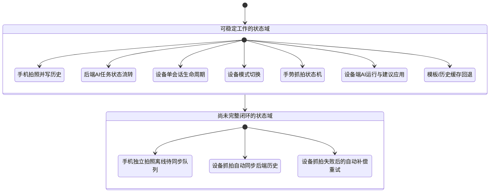

### 总结

这份状态图文档可以压缩成三句话：

1. 当前项目最成熟的状态机在设备联动侧，尤其是会话、推流、模式切换、手势抓拍和设备端 AI。
2. 手机侧业务状态机比较清晰，但更多是“页面提交状态 + 缓存回退状态”，不是复杂实时状态机。
3. 离线补传、设备抓拍自动同步历史这类“跨系统补偿状态机”目前还没有真正建立起来。
