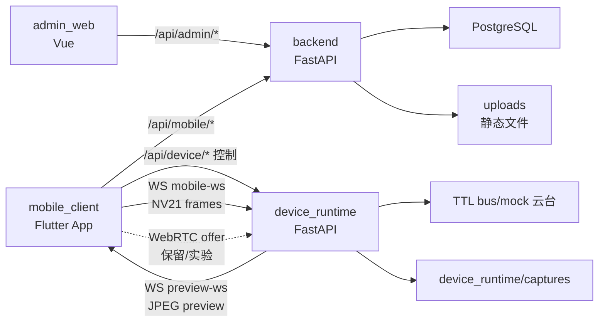

# 项目总览与架构说明

本文按当前代码说明 Camera Assistant System 的整体结构和主要流程。更偏实现细节的说明见 [技术架构与运行机制详解](./技术架构与运行机制详解.md)。

## 项目目标

系统把手机拍摄、模板构图、AI 图片分析、树莓派云台设备和运营后台组合成一个可联调的多端应用。

当前能力包括：

- 手机端登录、注册、拍摄、模板、历史、AI 分析和设备联动。
- 设备端本地会话、手机推流、人体/手部/人脸检测、overlay、云台控制、模板构图、手势抓拍和设备端 AI。
- 后端账号、套餐、模板、历史抓拍、上传文件、AI 任务和 Provider 配置。
- 管理后台用户、套餐、设备、推荐模板、抓拍记录、AI 任务和 Provider 管理。

## 总体架构

业务数据走 `backend`，实时视频和云台控制走 `device_runtime`。手机设置页分别保存“业务后端地址”和“设备运行时地址”。

## 仓库目录

| 目录 | 说明 |
| --- | --- |
| `backend` | FastAPI 业务后端 |
| `mobile_client` | Flutter 手机端 |
| `device_runtime` | 树莓派/本机设备运行时 |
| `admin_web` | Vue 管理后台 |
| `database` | PostgreSQL schema |
| `docs` | 项目文档 |
| `assets` | 项目资源 |
| `captures` | 本地设备抓拍输出，已忽略提交 |
| `uploads` | 后端上传文件目录，已忽略提交 |

## 核心流程

### 手机独立拍摄

1. 手机登录 `backend`。
2. 拉取套餐、模板和历史。
3. 拍摄页打开本机相机并绘制模板/姿态辅助。
4. 拍照后上传文件到 `/api/mobile/captures/file`。
5. 创建抓拍记录或 AI 任务。
6. 历史页从后端读取记录。

### 设备联动

1. 手机设置设备运行时地址，例如 `http://192.168.1.30:8001`。
2. 设备联动页打开 `mobile_push` 会话。
3. 手机通过 Android `CameraController.startImageStream` 获取 NV21 帧。
4. 手机把帧推到 `WS /api/device/stream/mobile-ws`。
5. 设备端处理检测、构图、跟踪、云台和 overlay。
6. 设备端通过 `WS /api/device/preview-ws` 回传 JPEG 预览。
7. 如果触发手势抓拍，设备端进入 3 秒倒计时，倒计时结束后保存本地文件。

### 模板引导

模板可以来自业务后端用户模板，也可以上传到设备端本地模板库。设备端在 `SMART_COMPOSE` 模式下把当前稳定人体框与模板目标进行比较，输出构图反馈、ready 状态和可选自动控制目标点。

### AI 分析

- 后端 AI：服务手机端独立拍摄、背景分析和连拍选优，任务入库到 `ai_tasks`。
- 设备端 AI：服务设备联动页的本地角度搜索、背景锁定和抓拍后本地分析，不替代后端历史 AI。

## 当前关键结论

- 设备联动默认不是后端历史链路；设备抓拍保存到设备端本地。
- 手势抓拍依赖手部 landmarks，并带 3 秒倒计时。
- 手机端当前默认推流是 WebSocket NV21 + JPEG 预览。
- WebRTC 支持仍在代码中保留，但不是 `_startMobilePush()` 的默认路径。
- 真机联调不能使用 `127.0.0.1` 或 `10.0.2.2`，必须使用局域网 IP。
- 设备运行时是单会话模型，打开新 session 会替换旧 session。

## 进一步阅读

- [技术架构与运行机制详解](./技术架构与运行机制详解.md)
- [接口契约](./接口契约.md)
- [部署说明](./部署说明.md)
- [统一采集存储与协同流程](./统一采集存储与协同流程.md)
- [AI 照片分析链路说明](./AI照片分析链路说明.md)
