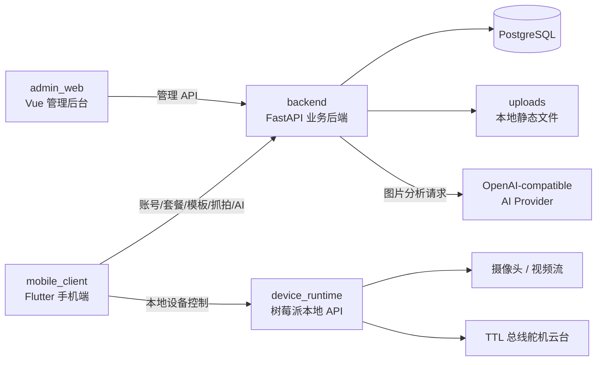
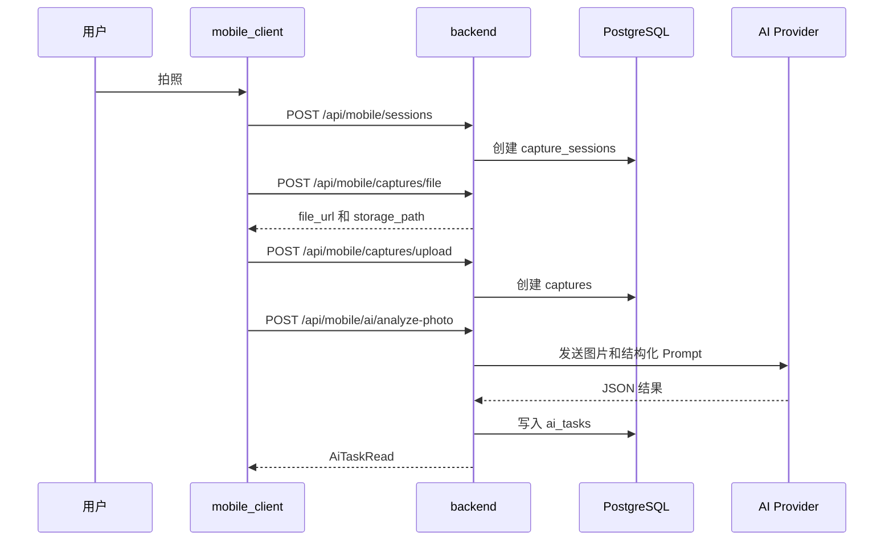
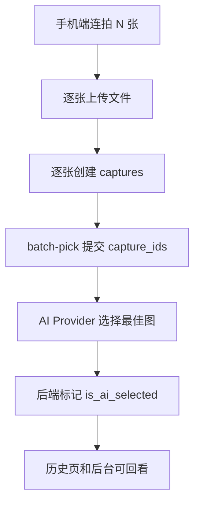
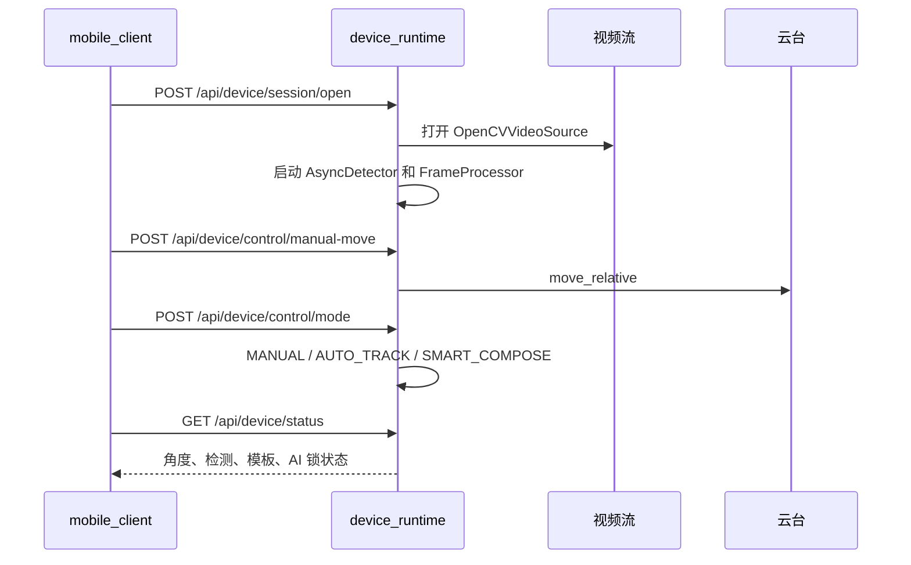
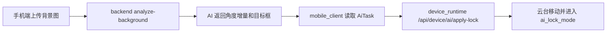
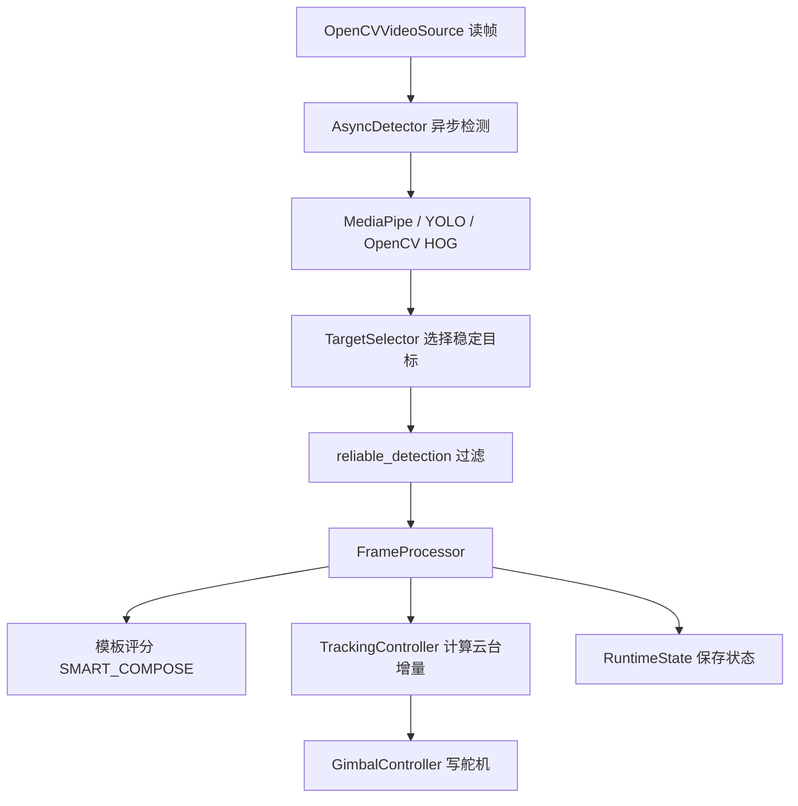
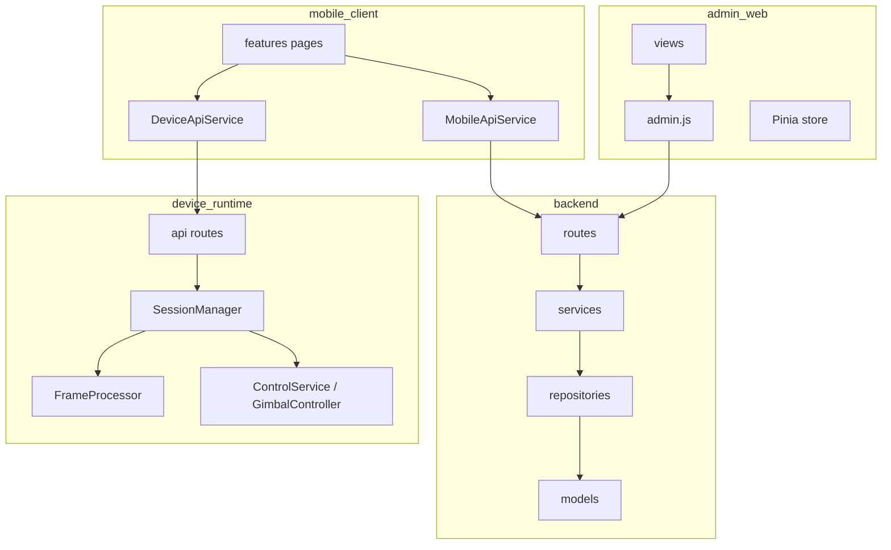

# Camera Assistant 项目总览与架构说明

## 1. 项目背景

Camera Assistant 的目标是把手机拍摄、树莓派设备控制和云端 AI 分析组合成一个可演示、可继续扩展的拍摄辅助系统。项目不是单一 App，而是四端协同：

- 手机端提供拍摄工作台、模板引导、AI 分析入口和设备控制入口。
- 业务后端保存用户、套餐、模板、抓拍、AI 任务和 AI Provider 配置。
- 设备运行时运行在树莓派或本机，接入视频流、视觉检测和云台控制。
- 管理后台提供运营配置、数据管理和 AI 配置管理。

## 2. 项目目标

第一版聚焦完整闭环，而不是追求所有硬件和商业能力一次到位：

1. 用户可以在手机端登录、拍摄、上传图片并触发 AI 分析。
2. 用户可以创建姿势模板，并在拍摄页看到模板叠加引导。
3. 用户可以连接本地设备运行时，执行开会话、切模式、手动移动、回中、套用 AI 建议等操作。
4. 管理员可以管理用户、套餐、设备、推荐模板和 AI Provider。
5. 所有关键业务数据都能落到 PostgreSQL，供后台查看和后续扩展。

## 3. 总体架构



### 3.1 仓库目录

| 目录 | 说明 |
| --- | --- |
| `backend` | 业务后端。`app/api` 是路由，`app/services` 是业务服务，`app/models` 是 SQLAlchemy 模型。 |
| `mobile_client` | Flutter App。`features` 按页面/功能分组，`services` 封装后端和设备端 API。 |
| `device_runtime` | 本地设备运行时。`api` 提供 HTTP 接口，`vision` 做检测，`control` 做云台控制，`services` 做运行时编排。 |
| `admin_web` | 管理后台。`views` 是页面，`api` 封装请求，`stores` 保存登录态和 API 地址。 |
| `database` | PostgreSQL 建表 SQL。 |
| `docs` | 当前维护文档。 |

## 4. 核心运行逻辑

### 4.1 手机独立拍摄与 AI 分析



手机端的主要实现位于 `mobile_client/lib/features/camera/camera_capture_page.dart`。它维护当前相机、模板、拍摄模式、待上传抓拍和 AI 任务状态。真正的业务请求通过 `MobileApiService` 发出。

关键片段：

```dart
final uploadedFile = await widget.apiService.uploadCaptureFile(
  accessToken: widget.accessToken,
  filePath: capture.path,
);

final uploadedCapture = await widget.apiService.createCapture(
  accessToken: widget.accessToken,
  sessionId: session.id,
  fileUrl: uploadedFile.fileUrl,
  storageProvider: uploadedFile.storageProvider,
);

final aiTask = await widget.apiService.analyzePhoto(
  accessToken: widget.accessToken,
  sessionId: session.id,
  captureId: uploadedCapture.id,
);
```

这段逻辑体现了当前系统的三步落库方式：先上传文件，再创建抓拍记录，最后创建 AI 任务。

### 4.2 连拍选优

连拍模式下，手机端先把多张图片逐张上传并写入 `captures`，再调用 `POST /api/mobile/ai/batch-pick`。后端校验这些图片属于同一个会话，然后请求 AI Provider 返回最佳 `capture_id`，并把最佳图片的 `is_ai_selected` 标记为 `true`。



### 4.3 设备联动

设备运行时本身不依赖业务后端启动。移动端保存一个设备 API 地址，例如 `http://127.0.0.1:8001`，然后直接访问设备 API。



设备端核心对象是 `DeviceSessionContext`。`SessionManager` 当前只维护一个活动会话，打开新会话会关闭旧会话。

关键片段：

```python
def open_session(self, payload: SessionOpenPayload) -> DeviceSessionContext:
    with self._lock:
        if self._session is not None:
            self._session.close()
        session = DeviceSessionContext(payload, ...)
        session.start()
        self._session = session
        return session
```

这说明设备端是单实例实时运行时，适合第一版演示和本地联调。

### 4.4 模板引导

模板存在两套场景：

- 业务后端的 `templates` 表保存用户模板和推荐默认模板，供手机端列表、拍摄页叠加和设备端 inline 下发使用。
- 设备端 `.template_library` 保存本地导入模板，供设备端单独使用。

手机端模板来自 `MobileApiService.listTemplates()`。拍摄页把模板的 `template_data` 转成 `OverlayScene`，在相机预览上画出引导线。设备联动页可以把模板数据发给设备端：

```dart
await _deviceApiService.selectTemplate(
  baseUrl: _deviceBaseUrl,
  templateId: template.id,
  templateData: template.templateData,
);
```

设备端收到 inline 模板后会构造 `TemplateProfile`，并由 `FrameProcessor` 在 `SMART_COMPOSE` 模式下计算构图评分和目标点。

```python
if self._mode_manager.mode == ControlMode.SMART_COMPOSE and selected_template is not None and stable is not None:
    compose_feedback = self._template_engine.evaluate(
        selected_template,
        stable,
        frame.shape,
        mirror_template=mirror_view,
        follow_mode=self._runtime_state.follow_mode,
    )
```

### 4.5 AI 背景锁与角度建议

后端 `analyze-background` 返回 `recommended_pan_delta`、`recommended_tilt_delta` 和 `target_box_norm`。移动端设备联动页可以把这个结果应用到设备端：



设备端 `apply_ai_lock()` 会限制角度增量范围，移动云台，并保存归一化目标框。后续帧处理会计算当前人物框和目标框的 IoU，作为 `fit_score`。

## 5. backend 模块

### 5.1 入口与配置

入口是 `backend/app/main.py`，创建 FastAPI 应用、挂载 `/uploads` 静态目录、注册 `/api` 路由。配置来自环境变量：

| 环境变量 | 作用 | 默认值 |
| --- | --- | --- |
| `DATABASE_URL` | PostgreSQL 连接串 | 空 |
| `BACKEND_AUTH_SECRET` | token 签名密钥 | 开发密钥 |
| `BACKEND_UPLOADS_DIR` | 上传目录 | 仓库根目录 `uploads` |
| `BACKEND_UPLOADS_URL_PATH` | 静态访问路径 | `/uploads` |

### 5.2 路由分组

- `/api/health`：健康检查和数据库状态。
- `/api/mobile/*`：手机端登录、注册、当前用户、套餐、订阅、模板、会话、抓拍、AI 分析、历史。
- `/api/admin/*`：管理端登录、用户、套餐、推荐模板、设备、抓拍、AI 任务、统计、AI Provider 配置。

### 5.3 服务层

| 服务 | 作用 |
| --- | --- |
| `AuthService` | 手机端和管理端登录、注册、token 生成。 |
| `MobileService` | 手机端业务主入口，包含模板、会话、抓拍、AI 任务。 |
| `AdminService` | 管理端 CRUD 和统计。 |
| `AiProviderService` | 调用真实 AI Provider，解析结构化结果。 |
| `TemplatePoseService` | 后端根据模板图片生成基础模板数据。 |

### 5.4 AI Provider 选择逻辑

后端优先读取用户当前订阅套餐的 `feature_flags`：

1. `default_ai_provider_code` 指定的 Provider。
2. `available_ai_provider_codes` 列表中的第一个可用 Provider。
3. 系统默认 Provider。

关键片段：

```python
requested_provider_code = selected_feature_flags.get("default_ai_provider_code")
available_provider_codes = selected_feature_flags.get("available_ai_provider_codes") or []

if isinstance(requested_provider_code, str) and requested_provider_code.strip():
    config = self.ai_provider_config_repo.get_by_provider_code(requested_provider_code.strip())
    selection_mode = "plan_default"

if config is None:
    config = self.ai_provider_config_repo.get_default()
```

配置必须满足：启用、有 `api_base_url`、有 `model_name`，非 Ollama 厂商还需要 `api_key`。未配置或未就绪时不会假装成功，而是写入 `failed` 状态的 `ai_tasks`。

### 5.5 数据模型

核心表和模型：

- `users`：用户和管理员。
- `plans`：套餐、额度、功能开关。
- `user_subscriptions`：用户当前套餐。
- `devices`：设备绑定和控制地址。
- `templates`：用户模板和推荐默认模板。
- `capture_sessions`：一次拍摄会话。
- `captures`：单张抓拍记录。
- `ai_tasks`：AI 分析任务和结果。
- `ai_provider_configs`：AI 厂商、模型、密钥和默认项。

## 6. device_runtime 模块

### 6.1 实际启动入口

`device_runtime/main.py` 仍是占位提示。实际启动方式是：

```powershell
uvicorn device_runtime.api.app:app --reload --host 0.0.0.0 --port 8001
```

### 6.2 API 能力

| 分组 | 路径 | 作用 |
| --- | --- | --- |
| health/status | `/api/device/health`, `/api/device/status`, `/api/device/preview.jpg` | 健康、状态、预览图 |
| session | `/api/device/session/open`, `/api/device/session/close` | 打开/关闭实时会话 |
| control | `/api/device/control/*` | 手动移动、切模式、回中、切跟随点 |
| templates | `/api/device/templates/*` | 本地模板导入、选择、删除，或接收手机端 inline 模板 |
| ai | `/api/device/ai/apply-angle`, `/api/device/ai/apply-lock` | 应用 AI 角度或背景锁结果 |
| capture | `/api/device/capture/trigger` | 用当前帧触发本地抓拍 |
| stream | `/api/device/stream/start` | 切换视频流地址 |

### 6.3 帧处理管线



### 6.4 云台控制

默认硬件方案是 TTL 总线舵机。Windows 本地联调默认使用 `mock` 驱动，树莓派默认使用 `ttl_bus`。关键环境变量：

- `DEVICE_SERVO_DRIVER=mock|ttl_bus`
- `DEVICE_TTL_SERIAL_PORT`
- `DEVICE_PAN_SERVO_ID`
- `DEVICE_TILT_SERVO_ID`
- `DEVICE_PAN_MIN_ANGLE` / `DEVICE_PAN_MAX_ANGLE`
- `DEVICE_TILT_MIN_ANGLE` / `DEVICE_TILT_MAX_ANGLE`

`TrackingController` 将目标偏移转成平滑的云台增量，包含死区、防抖、最小间隔、突变过滤和方向反转配置。

## 7. mobile_client 模块

### 7.1 页面与功能

| 功能 | 文件 | 说明 |
| --- | --- | --- |
| App 启动与登录态 | `lib/app/camera_assistant_app.dart` | 恢复 session，未登录进入登录页，已登录进入首页。 |
| 登录/注册 | `features/auth` | 调用 `/api/mobile/auth/*`，本地保存 token。 |
| 首页 | `features/home/home_page.dart` | 展示用户、订阅、套餐和快捷入口。 |
| 拍摄页 | `features/camera/camera_capture_page.dart` | 相机预览、模板叠加、拍照、上传、AI 分析、连拍选优。 |
| 设备联动 | `features/device_link/device_link_page.dart` | 连接设备运行时，控制云台，套用 AI 建议。 |
| 历史 | `features/history/history_page.dart` | 会话和抓拍记录，支持最近一组 AI 选优。 |
| 叠加层 | `features/overlay` | 模板、AI 目标框、实时姿态叠加绘制。 |

### 7.2 服务封装

- `MobileApiService`：访问业务后端 `/api/mobile`。
- `DeviceApiService`：访问设备端 `/api/device`。
- `ApiClient`：统一 JSON envelope、错误翻译、multipart 上传。
- `MobileCacheService`：缓存模板和历史，弱网时可显示旧数据。

### 7.3 拍摄模式

`CameraCapturePage` 当前有四种模式：

- `normal`：普通拍摄后分析。
- `templateGuided`：显示模板叠加，引导姿势和构图。
- `aiBurst`：连拍多张后调用 batch-pick。
- `background`：拍摄后调用 analyze-background，得到背景锁建议。

## 8. admin_web 模块

### 8.1 路由

| 路由 | 页面 | 说明 |
| --- | --- | --- |
| `/login` | `LoginView.vue` | 管理端登录。 |
| `/admin/overview` | `WorkbenchView.vue` | 统计概览。 |
| `/admin/users` | `UsersView.vue` | 用户管理和套餐绑定。 |
| `/admin/plans` | `PlansView.vue` | 套餐、额度、AI 配置绑定。 |
| `/admin/templates` | `RecommendedTemplatesView.vue` | 推荐默认模板管理。 |
| `/admin/devices` | `DevicesView.vue` | 设备管理。 |
| `/admin/captures` | `CapturesView.vue` | 抓拍记录。 |
| `/admin/ai-tasks` | `AiTasksView.vue` | AI 任务回看。 |
| `/admin/ai-provider` | `AiProviderConfigsView.vue` | 多 Provider 配置。 |

### 8.2 状态与请求

`src/stores/app.js` 保存 `accessToken`、当前管理员和 `apiBaseUrl`。`src/api/http.js` 在请求拦截器中注入 baseURL 和 Bearer token。`src/api/admin.js` 是所有管理端接口封装，并对常见错误做中文提示。

## 9. 模块协同关系



协同要点：

- 后端是业务事实源，负责用户、套餐、模板、抓拍和 AI 任务。
- 设备端是实时控制源，负责视频帧、检测结果和云台状态。
- 手机端是操作入口，既连后端也连设备端。
- 管理后台只连后端，不直接控制设备。

## 10. 当前限制与风险

1. AI 任务是同步请求内执行，Provider 慢或失败会直接影响接口耗时。
2. 后端当前使用自定义 HMAC token，不是标准 JWT，适合第一版但后续可替换。
3. 设备端单会话模型简单可靠，但不支持多客户端并发控制。
4. 设备端真实硬件需要按舵机安装方向校准角度、方向和串口。
5. 移动端设备抓拍和后端抓拍记录尚未完全统一，设备本地抓拍文件不会自动回流 backend。
6. 自动化测试主要在 Flutter 侧，后端和设备端缺少系统性测试。

## 11. 后续建议

优先级从高到低：

1. 给 backend 和 device_runtime 补关键服务测试，尤其是 AI Provider 失败语义、模板数据、设备状态。
2. 把 AI 任务改成队列或后台任务，避免接口长时间阻塞。
3. 打通设备端抓拍文件回传 backend 的闭环。
4. 给树莓派部署补 systemd 服务、日志轮转和健康检查。
5. 为移动端设备联动增加更明确的连接配置管理和设备发现能力。
